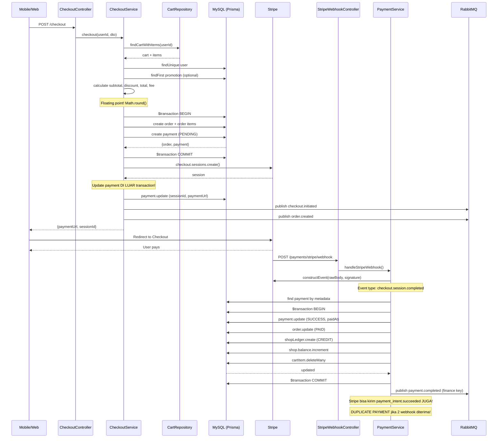

# Payment System Requirement and Bug Audit

## 1. Executive Summary

Sistem payment Greenly berbasis Stripe Checkout Session dengan arsitektur NestJS + Prisma MySQL + RabbitMQ. Flow checkout sudah cukup matang untuk transaksi single-shop dengan validasi cart, pembuatan order + payment dalam transaction, dan webhook Stripe. Namun ditemukan 20+ bug dan risk kritis yang perlu diperbaiki sebelum production-ready.

**Risiko terbesar:**
1. **Duplicate webhook delivery tidak di-handle** - Tidak ada idempotency table, tidak ada unique constraint pada `stripeCheckoutSessionId` atau `stripePaymentIntentId`. Stripe bisa delivery webhook yang sama 2x, menyebabkan ledger double-entry dan balance corrupt.
2. **Tidak ada outbox pattern** - Event RabbitMQ dipublish setelah DB commit. Jika publish gagal, stock tidak update secara real-time (tidak ada consumer yang update stock saat ini juga).
3. **Floating point fee calculation** - Fee marketplace 5% dihitung dengan `Math.round(grossAmount * 0.05)` menggunakan number, bukan Decimal. Gateway fee hardcoded `0` di checkout tapi `4000` di utility function `calculateOrderFees`.
4. **Tidak ada stock/inventory validation** - Checkout tidak mengecek stock product ke catalog-service.
5. **Tidak ada test payment** - Zero test untuk checkout, payment, webhook, refund, payout, ledger.
6. **Refund flow tidak menyentuh Stripe API** - Refund hanya internal, tidak pernah memanggil `stripe.refunds.create()`.
7. **Webhook duplicate event untuk event type sama** - `checkout.session.completed` dan `payment_intent.succeeded` bisa dipicu untuk transaksi yang sama, menyebabkan `applyStripeSuccess` dipanggil 2x.
8. **Payment URL update di luar transaction** - `checkout.service.ts` membuat Stripe session, lalu update payment di luar `$transaction` yang digunakan saat create order+payment.
9. **State machine tidak di-enforce di database** - Tidak ada constraint DB yang mencegah transisi status invalid.
10. **Idempotency key ada schema-nya tapi tidak pernah diimplementasi** - `payout.dto.ts` punya field `idempotencyKey` tapi tidak dipakai di service logic.

## 2. Payment Architecture

### Module & File Discovery Table

| Area | File/Path | Fungsi | Status | Catatan Risiko |
|------|-----------|--------|--------|----------------|
| Checkout Controller | `src/modules/commerce/checkout/checkout.controller.ts` | POST /checkout | Implemented | Tidak ada rate limiting |
| Checkout Service | `src/modules/commerce/checkout/checkout.service.ts` | Checkout orchestration | Implemented | Payment update di luar transaction |
| Checkout DTO | `src/modules/commerce/checkout/checkout.dto.ts` | Zod schema checkout | Implemented | Client kirim price, risk manipulation |
| Stripe Service | `src/modules/finance/payment/stripe.service.ts` | Stripe SDK wrapper | Implemented | Lazy init Stripe, no api version pinning |
| Payment Controller | `src/modules/finance/payment/payment.controller.ts` | Payment CRUD + webhook | Implemented | Webhook public tanpa auth guard |
| Payment Service | `src/modules/finance/payment/payment.service.ts` | Payment logic + webhook handler | Implemented | Tidak ada idempotency webhook |
| Payment DTO | `src/modules/finance/payment/payment.dto.ts` | Zod schema payment | Implemented | |
| Payment Repository | `src/modules/finance/payment/payment.repository.ts` | Prisma queries | Implemented | |
| Order Controller | `src/modules/commerce/order/order.controller.ts` | Order CRUD | Implemented | Payment callback mungkin redundant |
| Order Service | `src/modules/commerce/order/order.service.ts` | Order logic + refund legacy | Implemented | CreateRefund duplikat dengan refund module |
| Order Repository | `src/modules/commerce/order/order.repository.ts` | Prisma queries | Implemented | |
| Order DTO | `src/modules/commerce/order/dto/order.dto.ts` | Zod schema order | Implemented | |
| Refund Controller | `src/modules/finance/refund/refund.controller.ts` | Refund CRUD | Implemented | |
| Refund Service | `src/modules/finance/refund/refund.service.ts` | Refund logic | Implemented | Tidak integrasi Stripe refund API |
| Refund DTO | `src/modules/finance/refund/refund.dto.ts` | Zod schema refund | Implemented | paymentId pake uuid, Prisma pake cuid |
| Payout Controller | `src/modules/finance/payout/payout.controller.ts` | Payout CRUD | Implemented | |
| Payout Service | `src/modules/finance/payout/payout.service.ts` | Payout logic | Implemented | Idempotency key di DTO tapi tidak dipakai |
| Ledger Controller | `src/modules/finance/ledger/ledger.controller.ts` | Ledger list | Implemented | |
| Ledger Service | `src/modules/finance/ledger/ledger.service.ts` | Ledger logic | Implemented | |
| Finance Controller | `src/modules/finance/finance.controller.ts` | Admin finance overview | Implemented | |
| Finance Admin Guard | `src/modules/finance/guards/finance-admin.guard.ts` | Role guard admin | Implemented | |
| Shop Ownership Guard | `src/modules/finance/shared/guards/shop-ownership.guard.ts` | Shop authorization | Implemented | |
| RequireFinanceAccess | `src/modules/finance/shared/decorators/require-finance-access.decorator.ts` | Composite decorator | Implemented | |
| Prisma Schema | `prisma/schema.prisma` | Data models | Implemented | Missing unique pada stripe fields |
| Messaging Service | `src/libs/messagging/messagging.service.ts` | RabbitMQ client | Implemented | firstValueFrom, tidak ada retry |
| Events Module | `src/modules/events/events.module.ts` | Event consumer | Empty | Tidak ada consumer terdaftar |
| Main.ts | `src/main.ts` | NestJS bootstrap | Implemented | rawBody: true untuk Stripe webhook |
| Fee Rates | `src/modules/finance/shared/constants/fee-rates.constants.ts` | Fee constants | Implemented | GATEWAY_FIXED=4000 tapi checkout pake 0 |
| Calculate Fees Util | `src/modules/finance/shared/utils/calculate-fees.util.ts` | Fee calculator | Implemented | Floating point! |
| E2E Test | `test/app.e2e-spec.ts` | Basic e2e | Minimal | Hanya Hello World |
| Payment Module | `src/modules/finance/payment/payment.module.ts` | Module definition | Implemented | |
| Checkout Module | `src/modules/commerce/checkout/checkout.module.ts` | Module definition | Implemented | |
| Order Module | `src/modules/commerce/order/order.module.ts` | Module definition | Implemented | |
| Finance Module | `src/modules/finance/finance.module.ts` | Module definition | Implemented | Global module |

### Entity Relationships (Prisma)

- **User** 1---* **Order**
- **Order** 1---* **OrderItem**
- **Order** 1---1 **Payment**
- **Payment** 1---* **Refund**
- **Shop** 1---* **Order**
- **Shop** 1---* **Payment** (via Order)
- **Shop** 1---* **ShopLedger**
- **Shop** 1---* **Payout**

### Payment Flow Ownership

| Action | Owner | File |
|--------|-------|------|
| Membuat order | `CheckoutService.checkout()` | `checkout.service.ts:97-116` |
| Membuat payment | `CheckoutService.checkout()` | `checkout.service.ts:118-128` |
| Membuat Stripe Checkout Session | `CheckoutService.checkout()` | `checkout.service.ts:133-160` |
| Membuat Stripe Session ulang | `PaymentService.createStripeIntent()` | `payment.service.ts:140-177` |
| Menerima webhook Stripe | `PaymentService.handleStripeWebhook()` | `payment.service.ts:209-249` |
| Update status payment SUCCESS | `PaymentService.applyStripeSuccess()` | `payment.service.ts:252-325` |
| Update status payment FAILED | `PaymentService.applyStripeFailure()` | `payment.service.ts:327-405` |
| Update status payment EXPIRED | `PaymentService.applyStripeFailure()` | `payment.service.ts:327-405` |
| Update status payment REFUNDED | `PaymentService.applyStripeRefund()` | `payment.service.ts:407-448` |
| Membuat ledger | `PaymentService.creditSuccessfulPayment()` | `payment.service.ts:480-508` |
| Membuat refund | `RefundService.createRefund()` | `refund.service.ts:31-81` |
| Approve refund | `RefundService.approveRefund()` | `refund.service.ts:83-112` |
| Membuat payout request | `PayoutService.requestPayout()` | `payout.service.ts:32-93` |
| Publish event payment.completed | 3 publisher berbeda | lihat tabel event |
| Publish event order.created | `CheckoutService` + `CheckoutInitiatedPublisher` | `checkout.service.ts:175-188` |

## 3. Payment Flow Diagram



## 4. Current Payment Requirements Found

| Requirement | Evidence | Status | Notes |
|-------------|----------|--------|-------|
| Cart validation before checkout | `checkout.service.ts:31-45` | Implemented | Validasi cart tidak null dan itemIds sesuai |
| User authentication | JwtAccessGuard + Public decorator | Implemented | |
| Shipping address validation | `checkout.service.ts:51-55` | Implemented | Fallback ke user profile |
| Promotion code validation | `checkout.service.ts:59-68` | Implemented | Cek isActive, startDate, endDate |
| Discount calculation | `checkout.service.ts:75-81` | Implemented | Percentage dan fixed |
| Order creation in transaction | `checkout.service.ts:91-131` | Implemented | Prisma $transaction |
| Payment record creation | `checkout.service.ts:118-128` | Implemented | |
| Stripe Checkout Session creation | `checkout.service.ts:133-160` | Implemented | |
| Metadata sent to Stripe | `checkout.service.ts:141-153` | Implemented | orderId, paymentId, userId, shopId |
| Webhook raw body | `main.ts:9` | Implemented | `rawBody: true` |
| Webhook signature verification | `payment.service.ts:217-219` | Implemented | `stripe.webhooks.constructEvent` |
| Event type handling (5 types) | `payment.service.ts:221-249` | Implemented | checkout.session.(completed/expired), payment_intent.(succeeded/failed), charge.refunded |
| Payment status update to SUCCESS | `payment.service.ts:278-313` | Implemented | Dalam transaction |
| Order status update to PAID | `payment.service.ts:481-483` | Implemented | |
| Ledger credit creation | `payment.service.ts:486-508` | Implemented | Dengan guard duplicate |
| Shop balance increment | `payment.service.ts:504-507` | Implemented | |
| Cart items clearing on payment | `payment.service.ts:295-310` | Implemented | |
| Payout request with balance check | `payout.service.ts:32-93` | Implemented | Dalam transaction |
| Payout ledger lock | `payout.service.ts:64-72` | Implemented | |
| Refund with balance check | `refund.service.ts:31-81` | Implemented | |
| Refund lock balance | `refund.service.ts:61-74` | Implemented | Debit ledger |
| Admin approve/reject refund | `refund.service.ts:83-149` | Implemented | |
| Payment expire handling | `payment.service.ts:226-229, 378-383` | Implemented | Order status CANCELLED |
| Admin finance overview | `finance.service.ts` | Implemented | |

## 5. Missing Payment Requirements

| Requirement | Why Needed | Risk if Missing | Priority |
|-------------|-----------|-----------------|----------|
| Stock/Inventory validation | Checkout harus cek stock real-time ke catalog-service | Overselling produk | Critical |
| Product existence validation | Checkout harus validasi productId ada di catalog | Order produk tidak valid (ghost order) | High |
| Idempotency key for checkout | Mencegah duplicate checkout click | Double order dengan payment pending | Critical |
| Idempotency table for webhook events | Stripe bisa kirim webhook yang sama 2x | Double payment, double ledger, balance corrupt | Critical |
| Unique constraint on stripeCheckoutSessionId | Mencegah duplicate session ID di DB | Data inconsistency, duplicate payment record | Critical |
| Unique constraint on stripePaymentIntentId | Mencegah duplicate payment intent ID | Double payment success dari webhook | Critical |
| Outbox pattern for events | Event publishing harus reliable | Stock tidak update, notifikasi hilang | High |
| Stripe refund API integration | Refund harus synchronous via Stripe | Refund hanya internal, uang tidak balik ke customer | Critical |
| State machine enforcement di DB | Prevent invalid status transition | Data inconsistency | Medium |
| Rate limiting pada checkout | Mencegah brute force / DDoS checkout | Abuse API | Medium |
| Rate limiting pada refund/payout | Mencegah abuse refund/payout | Financial loss | High |
| Amount validation from client | Client bisa kirim price sembarang | Payment amount bisa dimanipulasi | Critical |
| Logging webhook events | Audit trail untuk Stripe events | Tidak bisa trace issue payment | Medium |
| Monitoring & alert Stripe | Mendeteksi webhook failure | Payment tidak terproses | High |
| Stripe API version pinning | Stripe API bisa breaking change | Unexpected behavior | Medium |
| Test coverage | Mencegah regression bug | Production bug tidak terdeteksi | High |
| Catalog consumer untuk payment events | Update stock setelah payment | Stock tidak real-time | High |

## 6. Checkout Flow Findings

### Bug CRITICAL: Missing stock & product validation
- **File**: `checkout.service.ts:30-205`
- **Problem**: Checkout tidak melakukan validasi bahwa product benar-benar ada di catalog-service dan stock mencukupi. `price` dikirim oleh client, bukan di-fetch dari database/source of truth.
- **Impact**: Overselling produk, client bisa manipulasi harga, ghost product di order.
- **Severity**: Critical

### Bug CRITICAL: Client menentukan price
- **File**: `checkout.dto.ts:15`, `checkout.service.ts:232`
- **Problem**: `CheckoutSchema` menerima `price: z.coerce.number().nonnegative()` dari client. Price ini digunakan di `price: Math.round(snapshot.price)` tanpa verifikasi dengan catalog.
- **Impact**: Client bisa checkout dengan price Rp 1 untuk product yang seharga Rp 100.000.
- **Severity**: Critical

### Bug HIGH: Payment update di luar transaction
- **File**: `checkout.service.ts:162-173`
- **Problem**: Setelah membuat Stripe session, update payment (transactionId, stripeCheckoutSessionId, paymentUrl) dilakukan di luar `$transaction`. Jika update ini gagal, Stripe session sudah terlanjur dibuat dan tidak ada rollback.
- **Impact**: Payment record tidak memiliki payment URL, user tidak bisa bayar, Stripe session dangling.
- **Severity**: High

### Bug HIGH: Event publish setelah DB commit (no outbox)
- **File**: `checkout.service.ts:175-188`
- **Problem**: `checkoutInitiatedPublisher.publish()` dan `orderCreatedPublisher.publish()` dipanggil setelah DB transaction sukses. Jika publish gagal (RabbitMQ down), event hilang.
- **Impact**: Catalog service tidak tahu ada order baru, stock tidak di-reserve.
- **Severity**: High

### Bug MEDIUM: Tidak ada idempotency key checkout
- **File**: `checkout.service.ts:30`
- **Problem**: Jika client double-click checkout, tidak ada idempotency key untuk mencegah duplicate order creation.
- **Impact**: Dua order PENDING untuk cart yang sama.
- **Severity**: Medium

### Bug MEDIUM: Duplicate event untuk order.created
- **File**: `checkout.service.ts:175-188`
- **Problem**: `checkoutInitiatedPublisher` dan `orderCreatedPublisher` dipanggil dengan payload mirip, menyebabkan 2 event berbeda untuk 1 checkout.
- **Impact**: Consumer menerima 2 event untuk 1 transaksi, risk duplicate processing.
- **Severity**: Medium

## 7. Stripe Integration Findings

### Bug CRITICAL: Success URL dan Cancel URL bisa kosong
- **File**: `stripe.service.ts:32-38`
- **Problem**: `successUrl` dan `cancelUrl` mengembalikan string kosong `""` jika env variable tidak diset. Stripe akan reject atau redirect ke blank page.
- **Impact**: Checkout gagal total atau user redirect ke halaman kosong.
- **Severity**: Critical

### Bug HIGH: Tidak ada Stripe API version
- **File**: `stripe.service.ts:21`
- **Problem**: `new Stripe(secretKey)` tanpa API version. Stripe SDK akan menggunakan default version terbaru, yang bisa berubah dan menyebabkan breaking change.
- **Impact**: Stripe API response berbeda setelah update SDK.
- **Severity**: Medium

### Bug MEDIUM: `buildStripeLineItems` behavior tidak konsisten
- **File**: `checkout.service.ts:238-278`
- **Problem**: Jika ada discount, line_items adalah 1 item dengan totalAmount (sudah termasuk discount). Jika tidak ada discount, line_items adalah per-item individual dengan harga item. Ini bisa membingungkan customer di Stripe Checkout.
- **Impact**: User experience tidak konsisten.
- **Severity**: Low

### Bug HIGH: Currency tidak dikonversi ke smallest unit untuk IDR
- **File**: `stripe.service.ts:48-71`
- **Problem**: IDR ada di set `zeroDecimal`. Seharusnya IDR tidak perlu * 100. Kode sudah benar (`Math.round(amount)`). TAPI masalahnya: `amount` yang masuk ke `toStripeAmount` adalah number hasil operasi floating point. Misal `Math.round(subtotal * 0.05)` bisa memberikan hasil yang salah karena floating point.
- **Impact**: Fee bisa kehilangan sen (rupiah) karena floating point rounding.
- **Severity**: High

### Info: Metadata sudah benar
- **File**: `checkout.service.ts:141-153`
- **Status**: OrderId, paymentId, userId, shopId dikirim di metadata session dan payment_intent. Ini baik untuk webhook lookup.

## 8. Webhook Findings

### Bug CRITICAL: Tidak ada idempotency webhook
- **File**: `payment.service.ts:221-249`
- **Problem**: Stripe bisa mengirim webhook yang sama multiple kali (At-Least-Once delivery). Tidak ada pengecekan apakah event ID sudah pernah diproses. Tidak ada tabel `stripe_event_logs`.
- **Impact**: `applyStripeSuccess` bisa dipanggil 2x. Duplicate ledger CREDIT, duplicate shop balance increment, duplicate cart item deletion.
- **Severity**: Critical

### Bug CRITICAL: Duplicate event type untuk transaksi sama
- **File**: `payment.service.ts:221-243`
- **Problem**: Stripe mengirim BOTH `checkout.session.completed` DAN `payment_intent.succeeded` untuk satu transaksi berhasil. Keduanya masuk ke `applyStripeSuccess`. Webhook pertama akan success. Webhook kedua juga akan success karena guard `payment.status === "SUCCESS"` hanya return response saja, TAPI masih ada masalah race condition jika webhook tiba bersamaan.
- **Impact**: Jika 2 webhook tiba bersamaan, keduanya bisa membaca `payment.status === "PENDING"` dan memproses duplikat.
- **Severity**: Critical

### Bug HIGH: Race condition di webhook
- **File**: `payment.service.ts:252-325`
- **Problem**: `findStripePayment(payload)` membaca payment sebelum transaction. Jika 2 webhook tiba simultan, keduanya bisa mendapatkan payment yang masih PENDING. Guard `payment.status === "SUCCESS" || "REFUNDED"` tidak akan trigger. Keduanya akan masuk `$transaction`.
- **Impact**: Duplicate ledger, duplicate balance increment, duplicate event publish.
- **Severity**: Critical

### Bug MEDIUM: Event tidak dikenal tetap return 2xx
- **File**: `payment.service.ts:246-249`
- **Problem**: Event type yang tidak dikenal dikembalikan dengan response `{received: true}` dan status 2xx. Stripe akan menganggap event berhasil diproses. Beberapa event yang mungkin penting (seperti `checkout.session.async_payment_succeeded`) akan di-ignore.
- **Impact**: Fitur Stripe baru tidak terproses tanpa admin sadari.
- **Severity**: Medium

### Bug HIGH: `charge.refunded` tidak handle partial refund
- **File**: `payment.service.ts:407-448`
- **Problem**: `applyStripeRefund` langsung set payment status ke REFUNDED. Stripe bisa mengirim `charge.refunded` untuk partial refund. Jika refund parsial, payment seharusnya tetap SUCCESS dengan sebagian amount direfund.
- **Impact**: Payment langsung REFUNDED meskipun refund hanya sebagian.
- **Severity**: High

### OK: Signature verification
- **File**: `payment.service.ts:217-219`, `stripe.service.ts:74-82`
- **Status**: Sudah menggunakan `stripe.webhooks.constructEvent(payload, signature, secret)` dengan rawBody dari NestJS `rawBody: true`.

### OK: Raw body handling
- **File**: `main.ts:9`, `payment.service.ts:217-218`
- **Status**: `rawBody: true` di NestFactory, dan `request.rawBody ?? Buffer.from(JSON.stringify(request.body))` sebagai fallback.

## 9. Payment State Machine Findings

### Order Status Transitions

| From | To Allowed | Source |
|------|-----------|--------|
| PENDING | PAID, CANCELLED | `order.service.ts:22` |
| PAID | PROCESSING, CANCELLED | `order.service.ts:23` |
| PROCESSING | SHIPPED, CANCELLED | `order.service.ts:24` |
| SHIPPED | COMPLETED | `order.service.ts:25` |
| COMPLETED | (none) | `order.service.ts:26` |
| CANCELLED | (none) | `order.service.ts:27` |

### Payment Status Transitions

| From | To Allowed | Source |
|------|-----------|--------|
| PENDING | SUCCESS, FAILED, EXPIRED | `payment.service.ts` |
| SUCCESS | REFUNDED (admin only) | `payment.service.ts:56` |
| FAILED | (none) | implied |
| EXPIRED | (none) | implied |
| REFUNDED | (none) | implied |

### Bug HIGH: PAID -> CANCELLED transition
- **File**: `order.service.ts:23`
- **Problem**: Order dengan status PAID bisa di-cancel oleh SELLER. Jika seller cancel order yang sudah PAID, payment tidak di-refund otomatis. Tidak ada guard yang memeriksa apakah refund sudah dilakukan sebelum cancel.
- **Impact**: Seller bisa cancel order yang sudah dibayar tanpa refund.
- **Severity**: High

### Bug MEDIUM: Tidak ada guard di webhook untuk status transition
- **File**: `payment.service.ts:261-269`
- **Problem**: `applyStripeSuccess` hanya cek status SUCCESS atau REFUNDED. Payment FAILED atau EXPIRED bisa tiba-tiba berubah ke SUCCESS via webhook (Stripe jarang, tapi bisa terjadi via manual action di dashboard).
- **Impact**: Payment FAILED bisa kembali ke SUCCESS tanpa validasi.
- **Severity**: Medium

### Bug MEDIUM: Payment status tidak di-enforce di Prisma enum
- **File**: `payment.service.ts:69`, `payment.service.ts:282`
- **Problem**: Status di-update dengan `status as any` tanpa validasi type safety. Prisma akan accept value apa pun yang match enum database. Tidak ada business logic guard sebelum update.
- **Impact**: Invalid status bisa masuk ke database.
- **Severity**: Medium

## 10. Database and Transaction Findings

### Bug CRITICAL: Tidak ada unique constraint pada stripe fields
- **File**: `prisma/schema.prisma:320-322`
- **Problem**: `stripeCheckoutSessionId` dan `stripePaymentIntentId` hanya di-index, bukan unique. Dua payment bisa memiliki stripe session ID yang sama.
- **Impact**: Duplicate webhook bisa membuat dua payment record berbeda mengacu ke Stripe session yang sama.
- **Severity**: Critical

### Bug HIGH: `$transaction` tidak menangani nested transaction
- **File**: `payment.service.ts:278-313`
- **Problem**: `creditSuccessfulPayment` dipanggil DI DALAM transaction `applyStripeSuccess`. `creditSuccessfulPayment` menggunakan `tx` dari luar, jadi OK. TAPI di `checkout.service.ts:162-173`, update payment dilakukan di luar transaction yang digunakan untuk create order+payment.
- **Impact**: Partial update pada checkout flow.
- **Severity**: High

### Bug MEDIUM: Tidak ada updatedAt di Order model
- **File**: `prisma/schema.prisma:273-293`
- **Problem**: Order model memiliki `createdAt` tapi tidak memiliki `updatedAt`. Payment model memiliki `updatedAt` (karena `@updatedAt`).
- **Impact**: Tidak bisa track kapan order terakhir diupdate.
- **Severity**: Low

### Bug HIGH: `updatePaymentStatus` tidak memeriksa payment method
- **File**: `payment.service.ts:48-107`
- **Problem**: Admin bisa mengubah status payment STRIPE dari PENDING ke SUCCESS secara manual. Ini berbahaya karena bisa bypass Stripe webhook. Juga tidak ada validasi bahwa status baru adalah transisi yang valid dari status saat ini.
- **Impact**: Admin fraud / human error bypass payment gateway.
- **Severity**: High

## 11. Fee, Ledger, Refund, Payout Findings

### Bug CRITICAL: Floating point fee calculation
- **File**: `checkout.service.ts:85-87`
- **Problem**: `Math.round(grossAmount * 0.05)` menggunakan JavaScript number (floating point). Prisma Decimal (15,2) menjamin presisi desimal. Tapi fee calculation menggunakan number, bukan Decimal.
- **Impact**: Kehilangan presisi sen/rupiah pada fee. Accumulasi error pada volume tinggi.
- **Severity**: Critical

### Bug HIGH: Gateway fee tidak konsisten
- **File**: `checkout.service.ts:86` vs `fee-rates.constants.ts:3` vs `calculate-fees.util.ts:10`
- **Problem**: Checkout hardcode `gatewayFee = 0`, utility function `calculateOrderFees` pake `gatewayFee = 4000`, constants `FEE_RATES.GATEWAY_FIXED = 4000`. Checkout TIDAK menggunakan `calculateOrderFees` atau `FEE_RATES`.
- **Impact**: Gateway fee 0 di payment record, padahal seharusnya Rp 4000.
- **Severity**: High

### Bug HIGH: `creditSuccessfulPayment` guard tidak cukup untuk race condition
- **File**: `payment.service.ts:486-508`
- **Problem**: Guard `findFirst` untuk `reference: PAYMENT_{payment.id}` di dalam transaction akan mencegah duplicate ledger dalam 1 transaksi. TAPI jika 2 webhook masuk ke 2 transaksi berbeda secara simultan, keduanya bisa `findFirst` dan tidak menemukan (karena belum commit), lalu membuat 2 ledger.
- **Impact**: Double ledger entry.
- **Severity**: Critical

### Bug HIGH: Refund approve tidak update payment status ke REFUNDED
- **File**: `refund.service.ts:83-112`
- **Problem**: `approveRefund` hanya update refund status ke COMPLETED. Tidak update payment status ke REFUNDED, tidak cancel order, tidak publish payment.refunded event.
- **Impact**: Payment tetap SUCCESS setelah refund, order tetap PAID.
- **Severity**: High

### Bug HIGH: Force refund tidak perlu balance check
- **File**: `refund.service.ts:151-180`
- **Problem**: `forceApprove` langsung set refund ke COMPLETED tanpa mengecek shop balance, tanpa membuat ledger adjustment, tanpa update shop balance.
- **Impact**: Admin bisa force refund tanpa mengurangi balance seller. Seller tidak kehilangan uang.
- **Severity**: Critical

### Bug MEDIUM: `createRefund` di order.service.ts vs refund.service.ts
- **File**: `order.service.ts:191-233` vs `refund.service.ts:31-81`
- **Problem**: Ada 2 implementasi createRefund: satu di OrderService (legacy) dan satu di RefundService. Keduanya memiliki validasi berbeda. OrderService tidak cek balance, tidak buat ledger lock.
- **Impact**: Inconsistency, refund bisa dibuat tanpa balance check.
- **Severity**: High

### Bug HIGH: Payout tidak punya guard concurrent withdraw
- **File**: `payout.service.ts:32-93`
- **Problem**: Balance dihitung dalam transaction, tapi jika 2 payout request tiba bersamaan untuk shop yang sama, keduanya bisa melihat balance yang sama (karena belum di-commit) dan keduanya approve.
- **Impact**: Double payout, balance negatif (tapi ada guard insufficient balance).
- **Severity**: High

### Info: Ledger reference sudah baik
- **File**: `payment.service.ts:498-499`
- **Status**: Reference menggunakan format `PAYMENT_{paymentId}`, `PAYOUT_LOCK_{payoutId}`, `REFUND_LOCK_{refundId}`. Ini baik untuk traceability.

## 12. Event/RabbitMQ Findings

### Event Table

| Event Name | Producer File | Consumer | Payload | Risk |
|------------|-------------|----------|---------|------|
| `checkout.initiated` | `checkout-initiated.publisher.ts` | Tidak ada consumer di repo | userId, orderId, totalAmount, timestamp | Event useless, tidak ada consumer |
| `order.created` | `order-created.publisher.ts` (via checkout service) | Tidak ada consumer di repo | orderId, userId, shopId, totalAmount, timestamp | Catalog tidak update stock |
| `order.status.changed` | `order-status-changed.publisher.ts` | Tidak ada consumer di repo | orderId, previousStatus, newStatus, timestamp | |
| `payment.completed` | **DUAL**: `payment-publishers.ts` (finance) + `payment.publisher.ts` (commerce) | Tidak ada consumer di repo | paymentId, orderId, shopId, netAmount, fees (finance) vs grossAmount, netAmount, method (commerce) | INKONSISTENSI PAYLOAD |
| `payment.failed` | **DUAL**: `payment-publishers.ts` (finance) + `payment.publisher.ts` (commerce) | Tidak ada consumer di repo | paymentId, orderId, shopId, reason (finance) vs paymentId, orderId, reason (commerce) | INKONSISTENSI PAYLOAD |
| `refund.processed` | **DUAL**: `refund-processed.publisher.ts` (finance) + `refund-processed.publisher.ts` (commerce) | Tidak ada consumer di repo | refundId, orderId, amount, reason (finance) vs refundId, paymentId, amount, status (commerce) | INKONSISTENSI PAYLOAD |
| `cart.updated` | `cart-updated.publisher.ts` | Tidak ada consumer di repo | userId, cartId, timestamp | |
| `cart.cleared` | `cart-cleared.publisher.ts` | Tidak ada consumer di repo | userId, cartId, timestamp | |
| `ledger.created` | `ledger-created.publisher.ts` | Tidak ada consumer di repo | shopId, type, amount, reference, description, timestamp | |
| `payout.status.changed` | `payout-status-changed.publisher.ts` | Tidak ada consumer di repo | payoutId, shopId, amount, status, approvedBy, paidAt | |

### Bug CRITICAL: Dual publisher with different payloads
- **File**: `payment-publishers.ts` (finance) vs `payment.publisher.ts` (commerce)
- **Problem**: Ada 2 publisher terpisah untuk event `payment.completed`:
  1. Finance module: `PaymentCompletedPublisher` (finance) dipanggil di `payment.service.ts:515-525` dengan payload: paymentId, orderId, shopId, netAmount, fees, transactionId
  2. Commerce module: `PaymentCompletedPublisher` (commerce) dipanggil di `order.service.ts:161-168` dengan payload: paymentId, orderId, grossAmount, netAmount, method, timestamp
- **Impact**: Consumer yang subscribe `payment.completed` akan menerima 2 format payload berbeda.
- **Severity**: Critical

### Bug CRITICAL: No consumer for any payment event
- **File**: `events.module.ts` (empty module)
- **Problem**: Module EventsModule kosong. Tidak ada consumer yang terdaftar untuk event payment/order. Catalog-service mungkin punya consumer sendiri, tapi tidak ada di core-service.
- **Impact**: Tidak ada yang memproses event payment. Stock tidak diupdate. Notification tidak dikirim.
- **Severity**: Critical

### Bug HIGH: No outbox pattern
- **File**: `messagging.service.ts:12-16`
- **Problem**: `this.client.emit(event, payload)` adalah fire-and-forget via RabbitMQ. Jika RabbitMQ down, event hilang. Tidak ada retry mechanism, tidak ada persistent queue guarantee di publisher side.
- **Impact**: Event hilang jika RabbitMQ bermasalah.
- **Severity**: High

### Bug MEDIUM: Routing key names tidak konsisten
- **File**: `routing-keys.constant.ts` vs `finance-events.constants.ts`
- **Problem**: 
  - Commerce: `payment.completed`
  - Finance: `payment.completed` (sama nama, beda publisher)
  - Commerce: `refund.processed`
  - Finance: `refund.processed` (sama nama, beda publisher)
- **Impact**: Satu routing key bisa digunakan oleh 2 publisher berbeda dengan payload berbeda.
- **Severity**: High

## 13. API Contract Findings

### API Endpoints Table

| Method | Path | Controller | Auth | Auth Detail | Risk |
|--------|------|-----------|------|-------------|------|
| POST | /checkout | CheckoutController | JWT (implicit dari global guard) | @CurrentUser() user | No rate limiting, client send price |
| GET | /orders | OrderController | JWT | @CurrentUser() user | OK |
| GET | /orders/shop/:shopId | OrderController | @Roles('SELLER') | JWT + Role check | OK |
| GET | /orders/:orderId | OrderController | JWT (no ownership check) | Only @CurrentUser | Tidak cek kepemilikan order |
| PATCH | /orders/:orderId/status | OrderController | @Roles('SELLER') | JWT + Role | OK |
| POST | /orders/payment-callback | OrderController | Public (no decorator) | No auth | RISK: Endpoint publik untuk update payment! |
| POST | /orders/refund | OrderController | @Roles('ADMIN') | JWT + Role | Legacy, duplikat dengan refund module |
| POST | /payments/stripe/create-intent | StripePaymentController | JWT | @CurrentUser() user | OK |
| POST | /payments/stripe/webhook | StripePaymentController | @Public() | No auth | WAJIB public (webhook) |
| GET | /admin/finance/payments | PaymentController | @RequireFinanceAccess('PLATFORM_ADMIN') | JWT + Admin | OK |
| PATCH | /admin/finance/payments/:id/status | PaymentController | @RequireFinanceAccess('PLATFORM_ADMIN') | JWT + Admin | RISK: Admin bisa SUCCESS-kan payment manual |
| GET | /shops/:shopId/finance/ledgers | LedgerController | @RequireFinanceAccess('PLATFORM_ADMIN', 'SHOP_OWNER') | JWT + Guard | OK |
| GET | /shops/:shopId/finance/refunds | RefundController | @RequireFinanceAccess('SHOP_OWNER') | JWT + Guard | OK |
| POST | /shops/:shopId/finance/refunds | RefundController | @RequireFinanceAccess('SHOP_OWNER') | JWT + Guard | OK |
| POST | /admin/finance/refunds | RefundController | @RequireFinanceAccess('PLATFORM_ADMIN') | JWT + Admin | OK |
| PATCH | /admin/finance/refunds/:id/approve | RefundController | @RequireFinanceAccess('PLATFORM_ADMIN') | JWT + Admin | Tidak update payment ke REFUNDED |
| POST | /admin/finance/refunds/:id/force-approve | RefundController | @RequireFinanceAccess('PLATFORM_ADMIN') | JWT + Admin | CRITICAL: Bypass balance check |
| GET | /shops/:shopId/finance/payouts | PayoutController | @RequireFinanceAccess('SHOP_OWNER', 'PLATFORM_ADMIN') | JWT + Guard | OK |
| POST | /shops/:shopId/finance/payouts/request | PayoutController | @RequireFinanceAccess('SHOP_OWNER') | JWT + Guard | OK |
| PATCH | /admin/finance/payouts/:id/approve | PayoutController | @RequireFinanceAccess('PLATFORM_ADMIN') | JWT + Admin | OK |
| GET | /admin/finance/overview | FinanceController | @RequireFinanceAccess('PLATFORM_ADMIN') | JWT + Admin | OK |

### Bug CRITICAL: `POST /orders/payment-callback` publik tanpa auth
- **File**: `order.controller.ts:67-72`
- **Problem**: Endpoint `POST /orders/payment-callback` tidak memiliki `@Public()` decorator eksplisit, tapi juga tidak memiliki auth guard (tidak ada `@UseGuards(JwtAccessGuard)` atau `@Roles()`). Karena `PaymentCallbackSchema` hanya membutuhkan `orderId`, `transactionId`, `status`, siapa pun bisa memanggil endpoint ini dan mengubah status order/payment.
- **Impact**: Attacker bisa mengubah order PENDING menjadi PAID tanpa bayar.
- **Severity**: Critical

### Bug MEDIUM: GET /orders/:orderId tidak cek ownership
- **File**: `order.controller.ts:49-54`
- **Problem**: Siapa pun yang tahu orderId bisa melihat detail order. Tidak ada pengecekan bahwa `CurrentUser.sub === order.userId`.
- **Impact**: Privacy issue, user bisa lihat order user lain.
- **Severity**: Medium

## 14. Security Findings

| Risk | File/Path | Impact | Severity | Recommendation |
|------|-----------|--------|----------|---------------|
| Payment callback publik tanpa auth | `order.controller.ts:67-72` | Order status bisa dimanipulasi tanpa bayar | Critical | Tambah JWT guard + signature verification |
| Webhook tanpa idempotency | `payment.service.ts:209-249` | Duplicate ledger, double balance | Critical | Implement `stripe_event_logs` table |
| Client kirim price | `checkout.dto.ts:15` | Manipulasi amount pembayaran | Critical | Fetch price dari catalog-service, ignore client price |
| `forceApprove` bypass balance check | `refund.service.ts:151-180` | Refund tanpa mengurangi balance seller | Critical | Tambah debit ledger + balance decrement |
| `updatePaymentStatus` admin bisa SUCCESS-kan payment | `payment.service.ts:48-107` | Admin fraud bypass gateway | High | Logging + approval workflow |
| No rate limiting checkout | Tidak ada middleware | Abuse API checkout | Medium | Implement rate limiter |
| Secret key tanpa API version | `stripe.service.ts:21` | Breaking change Stripe SDK | Medium | Pin API version |
| Logging tidak ada | Tidak ada structured logging | Tidak bisa trace issue payment | Medium | Implement webhook audit log |
| No object-level authorization order detail | `order.controller.ts:49-54` | Data leak | Medium | Tambah guard ownership |

## 15. Environment Variable Requirements

| Variable | Required | Used In | Purpose | Example | Risk if Missing |
|----------|----------|---------|---------|---------|-----------------|
| `STRIPE_SECRET_KEY` | Yes | `stripe.service.ts:15` | Init Stripe SDK | `sk_test_...` | Stripe tidak bisa diinisialisasi, checkout error |
| `STRIPE_PUBLISHABLE_KEY` | Optional | - | Frontend Stripe.js | `pk_test_...` | Frontend tidak bisa render Stripe elements |
| `STRIPE_WEBHOOK_SECRET` | Yes | `stripe.service.ts:40-42`, `payment.service.ts:76-81` | Verify webhook signature | `whsec_...` | Webhook signature verification gagal |
| `STRIPE_SUCCESS_URL` | Yes | `stripe.service.ts:32-34`, `checkout.service.ts:155` | Redirect after payment | `https://.../payment-success?session_id={CHECKOUT_SESSION_ID}` | Redirect ke empty URL, user stuck |
| `STRIPE_CANCEL_URL` | Yes | `stripe.service.ts:36-38`, `checkout.service.ts:156` | Redirect after cancel | `https://.../payment-cancel?session_id={CHECKOUT_SESSION_ID}` | Redirect ke empty URL, user stuck |
| `STRIPE_CURRENCY` | No (default `idr`) | `stripe.service.ts:26-29` | Currency untuk Stripe | `idr` | Default idr OK |
| `STRIPE_CHECKOUT_EXPIRES_HOURS` | No (default 24) | `stripe.service.ts:44-46` | Expiration checkout session | `24` | Default 24 jam OK |
| `FRONTEND_URL` / `API_URL` | Yes | `stripe.service.ts` (via config) | Base URL untuk success/cancel URL | `http://localhost:3000` | URL redirect broken |

### Rekomendasi `.env.example` payment section (hanya laporan, jangan edit):
```
# Stripe Payment Gateway
STRIPE_SECRET_KEY=
STRIPE_PUBLISHABLE_KEY=
STRIPE_WEBHOOK_SECRET=
STRIPE_SUCCESS_URL=http://localhost:3000/payment-success?session_id={CHECKOUT_SESSION_ID}
STRIPE_CANCEL_URL=http://localhost:3000/payment-cancel?session_id={CHECKOUT_SESSION_ID}
STRIPE_CURRENCY=idr
STRIPE_CHECKOUT_EXPIRES_HOURS=24
```

## 16. Testing Gap

| Area | Current Evidence | Missing Test | Suggested Test File | Priority |
|------|-----------------|--------------|-------------------|----------|
| Checkout validation | None | Test checkout dengan cart kosong, invalid items, no address | `checkout.service.spec.ts` | High |
| Checkout fee calculation | None | Test fee rounding, gateway fee, marketplace fee | `checkout.service.spec.ts` | High |
| Stripe session creation | None | Test metadata, amount, currency, line items | `checkout.service.spec.ts` | High |
| Webhook signature | None | Test invalid signature, missing signature, tampered body | `payment.service.spec.ts` | Critical |
| Webhook duplicate delivery | None | Test duplicate event delivery, idempotency | `payment.service.spec.ts` | Critical |
| Payment success flow | None | Test update payment + order + ledger + balance + event | `payment.service.spec.ts` | High |
| Payment expired flow | None | Test expired session cancel order | `payment.service.spec.ts` | High |
| Payment failed flow | None | Test failed payment, retry | `payment.service.spec.ts` | High |
| Refund approval | None | Test approve refund update payment + ledger | `refund.service.spec.ts` | High |
| Force refund | None | Test force refund bypass balance | `refund.service.spec.ts` | Critical |
| Payout request | None | Test balance check, ledger lock, concurrent request | `payout.service.spec.ts` | High |
| Payout reject | None | Test balance returned | `payout.service.spec.ts` | High |
| Authorization | None | Test owner-only finance access, admin-only refund | `finance-admin.guard.spec.ts` | High |
| Event publish | None | Test event payload consistency | `payment.service.spec.ts` | Medium |
| Integration E2E | Minimal (Hello World) | Test checkout -> stripe -> webhook E2E | `payment.e2e-spec.ts` | High |

## 17. Top 20 Payment Bugs/Risks

### #1: Duplicate Webhook Delivery - No Idempotency
- **File**: `payment.service.ts:209-249`
- **Problem**: Stripe delivers webhook with At-Least-Once semantics. No `stripe_event_logs` table, no idempotency check.
- **Impact**: Double payment processing, double ledger, double balance increment.
- **Severity**: Critical
- **Proposed Fix**: Create `stripe_event_logs` table with unique `stripeEventId`. Before processing, check if event already processed.
- **Acceptance Criteria**: When same webhook delivered twice, only first is processed.
- **Test Required**: Webhook duplicate delivery test.

### #2: Payment Callback Endpoint Without Auth
- **File**: `order.controller.ts:67-72`
- **Problem**: `POST /orders/payment-callback` is public endpoint that can update order payment status.
- **Impact**: Anyone can set any order to PAID without paying.
- **Severity**: Critical
- **Proposed Fix**: Remove endpoint or add JWT guard + signature verification.
- **Acceptance Criteria**: Only authenticated requests can change payment status.
- **Test Required**: Auth bypass test.

### #3: Client Controls Price Input
- **File**: `checkout.dto.ts:15`, `checkout.service.ts:232`
- **Problem**: `price` is sent by client, not fetched from catalog.
- **Impact**: User can set any price for products.
- **Severity**: Critical
- **Proposed Fix**: Fetch product prices from catalog-service/internal API. Ignore client-provided price.
- **Acceptance Criteria**: Price is always determined server-side.
- **Test Required**: Price manipulation test.

### #4: No Stock/Inventory Validation
- **File**: `checkout.service.ts:30-205`
- **Problem**: Checkout doesn't validate product stock with catalog-service.
- **Impact**: Overselling products.
- **Severity**: Critical
- **Proposed Fix**: Call catalog-service to check stock before order creation.
- **Acceptance Criteria**: Cannot checkout if stock insufficient.
- **Test Required**: Out-of-stock checkout test.

### #5: Race Condition in Webhook - Concurrent Duplicate Events
- **File**: `payment.service.ts:252-325`
- **Problem**: `findStripePayment` reads payment before transaction. Two concurrent webhooks can both see PENDING status.
- **Impact**: Double ledger, double balance increment.
- **Severity**: Critical
- **Proposed Fix**: Use `SELECT ... FOR UPDATE` or optimistic locking. Or use idempotency table with unique constraint.
- **Acceptance Criteria**: Concurrent webhooks don't double-process payment.
- **Test Required**: Race condition simulation test.

### #6: `checkout.session.completed` AND `payment_intent.succeeded` Both Trigger `applyStripeSuccess`
- **File**: `payment.service.ts:221-232`
- **Problem**: Stripe sends both events for a single successful payment. Both call `applyStripeSuccess`.
- **Impact**: Double processing if events arrive simultaneously.
- **Severity**: Critical
- **Proposed Fix**: Add guard to skip `payment_intent.succeeded` if already processed via `checkout.session.completed` (or vice versa with config).
- **Acceptance Criteria**: Only one webhook event triggers payment success.
- **Test Required**: Dual event test.

### #7: Force Approve Refund Bypasses Balance
- **File**: `refund.service.ts:151-180`
- **Problem**: `forceApprove` sets refund to COMPLETED without debit ledger or decrementing shop balance.
- **Impact**: Seller doesn't lose money when refund is forced.
- **Severity**: Critical
- **Proposed Fix**: Force approve must also debit ledger and decrement balance.
- **Acceptance Criteria**: Force refund reduces shop balance.
- **Test Required**: Force refund balance deduction test.

### #8: Dual Publisher for Same Event with Different Payload
- **File**: `payment-publishers.ts` (finance) vs `payment.publisher.ts` (commerce)
- **Problem**: Two different publishers for `payment.completed` with different payload formats.
- **Impact**: Consumer confusion, potential runtime errors.
- **Severity**: Critical
- **Proposed Fix**: Consolidate to single publisher with unified payload.
- **Acceptance Criteria**: Single source of truth for payment completed event.
- **Test Required**: Event payload contract test.

### #9: No Consumer for Any Payment Events
- **File**: `events.module.ts` (empty)
- **Problem**: No RabbitMQ consumer registered in core-service for any payment/order events.
- **Impact**: No inventory sync, no notification, no catalog update.
- **Severity**: Critical
- **Proposed Fix**: Implement consumers for critical events (order.created, payment.completed).
- **Acceptance Criteria**: Events are consumed and processed.
- **Test Required**: Event consumer integration test.

### #10: Floating Point Fee Calculation
- **File**: `checkout.service.ts:85-87`
- **Problem**: `Math.round(grossAmount * 0.05)` uses JavaScript number floating point.
- **Impact**: Precision loss on fee calculation.
- **Severity**: High
- **Proposed Fix**: Use Prisma Decimal for all monetary calculations. Use integer (cents/sen) arithmetic.
- **Acceptance Criteria**: Fee calculation is exact to the smallest currency unit.
- **Test Required**: Fee precision test.

### #11: Gateway Fee Hardcoded 0 in Checkout
- **File**: `checkout.service.ts:86` vs `fee-rates.constants.ts:3`
- **Problem**: Checkout uses `gatewayFee = 0`, utility expects `4000`.
- **Impact**: Gateway fee not charged.
- **Severity**: High
- **Proposed Fix**: Use `FEE_RATES.GATEWAY_FIXED` from constants.
- **Acceptance Criteria**: Gateway fee is included in payment record.
- **Test Required**: Gateway fee calculation test.

### #12: Payment Update Outside Transaction
- **File**: `checkout.service.ts:162-173`
- **Problem**: After Stripe session creation, payment update is outside the `$transaction` block.
- **Impact**: Partial state if update fails.
- **Severity**: High
- **Proposed Fix**: Include Stripe session ID update inside the transaction (with a placeholder or handle failure).
- **Acceptance Criteria**: All payment fields are consistent.
- **Test Required**: Transaction consistency test.

### #13: Refund Approve Doesn't Update Payment Status
- **File**: `refund.service.ts:83-112`
- **Problem**: `approveRefund` doesn't update payment to REFUNDED, doesn't cancel order.
- **Impact**: Payment remains SUCCESS, order remains PAID after refund.
- **Severity**: High
- **Proposed Fix**: Update payment to REFUNDED, cancel order, publish refund event.
- **Acceptance Criteria**: Payment becomes REFUNDED, order becomes CANCELLED.
- **Test Required**: Refund approval integration test.

### #14: Success/Cancel URL Can Be Empty
- **File**: `stripe.service.ts:32-38`
- **Problem**: Returns `""` if env not set. Stripe will reject or redirect to blank page.
- **Impact**: Checkout failure.
- **Severity**: High
- **Proposed Fix**: Throw error if URL not configured, or provide sensible defaults.
- **Acceptance Criteria**: Checkout fails early if URLs not configured.
- **Test Required**: URL configuration test.

### #15: PAID Order Can Be Cancelled Without Refund
- **File**: `order.service.ts:23`
- **Problem**: VALID_TRANSITIONS allows PAID -> CANCELLED. No check if refund was initiated.
- **Impact**: Seller can cancel paid order without refund.
- **Severity**: High
- **Proposed Fix**: Require refund before cancelling PAID order.
- **Acceptance Criteria**: Only cancelled orders with refund status REFUNDED.
- **Test Required**: Order cancellation with refund test.

### #16: No Outbox Pattern for Events
- **File**: `messagging.service.ts:12-16`
- **Problem**: Events published after DB commit. RabbitMQ failure loses events.
- **Impact**: Lost events, no inventory update.
- **Severity**: High
- **Proposed Fix**: Implement transactional outbox pattern (write event to DB, separate process publishes).
- **Acceptance Criteria**: Events survive RabbitMQ restart.
- **Test Required**: Event reliability test.

### #17: Checkout Idempotency Key Missing
- **File**: `checkout.service.ts:30`
- **Problem**: No idempotency key. Double-click creates duplicate orders.
- **Impact**: Duplicate PENDING orders.
- **Severity**: Medium
- **Proposed Fix**: Accept `Idempotency-Key` header, reject duplicate within TTL.
- **Acceptance Criteria**: Same idempotency key returns same result.
- **Test Required**: Idempotency checkout test.

### #18: No Unique Constraint on Stripe Fields
- **File**: `prisma/schema.prisma:320-322`
- **Problem**: `stripeCheckoutSessionId` and `stripePaymentIntentId` are indexed but not unique.
- **Impact**: Multiple payments can reference same Stripe session.
- **Severity**: Critical
- **Proposed Fix**: Add `@unique` to `stripeCheckoutSessionId` and `stripePaymentIntentId`.
- **Acceptance Criteria**: Unique constraint enforced at DB level.
- **Test Required**: DB constraint validation test.

### #19: Cart Item Price Not Persisted During Checkout
- **File**: `checkout.service.ts:107-112`
- **Problem**: OrderItem uses `price: item.price` from client snapshot, not verified price from catalog.
- **Impact**: Price in order reflects client-provided value, not actual catalog price.
- **Severity**: Critical
- **Proposed Fix**: Fetch real prices from catalog-service during checkout.
- **Acceptance Criteria**: OrderItem price matches catalog price at time of purchase.
- **Test Required**: Price integrity test.

### #20: `charge.refunded` Handles Partial Refund as Full
- **File**: `payment.service.ts:407-448`
- **Problem**: Any `charge.refunded` event sets payment to REFUNDED, even if partial.
- **Impact**: Payment shows fully refunded when only partially refunded.
- **Severity**: High
- **Proposed Fix**: Track partial refund amounts, only set REFUNDED when fully refunded.
- **Acceptance Criteria**: Partial refund keeps payment as SUCCESS with refund amount tracked.
- **Test Required**: Partial refund handling test.

## 18. Production-Ready Payment Checklist

### Stripe Configuration
- [ ] STRIPE_SECRET_KEY configured in all environments
- [ ] STRIPE_WEBHOOK_SECRET configured and matches webhook endpoint
- [ ] STRIPE_SUCCESS_URL and STRIPE_CANCEL_URL configured (not empty)
- [ ] Stripe API version pinned in code
- [ ] Test mode keys in staging, live keys in production
- [ ] Webhook endpoint registered in Stripe Dashboard
- [ ] Webhook events configured: checkout.session.completed, checkout.session.expired, payment_intent.succeeded, payment_intent.payment_failed, charge.refunded

### Webhook Security
- [ ] Raw body preserved (`rawBody: true` in NestFactory)
- [ ] Signature verified with `stripe.webhooks.constructEvent()`
- [ ] No JSON parsing before signature verification
- [ ] Stripe-Signature header validated
- [ ] Webhook secret fetched from env (not hardcoded)

### Idempotency
- [ ] `stripe_event_logs` table with unique `stripeEventId`
- [ ] Check event ID before processing
- [ ] Atomic check-and-insert for idempotency
- [ ] Checkout idempotency key
- [ ] Payment idempotency key for Stripe API calls

### Database
- [ ] `stripeCheckoutSessionId` unique
- [ ] `stripePaymentIntentId` unique
- [ ] `transactionId` unique
- [ ] All monetary fields use Prisma Decimal (15,2)
- [ ] All fee calculations use integer/Decimal, not floating point
- [ ] State transition guards in application layer

### Transactions
- [ ] Checkout: order + payment creation in single transaction
- [ ] Checkout: Stripe session update in transaction
- [ ] Webhook success: payment update + order update + ledger + balance in single transaction
- [ ] Refund: balance check + ledger + payment update in single transaction
- [ ] Payout: balance check + payout record + ledger lock in single transaction

### State Machine
- [ ] Order: PENDING -> PAID -> PROCESSING -> SHIPPED -> COMPLETED
- [ ] Order: PENDING/PAID/PROCESSING -> CANCELLED (with refund check)
- [ ] Payment: PENDING -> SUCCESS/FAILED/EXPIRED
- [ ] Payment: SUCCESS -> REFUNDED (only when fully refunded)
- [ ] Refund: PENDING -> APPROVED -> COMPLETED (or REJECTED)
- [ ] Payout: PENDING -> PROCESSING -> COMPLETED (or FAILED)

### Ledger & Balance
- [ ] CREDIT on payment success
- [ ] DEBIT on refund (or refund lock)
- [ ] DEBIT on payout request
- [ ] CREDIT on payout reject (balance returned)
- [ ] Balance reconciliation between ledger sum and shop.balance
- [ ] Prevent negative balance

### Events & Messaging
- [ ] Single publisher per event type
- [ ] Unified payload format per event type
- [ ] Transactional outbox pattern
- [ ] Consumer for critical events (inventory, notification)
- [ ] DLQ for failed events
- [ ] Retry mechanism

### Refund
- [ ] Stripe Refund API called (`stripe.refunds.create()`)
- [ ] Payment status updated to REFUNDED
- [ ] Order status updated to CANCELLED
- [ ] Ledger DEBIT for refund
- [ ] Shop balance decremented
- [ ] Partial refund handling

### Payout
- [ ] Balance check before payout
- [ ] Ledger LOCK debit on request
- [ ] Balance decremented on request
- [ ] Balance returned on reject
- [ ] Concurrent payout prevention

### Testing
- [ ] Checkout unit tests
- [ ] Checkout E2E test
- [ ] Webhook signature test
- [ ] Webhook duplicate delivery test
- [ ] Payment success flow test
- [ ] Payment failure/expire test
- [ ] Refund approval test
- [ ] Force refund test
- [ ] Payout request/reject test
- [ ] Authorization tests
- [ ] Event payload contract tests

### Monitoring & Logging
- [ ] Webhook received event logged
- [ ] Webhook processed event logged
- [ ] Webhook error logged
- [ ] Payment status change logged
- [ ] Stripe API errors logged
- [ ] RabbitMQ publish errors logged
- [ ] Alert on webhook failure
- [ ] Alert on payment processing error
- [ ] Dashboard for payment metrics

## 19. First 10 Safe PR Plan

> **⚠️ INI HANYA RENCANA. JANGAN EKSEKUSI.**

### PR #1: Add `stripe_event_logs` table for webhook idempotency
- **Goal**: Prevent duplicate webhook processing
- **Files likely touched**: `prisma/schema.prisma`, `payment.service.ts`
- **Change Summary**: Create `StripeEventLog` model with unique `stripeEventId`. Before processing webhook, check if event already handled.
- **Risk Level**: Low. Read-only addition, no existing flow changes.
- **Tests**: Webhook duplicate delivery test.
- **Rollback**: Remove model and revert payment.service.ts changes.

### PR #2: Add unique constraints on Stripe session/PI IDs
- **Goal**: Prevent duplicate Stripe references in DB
- **Files likely touched**: `prisma/schema.prisma` (+ migration)
- **Change Summary**: Add `@unique` to `stripeCheckoutSessionId` and `stripePaymentIntentId` on Payment model.
- **Risk Level**: Medium. Migration may fail if existing duplicates exist (need cleanup).
- **Tests**: DB constraint validation.
- **Rollback**: Reverse migration.

### PR #3: Fix client price manipulation
- **Goal**: Fetch real product prices from catalog-service
- **Files likely touched**: `checkout.dto.ts`, `checkout.service.ts`
- **Change Summary**: Remove `price` from client DTO. Fetch prices from catalog-service internal API. Validate price at checkout.
- **Risk Level**: Medium. New HTTP call to catalog-service.
- **Tests**: Price manipulation test.
- **Rollback**: Revert to client-provided price.

### PR #4: Secure payment-callback endpoint
- **Goal**: Prevent unauthorized payment status changes
- **Files likely touched**: `order.controller.ts`, `order.service.ts`
- **Change Summary**: Remove or secure `POST /orders/payment-callback`. If needed, add JWT guard + signature.
- **Risk Level**: Low. Endpoint is likely unused/legacy.
- **Tests**: Auth bypass test.
- **Rollback**: Restore public access.

### PR #5: Fix gateway fee and fee calculation
- **Goal**: Consistent fee calculation using Decimal
- **Files likely touched**: `checkout.service.ts`, `calculate-fees.util.ts`
- **Change Summary**: Use `calculateOrderFees` or `FEE_RATES` in checkout. Use Prisma Decimal for all fee arithmetic.
- **Risk Level**: Medium. Changes fee amounts affecting all new transactions.
- **Tests**: Fee precision test, gateway fee test.
- **Rollback**: Revert to inline Math.round.

### PR #6: Add stock validation in checkout
- **Goal**: Prevent overselling
- **Files likely touched**: `checkout.service.ts`
- **Change Summary**: Call catalog-service to validate stock before creating order.
- **Risk Level**: Medium. New service dependency.
- **Tests**: Out-of-stock checkout test.
- **Rollback**: Remove stock check call.

### PR #7: Fix refund approval - update payment to REFUNDED
- **Goal**: Consistent state machine on refund
- **Files likely touched**: `refund.service.ts`, `refund.dto.ts`
- **Change Summary**: On refund approve, update payment status to REFUNDED, cancel order.
- **Risk Level**: Medium. Changes refund processing logic.
- **Tests**: Refund approval integration test.
- **Rollback**: Revert refund service changes.

### PR #8: Integrate Stripe Refund API
- **Goal**: Actual money refund via Stripe
- **Files likely touched**: `refund.service.ts`, `stripe.service.ts`
- **Change Summary**: Call `stripe.refunds.create()` on refund approve.
- **Risk Level**: High (financial). Must be tested thoroughly.
- **Tests**: Stripe refund API integration test (test mode).
- **Rollback**: Disable Stripe refund call.

### PR #9: Add outbox pattern for critical events
- **Goal**: Reliable event delivery
- **Files likely touched**: `prisma/schema.prisma`, `messagging.service.ts`, `checkout.service.ts`, `payment.service.ts`
- **Change Summary**: Create outbox table. Write events to DB first, background worker publishes to RabbitMQ.
- **Risk Level**: Medium. Changes event publishing pattern.
- **Tests**: Event reliability test.
- **Rollback**: Revert to direct publish.

### PR #10: Consolidate dual publishers
- **Goal**: Single publisher per event type
- **Files likely touched**: `payment-publishers.ts` (finance), `payment.publisher.ts` (commerce), `order.service.ts`, `payment.service.ts`
- **Change Summary**: Remove duplicate publishers. Keep one source of truth. Unify payload format.
- **Risk Level**: Medium. May break downstream consumers.
- **Tests**: Event payload contract test.
- **Rollback**: Restore removed publishers.

## 20. Final Recommendation

### Urutan Kerja Paling Aman

**Fase 1 - Security & Idempotency (P0)**
1. Secure payment-callback endpoint (PR #4)
2. Add `stripe_event_logs` for webhook idempotency (PR #1)
3. Add unique constraints on Stripe fields (PR #2)
4. Fix client price manipulation (PR #3)

**Fase 2 - Financial Integrity (P0-P1)**
5. Fix gateway fee and fee calculation (PR #5)
6. Fix refund approval state machine (PR #7)
7. Integrate Stripe Refund API (PR #8)
8. Consolidate dual publishers (PR #10)

**Fase 3 - Business Logic (P1)**
9. Add stock validation (PR #6)
10. Add outbox pattern (PR #9)

**Fase 4 - Testing & Monitoring**
11. Add missing unit tests (refund, payout, webhook)
12. Add E2E payment test
13. Add webhook audit logging
14. Add monitoring alerts

---

**Catatan Akhir**: Dari 14 fase di atas, **Fase 1** adalah minimum untuk go-live safely. Tanpa idempotency webhook, unique constraint, dan price validation, sistem payment riskan terhadap duplicate payment, balance corrupt, dan fraud. Fase 2 diperlukan sebelum refund atau payout diaktifkan ke user.

**Mau saya mulai dari PR payment P0 nomor berapa?**

(Jawab dengan nomor PR atau "stop" untuk tidak lanjut)
