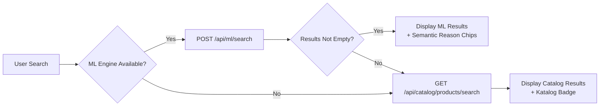

# 📱 Greenly Mobile App — Analisis UI & Integrasi ML Engine
**Project:** app (Flutter)
**Generated Date:** 29 June 2026
**Base URL (API Gateway):** `http://192.168.18.6/api`

## 📑 Table of Contents
- [1. Gambaran Umum Aplikasi](#1-gambaran-umum-aplikasi)
- [2. Integrasi ML Engine](#2-integrasi-ml-engine)
- [3. Search & Filtering System](#3-search--filtering-system)
- [4. Product Detail](#4-product-detail)
- [5. Home & Recommendations](#5-home--recommendations)
- [6. Diagram Alir Data ML](#6-diagram-alir-data-ml)
- [7. Daftar Semua API Endpoint](#7-daftar-semua-api-endpoint)

---

## 1. Gambaran Umum Aplikasi

| Aspek | Detail |
|-------|--------|
| **Framework** | Flutter (Dart) |
| **State Management** | `flutter_bloc` (BLoC pattern) |
| **HTTP Client** | Custom `ApiClient` wrapper |
| **API Gateway** | `http://192.168.18.6/api` (dari `.env`) |
| **Route** | `onGenerateRoute` dengan named routes |
| **Service Architecture** | 3 backend services: **Core**, **Catalog**, **ML Engine** |

### API URL Mapping
```dart
ENV.coreApiUrl    = '$api/core'     // → http://192.168.18.6/api/core
ENV.catalogApiUrl = '$api/catalog'  // → http://192.168.18.6/api/catalog
ENV.mlApiUrl      = '$api/ml'       // → http://192.168.18.6/api/ml
```

---

## 2. Integrasi ML Engine

Aplikasi mobile **terintegrasi langsung** dengan ML Engine (`/api/ml`) di **4 titik strategis**:

### 2.1 Rangkuman Integrasi ML

| # | Fitur | Endpoint ML | Service (Flutter) | Halaman |
|---|-------|-------------|-------------------|---------|
| 1 | **Semantic Search** | `POST /api/ml/search` | `SearchProductService` | Search Screen |
| 2 | **Home Recommendations** | `GET /api/ml/recommendations/home` | `MlProductService` | Home Screen |
| 3 | **Eco Picks** | `GET /api/ml/recommendations/eco` | `MlProductService` | Home Screen |
| 4 | **Similar Products** | `GET /api/ml/recommendations/similar/{id}` | `MlProductService` | Product Detail |

### 2.2 ML Product Service (`MlProductService`)

**File:** `lib/features/ml-products/service/ml_product_service.dart`

```dart
class MlProductService {
  static String get _base => ENV.mlApiUrl;  // /api/ml

  // Home recommendations
  Future<ApiResponse<List<MlProductResult>>> getHomeRecommendations({int limit = 10})
    => ApiClient.get('$_base/recommendations/home', query: {'limit': limit});

  // Eco-friendly picks
  Future<ApiResponse<List<MlProductResult>>> getEcoRecommendations({int limit = 10})
    => ApiClient.get('$_base/recommendations/eco', query: {'limit': limit});

  // Similar products by vector similarity
  Future<ApiResponse<List<MlProductResult>>> getSimilarProducts(String productId, {int limit = 8})
    => ApiClient.get('$_base/recommendations/similar/$productId', query: {'limit': limit});

  // Semantic search (via SearchProductService, not direct)
  Future<ApiResponse<List<MlProductResult>>> searchSemantic(MlSearchRequest request)
    => ApiClient.post('$_base/search', request.toJson());
}
```

### 2.3 ML Product Result Model (`MlProductResult`)

**File:** `lib/features/ml-products/domain/ml_product_result.dart`

Field-field yang dikembalikan oleh ML Engine dan digunakan di UI:

| Kategori | Field | Tipe | Digunakan Di |
|----------|-------|------|-------------|
| **Identity** | `id`, `productId`, `name`, `slug` | String | Semua card produk |
| **Price** | `price`, `originalPrice`, `finalPrice`, `currency` | double? | Price display |
| **Image** | `imageUrl`, `imageUrls` | String/List | Thumbnail produk |
| **ML Score** | `score` | double | Ranking urutan (internal) |
| **ML Reason** | `reason` | String | Chip alasan rekomendasi |
| **Eco** | `ecoScore`, `ecoLabel`, `ecoBadges`, `ecoReasons` | double/String/List | Eco badge, sustainability section |
| **Eco Detail** | `materialType`, `materialLabel`, `recyclable`, `carbonFootprint`, `carbonLabel` | double?/String?/bool? | Sustainability chips |
| **Promo** | `hasPromo`, `promotionCode`, `promotionLabel`, `discountPercent`, `discountAmount`, `savingLabel` | bool/String/double? | Promo section |
| **Stats** | `ratingAverage`, `reviewCount`, `favoriteCount`, `stock` | double?/int? | Rating, stock badge |
| **Info** | `categoryName`, `shopName` | String? | Chip kategori, nama toko |

### 2.4 Komponen ML di UI

**Folder:** `lib/features/ml-products/widgets/`

| Widget | File | Fungsi |
|--------|------|--------|
| `MlRecommendationSection` | `ml_recommendation_section.dart` | Section di home untuk "Rekomendasi Untuk Kamu" dan "Eco Picks" |
| `MlProductHorizontalList` | `ml_product_horizontal_list.dart` | Horizontal scroll list produk ML |
| `MlProductCard` | `ml_product_card.dart` | Card produk hasil ML dengan score badge |
| `SemanticReasonChip` | `semantic_reason_chip.dart` | Chip hijau "Mengapa ini muncul?" dengan alasan ML |
| `EcoScoreBadge` | `eco_score_badge.dart` | Badge skor eco pada card produk |

---

## 3. Search & Filtering System

### 3.1 Alur Search (Dual-Mode: ML Semantic + Catalog Fallback)

```
User input query
       │
       ▼
SearchProductScreen
       │
       ▼
SearchProductBloc.search(query, filters)
       │
       ▼
SearchProductService.search(query, limit, filters)
       │
       ├──▶ TRY: POST /api/ml/search  ←── ML ENGINE (PRIMARY)
       │      {
       │        "query": "bamboo toothbrush",
       │        "limit": 20,
       │        "filters": {
       │          "category_id": "xxx",
       │          "min_price": 5000,
       │          "max_price": 100000,
       │          "min_eco_score": 70
       │        }
       │      }
       │
       │   ┌─ Success + data not empty → Parse ML results
       │   │    SearchProductResult.fromMl()
       │   │    → fromFallback = false
       │   │
       │   └─ Failed / Empty → FALLBACK ke Catalog
       │
       └──▶ FALLBACK: GET /api/catalog/products/search?q=...&page=1&limit=20
                      SearchProductResult.fromCatalog()
                      → fromFallback = true (ditampilkan badge "Katalog")
```

### 3.2 Request Structure

**Semantic Search Request (ML):** `POST /api/ml/search`
```json
{
  "query": "bamboo toothbrush",
  "limit": 20,
  "filters": {
    "category_id": "abc123",
    "min_price": 5000,
    "max_price": 100000,
    "min_eco_score": 70
  }
}
```

**Fallback Catalog Request:** `GET /api/catalog/products/search`
```
?q=bamboo toothbrush
&page=1
&limit=20
&category_id=abc123
&min_price=5000
&max_price=100000
&min_eco_score=70
```

### 3.3 Filter Model (`SearchProductFilter`)

**File:** `lib/features/search-product/domain/dto/search_product_filter.dart`

| Field | JSON Key | Tipe | UI Component |
|-------|----------|------|-------------|
| `categoryId` | `category_id` | String? | Chip selector horizontal |
| `minPrice` | `min_price` | double? | TextField dengan prefix "Rp" |
| `maxPrice` | `max_price` | double? | TextField dengan prefix "Rp" |
| `minEcoScore` | `min_eco_score` | double? | Slider 0-100 + toggle switch |

### 3.4 UI Filter Sheet (`SearchFilterSheet`)

**File:** `lib/features/search-product/widgets/search_filter_sheet.dart`

Tampilan bottom sheet filter terdiri dari:
1. **Kategori** — Horizontal chip list dari `HomeService.getCategories(limit: 50)`
2. **Rentang Harga** — Dua TextField (min/max) dengan format Rupiah
3. **Skor Eco Minimum** — Slider (0-100) dengan toggle aktif/nonaktif
4. **Tombol** — Reset (hapus semua filter) + Terapkan (apply filter)

### 3.5 Search Result Display

Hasil pencarian dirender sebagai `SearchResultCard` → `ProductHorizontalCard`:
- Thumbnail gambar
- Nama produk
- Harga (final price, coret original price jika ada diskon)
- **Eco Score Badge** (lingkaran hijau dengan skor)
- **Semantic Reason Chip** (jika dari ML) — teks hijau "Mengapa ini muncul?"
- **Badge "Katalog"** (jika dari fallback)
- Tap → navigasi ke `ProductDetailScreen(slug: item.slug)`

### 3.6 Search History

- Disimpan di `SharedPreferences`
- Maksimal 10 item terakhir
- Bisa dihapus per-item atau di-clear all
- Tampil di bawah search bar sebelum user mengetik

---

## 4. Product Detail

### 4.1 Alur Detail Product

```
User tap produk → ProductDetailScreen(slug: slug)
       │
       ▼
initState()
  ├── ProductDetailBloc
  │     └── GetDetailProduct(slug)
  │           └── GET /api/catalog/products/slug/{slug}
  │                 → GetDetailProductRespon → DetailProductData
  │
  ├── HomeBloc (untuk "Produk Lainnya")
  │     └── GetFeaturedProductsRequested()
  │           └── GET /api/catalog/products?page=1&limit=10
  │
  ├── FavoriteBloc
  │     └── FavoriteCheckRequested(productId)
  │           └── GET /api/catalog/favorites/check/{productId}
  │
  └── SimilarProductsBloc   ←── ML ENGINE
        └── SimilarProductsRequested(productId)
              └── GET /api/ml/recommendations/similar/{productId}?limit=8
```

### 4.2 Detail Product Data (`DetailProductData`)

**File:** `lib/features/product-detail/domains/data/detail_product_data.dart`

Data berasal dari `GET /api/catalog/products/slug/{slug}` (Catalog Service):

```json
{
  "id": "...",
  "shopId": "...",
  "shopName": "...",
  "categoryId": "...",
  "name": "Produk Ramah Lingkungan",
  "slug": "produk-ramah-lingkungan",
  "description": "Deskripsi lengkap produk...",
  "sku": "SKU001",
  "favoriteCount": 42,
  "reviewCount": 15,
  "ratingAverage": 4.5,
  "isActive": true,
  "price": 50000,
  "originalPrice": 60000,
  "finalPrice": 45000,
  "currency": "IDR",
  "stock": 100,
  "imageUrls": ["https://..."],
  "categoryName": "Alat Mandi",
  "eco": {
    "score": 85,
    "label": "Sangat Ramah Lingkungan",
    "badges": ["Organic", "Recyclable"],
    "reasons": ["Bahan organik...", "Dapat didaur ulang"],
    "materialType": "organic_cotton",
    "materialLabel": "Katun Organik",
    "recyclable": true,
    "carbonFootprint": 5.2,
    "carbonLabel": "Rendah"
  },
  "promotion": { ... },
  "createdAt": "...",
  "updatedAt": "..."
}
```

### 4.3 Section Layout Detail Product

```
┌─────────────────────────────────┐
│ ProductImageGallery             │ ← Image slider + favorite toggle
│   (swipeable images)            │
├─────────────────────────────────┤
│ Category Badge                  │
│ Product Name                    │
│ SKU                             │
│ PriceDisplayWidget              │ ← Harga final, coret original, % diskon
│ PromoSection (if hasPromo)      │ ← Banner promo orange
│ StockBadgeWidget                │ ← Hijau "Stok tersedia" / Merah "Habis"
│ RatingReviewWidget              │ ← ★ 4.5 (15 ulasan) · ❤ 42 favorit
├─────────────────────────────────┤
│ SustainabilitySection           │ ← ECO FEATURE
│   "Kenapa produk ini ramah      │
│    lingkungan?"                 │
│   Eco 85 badge                  │
│   Eco badges chips              │
│   Alasan-alasan eco             │
│   Info bahan & carbon           │
├─────────────────────────────────┤
│ ShopInfoWidget                  │
│   Nama toko · Chat button       │
│   (tap → ke halaman toko)       │
├─────────────────────────────────┤
│ Deskripsi Produk                │
├─────────────────────────────────┤
│ ProductReviewsWidget            │ ← Reviews dari Catalog Service
│   (paginated, 10 per page)      │
├─────────────────────────────────┤
│ SimilarProductsSection          │ ← ML ENGINE
│   "Produk Mirip"                │
│   [Card] [Card] [Card] →       │ ← Horizontal scroll
│   MlProductHorizontalList       │
├─────────────────────────────────┤
│ Produk Lainnya                  │ ← Catalog products grid
│   [Grid] [Grid] [Grid]         │
│   (infinite scroll)             │
└─────────────────────────────────┘
```

### 4.4 Product Detail → ML Engine Flow

```
ProductDetailScreen(slug)
  ↓
GET /api/catalog/products/slug/{slug}
  ↓ (dapat product.id)
SimilarProductsBloc
  ↓
GET /api/ml/recommendations/similar/{productId}?limit=8
  ↓
MlProductResult[] ← Vector similarity dari FAISS
  ↓
SimilarProductsSection → MlProductHorizontalList
  ↓
Tap produk → ProductDetailScreen(slug: produk.slug)  (loop)
```

---

## 5. Home & Recommendations

### 5.1 Alur Home Screen

```
HomeScreen.initState()
  │
  ├── HomeBloc
  │     ├── GetActiveBannersRequested()
  │     │     └── GET /api/core/banners/active
  │     │
  │     ├── GetCategoriesRequested()
  │     │     └── GET /api/catalog/categories?page=1&limit=20
  │     │
  │     └── GetFeaturedProductsRequested()
  │           └── GET /api/catalog/products?page=1&limit=10
  │           └── LoadMoreProductsRequested() (infinite scroll)
  │
  └── HomeMlBloc   ←── ML ENGINE
        └── HomeMlStarted()
              │
              ├── Future #1: GET /api/ml/recommendations/home?limit=10
              │     └── → "Rekomendasi Untuk Kamu" section
              │
              └── Future #2: GET /api/ml/recommendations/eco?limit=10
                    └── → "Eco Picks" section
```

### 5.2 Layout Home Screen

```
┌─────────────────────────────────┐
│ Greenly Insight Section         │ ← Statistik dari data produk + ML
│   [Produk: 10] [Rata harga]     │
│   [Eco picks: 5] [Avg eco: 78]  │
│   Rating Distribution Chart     │
├─────────────────────────────────┤
│ BannerWidget                    │ ← Core Service banners
├─────────────────────────────────┤
│ CategoriesWidget                │ ← Catalog Service categories
│   [All] [Cat1] [Cat2] [Cat3] → │
├─────────────────────────────────┤
│ MlRecommendationSection         │ ← ML ENGINE
│   "Rekomendasi Untuk Kamu"      │
│   [Card] [Card] [Card] [Card] →│
├─────────────────────────────────┤
│ MlRecommendationSection         │ ← ML ENGINE
│   "Eco Picks"                   │
│   [Card] [Card] [Card] [Card] →│
├─────────────────────────────────┤
│ ProductsWidget                  │ ← Catalog products
│   Featured Products grid        │
│   (infinite scroll)             │
└─────────────────────────────────┘
```

### 5.3 Home Ml Bloc

**File:** `lib/features/Main/features/home/bloc/home_ml_bloc.dart`

```dart
HomeMlBloc(MlProductService)
  │
  ├── Event HomeMlStarted → _load()
  └── Event HomeMlRefreshed → _load()

_load():
  final results = await Future.wait([
    _service.getHomeRecommendations(limit: 10),  // GET /api/ml/recommendations/home
    _service.getEcoRecommendations(limit: 10),    // GET /api/ml/recommendations/eco
  ]);
  
  → emit(HomeMlState(homeRecs: ..., ecoRecs: ...))
```

---

## 6. Diagram Alir Data ML

### 6.1 Semantic Search Flow (End-to-End)

```
Flutter App                          Backend Services
───────────                          ───────────────
                                     ┌──────────────┐
User mengetik query                  │  CATALOG      │
       │                             │  SERVICE      │
       ▼                             │  (MongoDB)    │
SearchProductService                 └──────┬───────┘
       │                                    │
       ├──▶ POST /api/ml/search ───────▶ ┌──┴────────┐
       │     {query, filters}            │ ML ENGINE  │
       │                                 │ (FAISS +   │
       │     ◀── ML Results ──────────── │ SentenceTr)│
       │     [{reason, ecoScore, ...}]   └───────────┘
       │                                    ▲
       │  (fallback jika ML gagal)           │ (RabbitMQ events
       │                                    │  sync index)
       └──▶ GET /api/catalog/products/search ───┘
             ?q=...&category_id=...
```

### 6.2 Recommendation Flow (End-to-End)

```
Flutter App                          Backend Services
───────────                          ───────────────
Home Screen Load                     ┌──────────────┐
       │                             │  CATALOG      │
       ▼                             │  SERVICE      │
HomeMlBloc                           │  (MongoDB)    │
       │                             └──────┬───────┘
       ├──▶ GET /api/core/banners/active ───┤ Core
       │                                    │
       ├──▶ GET /api/catalog/categories ────┤ Catalog
       │                                    │
       ├──▶ GET /api/ml/recommendations ──▶ ┌┴─────────┐
       │     /home?limit=10                  │ ML ENGINE │
       │     ◀── Ranked Products ─────────── │ (Ranking  │
       │     [{reason, score, ecoScore ...}] │ Algorithm)│
       │                                    └──────────┘
       ├──▶ GET /api/ml/recommendations ──▶ ┌┴─────────┐
       │     /eco?limit=10                   │ ML ENGINE │
       │     ◀── Eco Products ────────────── │ (Eco Sort)│
       │                                    └──────────┘
       └──▶ GET /api/catalog/products ───────┤ Catalog
```

### 6.3 Product Detail + Similar Products Flow

```
Flutter App                          Backend Services
───────────                          ───────────────
ProductDetailScreen                  ┌──────────────┐
(slug: "produk-xyz")                 │  CATALOG      │
       │                             │  SERVICE      │
       ▼                             └──────┬───────┘
GET /api/catalog/products/slug/produk-xyz ───┤
       │                                    │
       ◀── DetailProductData ───────────────┤
       │  {id, eco, promotion, ...}         │
       │                                    │
       ▼ (dapat product.id)                 │
GET /api/ml/recommendations/similar/{id} ──▶ ┌┴─────────┐
       │     ?limit=8                        │ ML ENGINE │
       │     ◀── MlProductResult[] ───────── │ (FAISS    │
       │     [{reason, score, ...}]          │  Vectors) │
       │                                    └──────────┘
       ▼
SimilarProductsSection
"Produk Mirip" horizontal scroll
```

---

## 7. Daftar Semua API Endpoint (Mobile App)

### 7.1 Core Service (`/api/core`)

| Method | Endpoint | Service (Flutter) | Keterangan |
|--------|----------|-------------------|------------|
| POST | `/api/core/auth/register` | AuthService | Registrasi |
| POST | `/api/core/auth/login` | AuthService | Login |
| POST | `/api/core/auth/verify-email` | AuthService | Verifikasi email |
| POST | `/api/core/auth/verify-password` | AuthService | Verifikasi reset password |
| POST | `/api/core/auth/forgot-password` | AuthService | Lupa password |
| PATCH | `/api/core/auth/change-password` | AuthService | Ganti password |
| POST | `/api/core/auth/refresh-token` | AuthService | Refresh JWT token |
| POST | `/api/core/auth/resend-token` | AuthService | Kirim ulang token |
| POST | `/api/core/auth/logout` | AuthService | Logout |
| GET | `/api/core/me` | MeService, ProfileService | Profil user |
| PATCH | `/api/core/me/update` | MeService | Update profil |
| GET | `/api/core/me/following/shops` | ShopService | Toko yang diikuti |
| GET | `/api/core/banners/active` | HomeService | Banner aktif |
| GET | `/api/core/cart` | CartService | Keranjang |
| POST | `/api/core/cart/items` | CartService | Tambah item |
| PUT | `/api/core/cart/items/{productId}` | CartService | Update item |
| DELETE | `/api/core/cart/items/{productId}` | CartService | Hapus item |
| DELETE | `/api/core/cart` | CartService | Clear cart |
| POST | `/api/core/checkout` | OrderService | Checkout |
| GET | `/api/core/orders` | OrderService | Daftar order |
| GET | `/api/core/orders/{id}` | OrderService | Detail order |
| PATCH | `/api/core/orders/{id}/status` | OrderService | Update status |
| POST | `/api/core/payments/stripe/create-intent` | OrderService | Payment intent |
| GET | `/api/core/shops/{id}` | ShopService | Detail toko |
| POST | `/api/core/shops/{id}/follow` | ShopService | Follow toko |
| DELETE | `/api/core/shops/{id}/follow` | ShopService | Unfollow toko |
| GET | `/api/core/notifications` | NotificationService | Notifikasi |
| PATCH | `/api/core/notifications/{id}/read` | NotificationService | Baca notifikasi |
| PATCH | `/api/core/notifications/read-all` | NotificationService | Baca semua |
| GET | `/api/core/notifications/stream` | NotificationService | SSE stream notif |
| GET | `/api/core/chat/conversations` | ChatService | Percakapan chat |
| POST | `/api/core/chat/conversations` | ChatService | Buat percakapan |
| GET | `/api/core/chat/conversations/{id}/messages` | ChatService | Pesan chat |
| POST | `/api/core/chat/conversations/{id}/messages` | ChatService | Kirim pesan |
| GET | `/api/core/chat/conversations/{id}/stream` | ChatService | SSE stream chat |

### 7.2 Catalog Service (`/api/catalog`)

| Method | Endpoint | Service (Flutter) | Keterangan |
|--------|----------|-------------------|------------|
| GET | `/api/catalog/categories` | HomeService | Daftar kategori |
| GET | `/api/catalog/products` | HomeService / ProductListService | Produk (pagination) |
| GET | `/api/catalog/products/slug/{slug}` | **ProductDetailService** | **Detail produk** |
| GET | `/api/catalog/products/{id}` | CartService | Cek produk |
| GET | `/api/catalog/products/search` | **SearchProductService** (fallback) | **Search fallback** |
| GET | `/api/catalog/favorites` | FavoriteService | Daftar favorit |
| POST | `/api/catalog/favorites/toggle` | FavoriteService | Toggle favorit |
| GET | `/api/catalog/favorites/check/{productId}` | FavoriteService | Cek status favorit |
| GET | `/api/catalog/reviews/product/{productId}` | ProductReviewService | Review per produk |
| GET | `/api/catalog/reviews/mine` | ReviewService | Review user |
| POST | `/api/catalog/reviews` | ReviewService | Buat review |
| PUT | `/api/catalog/reviews/{id}` | ReviewService | Update review |
| DELETE | `/api/catalog/reviews/{id}` | ReviewService | Hapus review |
| POST | `/api/catalog/reviews/{id}/helpful` | ReviewService | Tandai helpful |

### 7.3 ML Engine (`/api/ml`) — **Fitur Unggulan**

| Method | Endpoint | Service (Flutter) | Halaman | Fungsi ML |
|--------|----------|-------------------|---------|-----------|
| **POST** | **`/api/ml/search`** | **SearchProductService** | Search | **Semantic search** — FAISS vector similarity |
| **GET** | **`/api/ml/recommendations/home`** | **MlProductService** | Home | **Home ranking** — weighted formula |
| **GET** | **`/api/ml/recommendations/eco`** | **MlProductService** | Home | **Eco picks** — sorted by eco score |
| **GET** | **`/api/ml/recommendations/similar/{id}`** | **MlProductService** | Product Detail | **Similar products** — FAISS vector similarity |

---

## 📝 Catatan Tambahan

### Ringkasan Koneksi Mobile → ML Engine

| Aspek | Detail |
|-------|--------|
| **Jumlah endpoint ML yang digunakan** | **4 endpoint** |
| **Service Flutter khusus ML** | `MlProductService` + `SearchProductService` |
| **BLoC khusus ML** | `HomeMlBloc` (home), `SimilarProductsBloc` (detail) |
| **Widget khusus ML** | 6 widget di `features/ml-products/widgets/` |
| **Model data ML** | `MlProductResult`, `MlSearchRequest`, `MlSearchFilter` |
| **Fallback mechanism** | Search: ML gagal → fallback ke Catalog Service |
| **Caching JWT user** | Redis di backend Catalog Service & Core Service |

### Pola Dual-Source Search

Salah satu temuan arsitektur paling penting: **setiap pencarian menggunakan ML sebagai primary source**, dan **catalog service sebagai fallback**:



### File Kunci untuk Referensi

| Path | Deskripsi |
|------|-----------|
| `lib/core/config/env.dart` | Konfigurasi URL API (core, catalog, ml) |
| `lib/core/utils/api_client.dart` | HTTP Client dengan auto-refresh token |
| `lib/features/search-product/service/search_product_service.dart` | Dual-mode search (ML + fallback) |
| `lib/features/search-product/domain/dto/semantic_search_request.dart` | Request DTO ke ML Engine |
| `lib/features/search-product/domain/dto/search_product_filter.dart` | Filter model (category, price, eco) |
| `lib/features/search-product/domain/data/search_product_result.dart` | Dual-source result parser (ML & Catalog) |
| `lib/features/ml-products/service/ml_product_service.dart` | Service khusus ML (recommendations, similar) |
| `lib/features/ml-products/domain/ml_product_result.dart` | ML result data model |
| `lib/features/product-detail/product_detail_service.dart` | Detail produk via Catalog Service |
| `lib/features/product-detail/product_detail_screen.dart` | Full layout detail produk |
| `lib/features/product-detail/widgets/similar_products_section.dart` | Section similar products (ML-powered) |
| `lib/features/product-detail/bloc/similar_products_bloc.dart` | BLoC untuk similar products |
| `lib/features/Main/features/home/bloc/home_ml_bloc.dart` | BLoC untuk ML recommendations di home |
| `lib/features/Main/features/home/home_screen.dart` | Home screen dengan ML sections |

### Total API Endpoint yang Dipanggil Mobile

| Service | Jumlah Endpoint |
|---------|----------------|
| Core Service | 34 endpoint |
| Catalog Service | 14 endpoint |
| **ML Engine** | **4 endpoint** |
| **Total** | **52 endpoint** |
