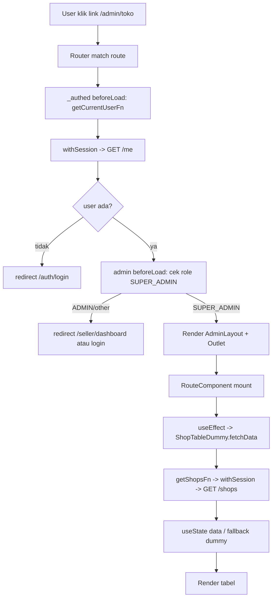
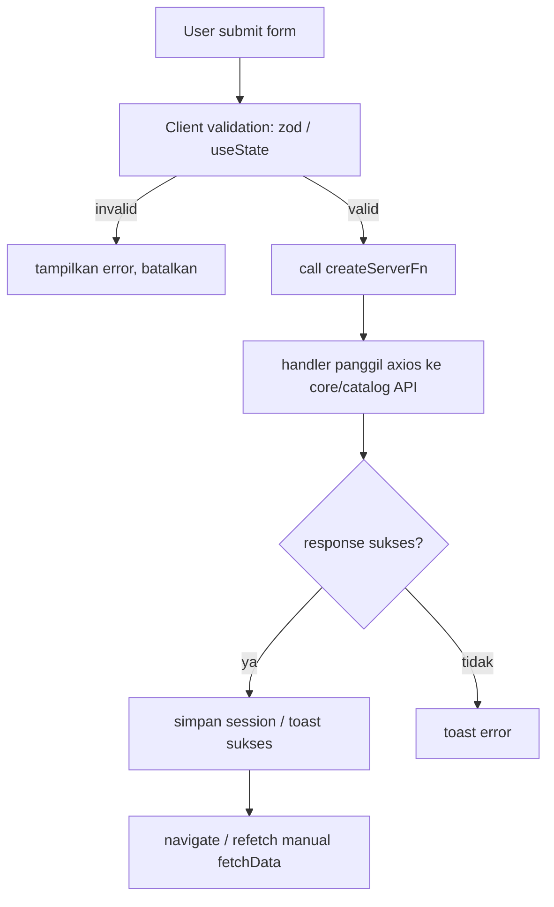

# Laporan Analisis Project: Greenly Mart (web)

> Audit statis berbasis pembacaan langsung seluruh source code di `apps/web`.
> Semua klaim ditelusuri ke file sumber (path dicantumkan per section).

## 1. Ringkasan Project

- **Nama project:** `web` (package.json:2) — frontend "Greenly Mart", marketplace UMKM/Petani.
- **Framework:** TanStack Start v1.132.0 (`@tanstack/react-start`), React 19.2 (`package.json:31-32`), routing via `@tanstack/react-router` v1.132.0, SSR lewat **Nitro** (`nitro-nightly`, `vite.config.ts:9,14`).
- **Bahasa:** TypeScript (strict mode, `tsconfig.json:22-27`).
- **Dependency kunci:**
  - Data fetching server: `createServerFn` (TanStack Start) — **tidak** pakai React Query untuk data produksi.
  - State server data: `@tanstack/react-query` v5.66 dipasang tapi **hanya dipakai di demo** (`src/routes/demo/tanstack-query.tsx`).
  - Styling: Tailwind CSS v4 (`@tailwindcss/vite`), shadcn/ui-style components (`components.json`), `radix-ui`, `class-variance-authority`, `clsx`, `tailwind-merge`.
  - Form: `@tanstack/react-form` (hanya di `FormLogin`).
  - Validasi: `zod` v4.
  - Ikon: `lucide-react`.
  - Toast: `sonner`.
  - HTTP client server: `axios`.
- **Tujuan:** Panel Admin (SUPER_ADMIN/ADMIN) dan Seller dashboard, plus landing page publik. Backend dipisah (core-service + catalog-service eksternal, lihat `AGENTS.md`).
- **Script:** `dev`, `build`, `preview`, `test` (`package.json:8-13`).

## 2. Struktur Folder

```
apps/web
├── .env.example                 # template env (TIDAK ada .env dibaca)
├── components.json              # konfigurasi shadcn/ui
├── package.json
├── tsconfig.json
├── vite.config.ts               # plugin: devtools, nitro, tsconfigPaths, tailwind, tanstackStart, react
├── public/                      # aset statis (logo, gambar toko/produk)
└── src
    ├── components
    │   ├── admin/               # ApprovalTable, CetegoryTable, CistomerTable, PesananTable, TokoTable
    │   ├── auth/                # FormLogin.tsx, FormRegister.tsx
    │   ├── seller/              # OrderTable.tsx, ProductTable.tsx
    │   ├── ui/                  # badge, button, card, field, input-group, input, label, separator, table, textarea
    │   ├── Header.tsx           # (ada tapi TIDAK dipakai)
    │   ├── LandingPage.tsx
    │   ├── SidebarAdmin.tsx
    │   └── SidebarSeller.tsx
    ├── constants/dummy.table/   # data contoh (approvals, categories, customers, orders, products, shops) + index
    ├── context/auth.tsx         # AuthProvider/useAuth — TIDAK dipakai di mana pun
    ├── hooks/
    │   ├── useAuth.ts           # stub kosong (export const useAuth = () => {})
    │   └── useSession.ts        # wrapper useSession (cookie session)
    ├── integrations/tanstack-query/  # root-provider.tsx, devtools.tsx
    ├── lib/                     # request.ts, roles.ts, utils.ts, zod.ts
    ├── router.tsx
    ├── routeTree.gen.ts         # generated (jangan edit manual)
    ├── routes/
    │   ├── __root.tsx
    │   ├── index.tsx            # "/" -> LandingPage
    │   ├── home.tsx             # "/home" -> placeholder
    │   ├── demo/tanstack-query.tsx
    │   ├── auth/login.tsx
    │   ├── auth/register.tsx    # redirect -> /auth/login
    │   └── _authed/
    │       ├── route.tsx        # guard global (getCurrentUserFn)
    │       ├── admin.tsx        # layout + role guard SUPER_ADMIN
    │       ├── seller.tsx       # layout + role guard ADMIN
    │       ├── user/data.tsx    # placeholder
    │       ├── admin/           # dashboard, approval, approval2(redirect), toko, tokotoko, pesanan, pesanini, kategori, daftarkategori, customer
    │       └── seller/          # dashboard, produk, produkdua, pesanan, pesanandua, customer, chat, laporan-keuangan
    ├── schema/auth.ts           # LoginSchema (zod)
    ├── server/                  # admin.ts, seller.ts, dashboard.ts, web-api.ts, auth.ts, api.ts, _request.ts
    ├── styles.css               # Tailwind v4 + design tokens (CSS variables)
    └── types/                   # api.response.ts, login.response.ts, server.ts, user.me.ts
```

## 3. Routing & Halaman

Routing berbasis file di `src/routes` (TanStack Start file-based routing). Konvensi: `_authed` = pathless layout (guard), `admin`/`seller` = route group bersarang.

| Path URL | File fisik | Loader | Auth Guard | Komponen utama |
|---|---|---|---|---|
| `/` | `routes/index.tsx` | – | – | `LandingPage` |
| `/home` | `routes/home.tsx` | – | – | teks placeholder |
| `/demo/tanstack-query` | `routes/demo/tanstack-query.tsx` | – | – | demo `useQuery` |
| `/auth/login` | `routes/auth/login.tsx` | – | public | `FormLogin` |
| `/auth/register` | `routes/auth/register.tsx` | – | `beforeLoad` redirect → login | `() => null` |
| `/_authed` (layout) | `routes/_authed/route.tsx` | – | `beforeLoad` → `getCurrentUserFn`, redirect ke login jika tidak login | – (Outlet) |
| `/admin/dashboard` | `routes/_authed/admin/dashboard.tsx` | – | `admin.tsx` (SUPER_ADMIN) | `getAdminDashboardFn` + UI manual |
| `/admin/approval` | `routes/_authed/admin/approval.tsx` | – | SUPER_ADMIN | `ApprovalTableDummy` |
| `/admin/approval2` | `routes/_authed/admin/approval2.tsx` | – | `beforeLoad` redirect → approval | `() => null` |
| `/admin/toko` | `routes/_authed/admin/toko.tsx` | – | SUPER_ADMIN | `ShopTableDummy` |
| `/admin/tokotoko` | `routes/_authed/admin/tokotoko.tsx` | – | SUPER_ADMIN | **hardcoded dummy** (tidak di sidebar) |
| `/admin/pesanan` | `routes/_authed/admin/pesanan.tsx` | – | SUPER_ADMIN | `OrderTableDummy` |
| `/admin/pesanini` | `routes/_authed/admin/pesanini.tsx` | – | SUPER_ADMIN | **hardcoded dummy** (tidak di sidebar) |
| `/admin/kategori` | `routes/_authed/admin/kategori.tsx` | – | SUPER_ADMIN | `CategoryTableDummy` |
| `/admin/daftarkategori` | `routes/_authed/admin/daftarkategori.tsx` | – | SUPER_ADMIN | **hardcoded dummy** (tidak di sidebar) |
| `/admin/customer` | `routes/_authed/admin/customer.tsx` | – | SUPER_ADMIN | `CustomerTableDummy` |
| `/seller/dashboard` | `routes/_authed/seller/dashboard.tsx` | – | `seller.tsx` (ADMIN) | `getSellerDashboardFn` |
| `/seller/produk` | `routes/_authed/seller/produk.tsx` | – | ADMIN | `ProductTableFull` |
| `/seller/produkdua` | `routes/_authed/seller/produkdua.tsx` | – | ADMIN | **hardcoded dummy** (tidak di sidebar) |
| `/seller/pesanan` | `routes/_authed/seller/pesanan.tsx` | – | ADMIN | `OrderTable` |
| `/seller/pesanandua` | `routes/_authed/seller/pesanandua.tsx` | – | ADMIN | **hardcoded dummy** (tidak di sidebar) |
| `/seller/customer` | `routes/_authed/seller/customer.tsx` | – | ADMIN | **hardcoded dummy** |
| `/seller/chat` | `routes/_authed/seller/chat.tsx` | – | ADMIN | **hardcoded dummy** |
| `/seller/laporan-keuangan` | `routes/_authed/seller/laporan-keuangan.tsx` | – | ADMIN | `getShopBalanceFn`/`getShopLedgerFn`/`getMyShopFn` |
| `/_authed/user/data` | `routes/_authed/user/data.tsx` | – | login-only (placeholder "Hello /admin/ha!") | teks placeholder |

**Catatan penting:**
- **Tidak ada satu pun route yang memakai `loader`** dari TanStack Router. Semua pengambilan data dilakukan di dalam komponen via `useServerFn` + `useEffect` + `useState` (`src/routes/_authed/admin/dashboard.tsx:26`, `src/components/admin/TokoTable.tsx:100`, dll).
- **Tidak ada `errorComponent`, `pendingComponent`, `notFoundComponent`** di level mana pun. Loading/error/empty state ditangani manual per-komponen.
- `admin.tsx`/`seller.tsx` pakai `beforeLoad` + `redirect`. Logika role: `admin.tsx:13-19` → SUPER_ADMIN lolos, ADMIN di-redirect ke `/seller/dashboard`, lainnya ke login. `seller.tsx:13-19` → ADMIN lolos, SUPER_ADMIN di-redirect ke `/admin/dashboard`. Jadi SUPER_ADMIN tidak bisa masuk area seller dan sebaliknya.

## 4. Pemetaan Page → Component

- **`/` (LandingPage)** `index.tsx` → `LandingPage` → `Button`, `Badge`, `Card`/`CardContent`, `Input`, `Textarea` (semua dari `#/components/ui`), `Link` (router). State lokal: `showPopup`, `isMobileMenuOpen`, `nama/wa/email/pesan`, `active`.
- **`/auth/login`** `login.tsx` → `FormLogin` → `Button`, `Card*` (Card, CardContent, CardDescription, CardFooter, CardHeader, CardTitle), `Field*` (ui/field), `Input`, `LoginSchema`, `loginFn`. State lokal: `showPassword`.
- **`/admin/dashboard`** → `getAdminDashboardFn` + sub-komponen lokal `StatCard`, `ProgressRow`, ikon SVG inline (`UserIcon`, `ShopIcon`, …).
- **`/admin/approval`** → `ApprovalTableDummy` (`components/admin/ApprovalTable.tsx`) → `Table*`, `Input`, `Button`, `Badge`, server fns `getApplicationsFn`/`reviewApplicationFn`. Modal detail & reject lokal.
- **`/admin/toko`** → `ShopTableDummy` (`components/admin/TokoTable.tsx`) → `Table*`, `Input`, `Button`, `Badge`, `getShopsFn`/`reviewApplicationFn`, dummy fallback `dummyShops`.
- **`/admin/pesanan`** → `OrderTableDummy` (`components/admin/PesananTable.tsx`) → `Table*`, `Input`, `Button`, `Badge`, `getAllOrdersFn`, dummy `dummyOrders`.
- **`/admin/kategori`** → `CategoryTableDummy` (`components/admin/CetegoryTable.tsx`) → `Table*`, `Input`, `Button`, `getCategoriesFn`/`createCategoryFn`/`updateCategoryFn`/`deleteCategoryFn`, dummy `dummyCategories`.
- **`/admin/customer`** → `CustomerTableDummy` (`components/admin/CistomerTable.tsx`) → `Table*`, `Input`, `Button`, `Badge`, `getUsersFn`/`updateUserStatusFn`, dummy `dummyCustomers`.
- **`/seller/dashboard`** → `getSellerDashboardFn` + `StatCard` lokal (data chart `ORDER_STATUS_DATA` **hardcoded**, `seller/dashboard.tsx:20-27`).
- **`/seller/produk`** → `ProductTableFull` (`components/seller/ProductTable.tsx`) → `Table*`, `Input`, `Button`, `getMyShopFn`/`getSellerProductsFn`/`createProductFn`/`updateProductFn`/`deleteProductFn`/`toggleProductFn`/`getCategoriesFn`.
- **`/seller/pesanan`** → `OrderTable` (`components/seller/OrderTable.tsx`) → `Table*`, `Button`, `Badge`, `getMyShopFn`/`getShopOrdersFn`/`updateOrderStatusFn`.
- **`/seller/laporan-keuangan`** → `getMyShopFn`/`getShopBalanceFn`/`getShopLedgerFn`, chart manual (bar chart div-based), filter tanggal/tipe, tabel ledger, `fallbackLedger`.
- **Halaman dummy (tokotoko, pesanini, daftarkategori, produkdua, pesanandua, customer, chat)** → render data `useState`/array literal hardcoded, tanpa koneksi server. Tidak direferensikan oleh sidebar mana pun.

## 5. UI & Design System

- **Styling:** Tailwind CSS v4 (CSS-first, `@import 'tailwindcss'` di `styles.css:1`). Tidak ada `tailwind.config.js` (codepath kosong di `components.json:11`).
- **Design tokens:** CSS variables di `:root` dan `.dark` (`styles.css:22-94`): `--background`, `--foreground`, `--primary (#16A34A)`, `--muted-foreground`, `--sidebar-start (#1B5E20)` / `--sidebar-end (#4CAF50)`, `--radius: 0.75rem`, chart colors, dll. Dipetakan ke utility Tailwind via `@theme inline` (`styles.css:95-132`).
- **Komponen reusable (shadcn-style)** di `src/components/ui/`: `badge`, `button`, `card`, `field`, `input-group`, `input`, `label`, `separator`, `table`, `textarea`. Dibangun di atas `radix-ui` + `class-variance-authority` + `cn()` (`lib/utils.ts`).
- **Layout components:** `SidebarAdmin.tsx`, `SidebarSeller.tsx` (desktop sticky + mobile drawer, branding gradient hijau, logout via `logoutFn`), `LandingPage.tsx` (navbar/hero/footer sendiri). `Header.tsx` ada tapi **tidak dipakai di mana pun**.
- **Icons:** `lucide-react` (sidebar, form) dan SVG inline (dashboard).
- **Tema terang/gelap:** token `.dark` disediakan, tapi **tidak ada toggle dark mode** dan `shellComponent`/`body` selalu terang.

## 6. State Management

- **Client state utama = `useState` lokal** di tiap komponen (tabel, form, filter, modal). Tidak ada Zustand/Jotai/Context global yang aktif.
- **TanStack Query (`@tanstack/react-query`)** di-setup di `integrations/tanstack-query/root-provider.tsx` dan dibungkus di `__root.tsx:36`, tapi **tidak dipakai untuk data produksi** — hanya `demo/tanstack-query.tsx` memanggil `useQuery`. Konsekuensi: tidak ada cache/refetch/invalidation terpusat; mutasi dilakukan manual lewat `fetchData()` di `useEffect`.
- **Session/auth state:** cookie-based via `useSession` (`hooks/useSession.ts`) dengan nama `app-session`. User saat ini di-fetch tiap navigasi `_authed` via `getCurrentUserFn` (`_authed/route.tsx:7`).
- **`context/auth.tsx` (AuthProvider + `useAuth`)** terdefinisi lengkap tapi **TIDAK di-mount di `__root.tsx`** dan tidak dipakai di file manapun (grep: hanya deklarasi sendiri). `hooks/useAuth.ts` adalah **stub kosong** yang bertabrakan nama dengan `useAuth` dari `context/auth.tsx` — dead code/legacy.
- **Form state:** `FormLogin` pakai `@tanstack/react-form` (`useForm`); semua form lain (kategori, produk, customer, reject modal) pakai `useState` manual → **tidak konsisten**.

## 7. Fungsionalitas Utama

1. **Autentikasi (Login)**
   - Trigger: submit `FormLogin`.
   - Alur: `loginFn` (`server/auth.ts:12`) → POST `/auth/login` (core API) → simpan `accessToken`/`refreshToken` ke cookie session (`useAppSession().update`) → `getDashboardPath` (`FormLogin.tsx:31`) menentukan rute berdasarkan role → `navigate`.
   - Validasi client: `LoginSchema` (zod) `validators.onSubmit` (`FormLogin.tsx:50`).
2. **Authorization / Guard**
   - `_authed/route.tsx` `beforeLoad` → `getCurrentUserFn` (`server/auth.ts:31`) → `withSession` → GET `/me`. Gagal → redirect login.
   - `admin.tsx`/`seller.tsx` `beforeLoad` → cek `context.user.roles` via `hasRole` (`lib/roles.ts:13`).
3. **CRUD Admin (toko, kategori, customer, pesanan, approval)**
   - Tabel mengambil data via server fn (`getShopsFn`, `getCategoriesFn`, `getUsersFn`, `getAllOrdersFn`, `getApplicationsFn`) dengan fallback ke dummy bila gagal/empty (`TokoTable.tsx:78-98`).
   - Mutasi: `reviewApplicationFn`, `createCategoryFn`, `updateCategoryFn`, `deleteCategoryFn`, `updateUserStatusFn` → toast sukses/gagal → `fetchData()` manual.
4. **CRUD Seller (produk)**
   - `ProductTableFull`: list (`getSellerProductsFn`), create/update (`createProductFn`/`updateProductFn`), delete (`deleteProductFn`), toggle aktif (`toggleProductFn`). Tanpa ID toko → pakai `fallbackProducts`.
5. **Manajemen pesanan seller**
   - `OrderTable`: list (`getShopOrdersFn`), update status (`updateOrderStatusFn`: PAID→PROCESSING→SHIPPED).
6. **Laporan keuangan seller**
   - `laporan-keuangan.tsx`: balance (`getShopBalanceFn`), ledger (`getShopLedgerFn`), filter tanggal + tipe + search, bar chart manual, fallback `fallbackLedger`.
7. **Dashboard**
   - Admin: `getAdminDashboardFn` (agregasi users/shops/orders/products/categories + revenue via `Promise.allSettled`).
   - Seller: `getSellerDashboardFn` (shop + produk + order + balance). **Chart status pesanan di-hardcode** (`ORDER_STATUS_DATA`), bukan dari API.
8. **Logout**
   - `SidebarAdmin`/`SidebarSeller` → `logoutFn` (`server/auth.ts:39`) → POST `/auth/logout` + `session.clear()` → navigate login.
9. **Halaman dummy (tokotoko, pesanini, daftarkategori, produkdua, pesanandua, customer, chat)**: data statis, hanya UI demo, tidak terhubung backend.

**Loading / Error / Empty state:** ditangani per-komponen (skeleton `animate-pulse` di dashboard; `Memuat...`/`Tidak ada data` di tabel). Konsisten di komponen tabel, tapi halaman dummy tidak punya state tersebut (statis). Tidak ada error boundary global.

## 8. Server Functions & API Routes

Semua server function pakai `createServerFn` dari `@tanstack/react-start`. Tiap handler memanggil backend eksternal lewat axios (`server/api.ts`).

| Nama | File | Method | Input (zod) | Fungsi | Catatan |
|---|---|---|---|---|---|
| `loginFn` | `server/auth.ts:12` | POST | `LoginSchema` | POST `/auth/login`, simpan token ke session | – |
| `getCurrentUserFn` | `server/auth.ts:31` | GET | – | GET `/me` (via `withSession`) | dipakai guard |
| `logoutFn` | `server/auth.ts:39` | POST | – | POST `/auth/logout` + `session.clear()` | – |
| `getUsersFn` | `server/admin.ts:46` | GET | page/limit/search/status | GET `/users` | |
| `updateUserStatusFn` | `server/admin.ts:61` | POST | id/status | PATCH `/users/:id` | |
| `getShopsFn` | `server/admin.ts:77` | GET | page/limit/search/status | GET `/shops` | |
| `updateShopStatusFn` | `server/admin.ts:92` | POST | id/status | PATCH `/shops/:id` | (tidak dipakai komponen) |
| `getApplicationsFn` | `server/admin.ts:107` | GET | page/limit/status | GET `/shops` + per-shop `/application` | N+1 calls |
| `reviewApplicationFn` | `server/admin.ts:147` | POST | shopId/status/notes | PATCH `/shops/:id/application/review` | |
| `getCategoriesFn` | `server/admin.ts:165` | GET | page/limit/search | GET `/categories` (catalog) | via `catalogRequest` |
| `createCategoryFn` | `server/admin.ts:175` | POST | name/parentId | POST `/categories` (catalog) | |
| `updateCategoryFn` | `server/admin.ts:184` | POST | id/name/parentId | PUT `/categories/:id` (catalog) | |
| `deleteCategoryFn` | `server/admin.ts:194` | POST | id | DELETE `/categories/:id` (catalog) | |
| `getAllOrdersFn` | `server/admin.ts:209` | GET | page/limit/status | GET `/orders` | |
| `getPlatformFinanceFn` | `server/admin.ts:223` | GET | – | GET `/admin/finance/overview` | **TIDAK dipakai** |
| `getMyShopFn` | `server/seller.ts:33` | GET | – | GET `/shops/me` | |
| `getSellerProductsFn` | `server/seller.ts:54` | GET | shopId/page/limit/search | GET `/products` (catalog) | |
| `createProductFn` | `server/seller.ts:82` | POST | ProductPayload | POST `/products` (catalog) | |
| `updateProductFn` | `server/seller.ts:91` | POST | id + payload | PUT `/products/:id` (catalog) | |
| `deleteProductFn` | `server/seller.ts:100` | POST | id | DELETE `/products/:id` (catalog) | |
| `toggleProductFn` | `server/seller.ts:109` | POST | id | PATCH `/products/:id/toggle` (catalog) | |
| `getShopOrdersFn` | `server/seller.ts:125` | GET | shopId/page/limit/status | GET `/orders/shop/:id` | |
| `updateOrderStatusFn` | `server/seller.ts:142` | POST | shopId/orderId/status | PATCH `/shops/:id/orders/:id/status` | |
| `getShopBalanceFn` | `server/seller.ts:161` | GET | shopId | GET `/shops/:id/finance/balance` | |
| `getShopLedgerFn` | `server/seller.ts:173` | GET | shopId/page/limit | GET `/shops/:id/finance/ledger` | |
| `getAdminDashboardFn` | `server/dashboard.ts:22` | GET | – | agregasi users/shops/orders/products/categories | |
| `getSellerDashboardFn` | `server/dashboard.ts:60` | GET | – | agregasi shop/produk/order/balance | |
| `listShopsFn` … `getShopRevenueFn` | `server/web-api.ts` (11 fns) | GET/POST | bermacam | duplikat `server/admin.ts` & `server/seller.ts` | **TIDAK dipakai di mana pun** |

**API routes khusus (TanStack Start server routes `routes/api/*`):** Tidak ditemukan. Semua komunikasi backend dilakukan lewat `createServerFn` yang mem-proxy ke core/catalog API eksternal.

## 9. Middleware & Autentikasi

- **Middleware (Nitro/logging/rate-limit):** Tidak ditemukan. `vite.config.ts` memasang `nitro()` tapi tidak ada file middleware/server handler khusus.
- **Auth/session mechanism:**
  - Cookie session via `@tanstack/react-start/server` `useSession` (`hooks/useSession.ts`), nama `app-session`, `httpOnly`, `sameSite: lax`, `secure` hanya di production. Password diambil dari `process.env.SESSION_SECRET!` (**tanpa validasi**).
  - Token akses (`accessToken`/`refreshToken`) disimpan di dalam session cookie, lalu disuntikkan sebagai `Authorization: Bearer` ke axios (`server/api.ts:11-15`).
  - **Refresh token otomatis:** `withSession` (`server/_request.ts:5`) menangkap 401, memanggil `/auth/refresh-token`, update session, retry handler. Jika gagal → `session.clear()` + throw.
  - **Pemisahan client/server env:** `api.ts` membaca `process.env.API_URL`/`CATALOG_API_URL` dengan fallback hardcoded (`server/api.ts:3-4`). Tidak ada file `env.ts` validasi zod. `.env.example` ada (`API_URL`, `CATALOG_API_URL`, `SESSION_SECRET`, `NODE_ENV`).
- **Authorization:** role-based di `beforeLoad` route (lihat §3). Helper `hasRole`/`normalizeRoles` (`lib/roles.ts`).

## 10. Alur Data (Data Flow)

### (a) Render halaman dengan data (contoh: `/admin/toko`)


### (b) Submit form / mutasi data (contoh: login & review toko)


**Catatan:** TanStack Query **tidak** dipakai untuk invalidasi cache; setelah mutasi, komponen memanggil `fetchData()` lagi via `useEffect` dependency. Pola ini konsisten tapi duplikatif.

## 11. Environment Variables

Dari `.env.example` (nilai asli tidak dibaca):
- `API_URL` — base URL core API (fallback hardcoded `https://greenly-api.duckdns.org/api/core` di `server/api.ts:3`).
- `CATALOG_API_URL` — base URL catalog API (fallback hardcoded di `server/api.ts:4`).
- `SESSION_SECRET` — password enkripsi cookie session (min 32 char), dibaca di `hooks/useSession.ts:11` dengan `!` (tidak divalidasi).
- `NODE_ENV` — mode production/development (mengatur `secure` cookie, `useSession.ts:13`).

**Risiko:** Tidak ada validasi zod/env di startup. Jika `SESSION_SECRET` kosong di production, `useSession` akan throw saat runtime (bukan saat boot).

## 12. Temuan & Potensi Masalah

- **Dead code / tidak terpakai:**
  - `server/web-api.ts` (11 server fn duplikat) — tidak diimpor di mana pun.
  - `context/auth.tsx` (AuthProvider + useAuth) — tidak di-mount/`useAuth` tidak dipakai.
  - `hooks/useAuth.ts` — stub kosong, nama tabrakan dengan `context/auth.tsx`.
  - `components/Header.tsx` — tidak direferensi.
  - `components/auth/FormRegister.tsx` — ada tapi route register redirect ke login.
  - `server/admin.ts: getPlatformFinanceFn` — tidak dipakai.
  - `routes/home.tsx` — placeholder "Hello /home" (tidak di-navigasi).
  - `routes/_authed/user/data.tsx` — placeholder "Hello /admin/ha!".
  - `routes/_authed/admin/approval2.tsx` — pure redirect.
- **Halaman dummy yang tidak konsisten:** `tokotoko`, `pesanini`, `daftarkategori` (admin) dan `produkdua`, `pesanandua`, `customer`, `chat` (seller) berisi data **hardcoded** dan **tidak ada di sidebar** — membingungkan, berpotensi diakses langsung via URL.
- **Duplikasi server fn & helper:** `server/admin.ts` dan `server/seller.ts` masing-masing punya `catalogRequest`, `cleanParams`, `ApiResult` identik; plus tumpang-tindih dengan `server/web-api.ts`.
- **Naming inconsistency:** typo filename `CetegoryTable.tsx` (Category), `CistomerTable.tsx` (Customer); route `tokotoko`/`pesanini`/`daftarkategori` (Indonesian) vs `approval`/`customer` (English). Campur aduk kebab/pascal.
- **TanStack Query terpasang tapi tidak dipakai** untuk data — pemborosan & inkonsistensi pola data fetching.
- **Tidak ada route-level `errorComponent`/`pendingComponent`/`notFoundComponent`** — tidak ada global error boundary; error tak tertangani akan merusak halaman.
- **N+1 query:** `getApplicationsFn` (`server/admin.ts:107`) melakukan GET `/shops` lalu loop `Promise.all` GET `/shops/:id/application` per toko.
- **Fallback data menutupi kegagalan:** banyak tabel bila API gagal/empty langsung pakai dummy (`TokoTable.tsx:95-97`, `CetegoryTable.tsx:84-87`, dll) → user tidak tahu data asli gagal; hanya toast singkat.
- **Seller dashboard chart di-hardcode** (`ORDER_STATUS_DATA`, `seller/dashboard.tsx:20-27`) — bukan data asli.
- **Session cookie `secure` hanya di production** & `sameSite: lax` — acceptable, tapi tidak ada CSRF protection eksplisit.
- **`useSession` membaca `process.env.SESSION_SECRET!` tanpa validasi** — risiko runtime di production.
- **`getCurrentUserFn` dipanggil setiap navigasi `_authed`** (tidak di-cache) → N calls ke `/me` per sesi navigasi.
- **`updateShopStatusFn`** (`server/admin.ts:92`) didefinisikan tapi tidak ada komponen yang memanggilnya (status toko diubah via `reviewApplicationFn` di `TokoTable`).

## 13. Rekomendasi (prioritas tinggi → rendah)

1. **Hapus/rapikan dead code:** `server/web-api.ts`, `context/auth.tsx`, `hooks/useAuth.ts` (stub), `components/Header.tsx`, `FormRegister.tsx`, `getPlatformFinanceFn`, `routes/home.tsx`, `_authed/user/data.tsx`, `approval2.tsx`. Kurangi kebingungan developer baru.
2. **Putuskan nasib halaman dummy** (`tokotoko`, `pesanini`, `daftarkategori`, `produkdua`, `pesanandua`, `customer`, `chat`):要么 sambungkan ke API nyata & masukkan ke sidebar, atau hapus. Jangan biarkan route berisi data hardcoded yang bisa diakses publik (walau butuh login).
3. **Terapkan validasi env** (mis. `src/env.ts` dengan zod) untuk `SESSION_SECRET` (wajib ≥32 char) & `API_URL`/`CATALOG_API_URL` saat boot — cegah miskonfigurasi production.
4. **Gunakan TanStack Query secara konsisten** untuk data produksi (ganti pola `useEffect`+`useState` manual): dapatkan caching, `useMutation` + `invalidateQueries`, dan loading/error state terpusat. Atau sebaliknya, lepas dependency `@tanstack/react-query` jika tidak akan dipakai.
5. **Tambahkan `errorComponent`/`notFoundComponent`** di `__root.tsx` (dan/atau tiap layout) sebagai global error boundary.
6. **Hentikan fallback dummy menutupi kegagalan API** — tampilkan empty state jelas + pesan error persisten, jangan silently ganti dengan data contoh (kecuali mode demo eksplisit).
7. **Normalisasi penamaan file:** perbaiki `CetegoryTable`→`CategoryTable`, `CistomerTable`→`CustomerTable`; seragamkan route (English kebab-case).
8. **Singkirkan duplikasi server fn:** gabungkan `server/admin.ts`, `server/seller.ts`, `server/web-api.ts` ke modul bersama; ekstrak `catalogRequest`/`cleanParams`/`ApiResult` ke `server/_request.ts` atau `lib`.
9. **Optimasi N+1** di `getApplicationsFn` (minta endpoint agregat dari backend, atau cache per shop).
10. **Cache `getCurrentUserFn`** (mis. via React Query `useQuery` di root atau session singleton) agar tidak hit `/me` tiap navigasi.
11. **Gunakan TanStack Form untuk semua form** (kategori/produk/customer) agar validasi & state konsisten dengan `FormLogin`.
12. **Tambahkan dark-mode toggle** (token `.dark` sudah ada) jika diinginkan, atau hapus token yang tidak terpakai.

---

*Audit selesai tanpa mengubah satupun kode (sesuai instruksi). Semua temuan ditelusuri ke file sumber di `apps/web/src`.*
