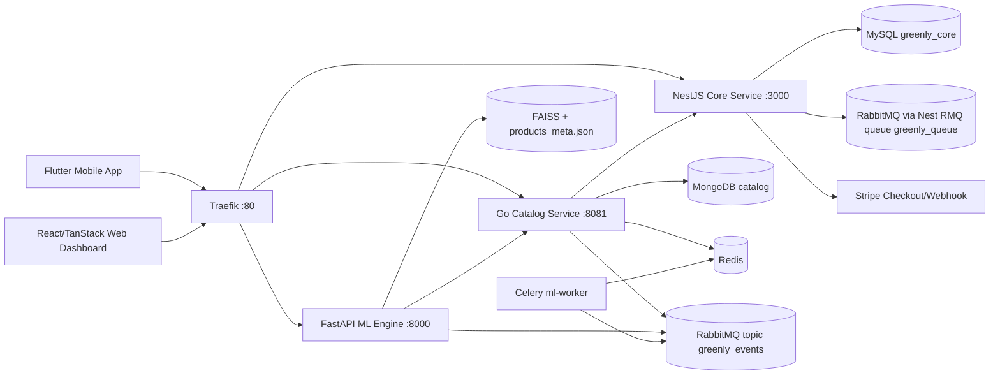
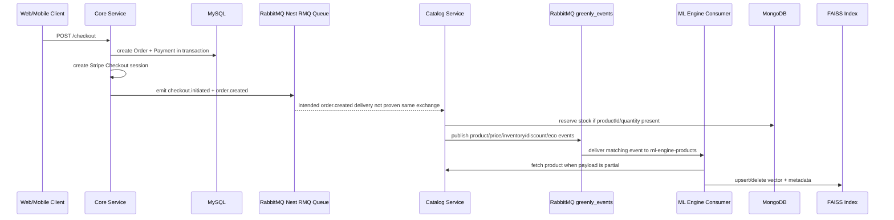
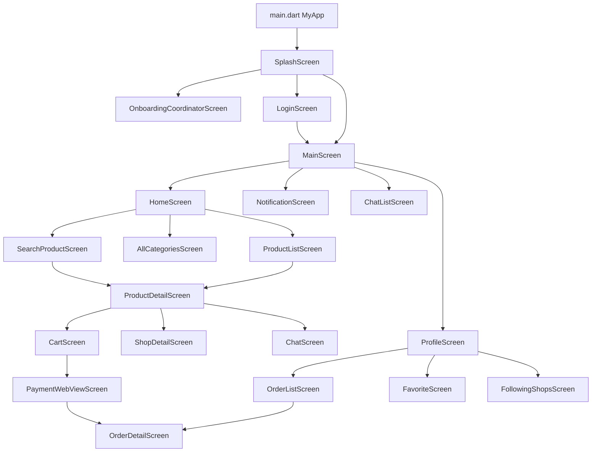

# Event-Driven Architecture & Full Codebase Analysis

## 1. Executive Summary

Greenly adalah polyglot full-stack monorepo untuk marketplace produk eco-friendly. Codebase aktual menunjukkan lima area runtime utama: Flutter mobile app di `apps/app`, web dashboard React/TanStack di `apps/web`, `core-service` NestJS + Prisma + MySQL, `catalog-service` Go/Gin + MongoDB, dan `ml-engine` FastAPI + FAISS. Runtime lokal diorkestrasi oleh `docker-compose.yml` dengan Traefik, MySQL, MongoDB, Redis, RabbitMQ, core-service, catalog-service, ml-engine, dan ml-worker.

Event-driven architecture sudah ada, tetapi belum seragam antar service. `catalog-service` memakai RabbitMQ AMQP langsung dengan exchange topic `greenly_events`, queue `catalog_service_queue`, DLX `greenly_events_dlx`, dan DLQ `catalog_service_dlq`. `ml-engine` memakai Kombu consumer pada queue `ml-engine-products` yang bind ke `greenly_events` dengan routing key `#`. `core-service` memakai NestJS RMQ `ClientProxy` melalui `services/core-service/src/libs/messagging/messagging.service.ts`, tetapi queue/exchange detailnya mengikuti transport Nest RMQ dan tidak terlihat sebagai topic exchange `greenly_events` di file yang dianalisis.

Risiko terbesar yang ditemukan adalah kontrak event lintas service belum konsisten. Contoh nyata: `core-service` publish `order.created` dengan `items[]` di `services/core-service/src/modules/commerce/checkout/checkout.service.ts`, sedangkan handler `catalog-service` pada `services/catalog-service/internal/rabbitmq/init.go` hanya melakukan reserve stock jika `event.ProductID` tunggal terisi. Ini berarti stock reservation untuk checkout multi-item berpotensi tidak jalan walaupun event terkirim.

Mobile app cukup lengkap untuk auth, onboarding, home, product, search, cart, checkout, order, chat, profile, favorite, shop, review, banner, dan promo display. Mobile memakai `flutter_bloc`, `ApiClient` terpusat, secure token storage, dan SSE untuk chat/notification stream. Risiko mobile terbesar adalah enrichment cart per item yang memicu banyak request ke catalog/core, beberapa flow masih memakai local `setState`, dan belum ditemukan offline cache/retry backoff selain refresh token untuk 401.

Web dashboard memakai TanStack Start/Router/Query, server functions, session cookie, dan API modules untuk admin/seller. Beberapa area sudah memanggil backend (`apps/web/src/features/admin/api.ts`, `apps/web/src/features/seller/api.ts`, `apps/web/src/features/dashboard/api.ts`), tetapi masih ada dummy constants dan login dummy di `apps/web/src/components/auth/FormLogin.tsx`.

## 2. Repository Scope

| Area | Path | Evidence yang dibaca | Ringkasan |
|---|---|---|---|
| Root runtime | `docker-compose.yml`, `.env.example` | service, port, env, volume, network | Orkestrasi Traefik, MySQL, MongoDB, Redis, RabbitMQ, core, catalog, ML |
| Core backend | `services/core-service/src`, `services/core-service/prisma/schema.prisma` | Nest modules, controllers, services, publishers, consumers, schema | Auth, identity, shops, commerce, finance, promotion, notification, chat, banners |
| Catalog backend | `services/catalog-service` | Go router/service/repository, RabbitMQ, Redis, Mongo models | Product/catalog, categories, inventory, price, discount, eco attributes, reviews, favorites |
| ML engine | `services/ml-engine` | FastAPI routers, Kombu consumer, Celery, vector store | Semantic search, recommendations, FAISS index, event-driven upsert/delete |
| Mobile UI | `apps/app/lib`, `apps/app/pubspec.yaml` | Flutter entry, router, services, BLoCs, screens, widgets | Mobile marketplace app with BLoC and HTTP client |
| Web UI | `apps/web/src`, `apps/web/package.json` | TanStack routes, server functions, components | Admin/seller dashboard with mixed real API and dummy remnants |
| Infra | `infra/traefik/*.yml`, `docker-compose.yml` | Traefik static/dynamic config and Compose labels | Reverse proxy path routing; middleware file exists but Compose labels do not attach it |

## 3. High-Level Architecture

Monorepo ini memisahkan domain runtime menjadi:

| Component | Stack | Responsibility aktual dari source |
|---|---|---|
| `apps/app` | Flutter, `flutter_bloc`, `http`, secure storage | Consumer-facing mobile app untuk auth, browsing produk, search, cart, checkout, order, chat, profile |
| `apps/web` | React 19, TanStack Start/Router/Query, Axios, Tailwind | Admin/seller dashboard untuk dashboard, users, shops, applications, categories, products, orders, finance |
| `services/core-service` | NestJS, Prisma, MySQL, Stripe, RabbitMQ client | Auth/JWT, users/roles, shops, cart, checkout/order, payment/refund/payout/ledger, promotion, banner, notification, chat |
| `services/catalog-service` | Go/Gin, MongoDB, Redis, RabbitMQ AMQP | Products, categories, inventory, price, discounts, active price, eco attributes, favorites, reviews, product ratings |
| `services/ml-engine` | FastAPI, FAISS, sentence-transformers/hash embeddings, Celery, Kombu | Semantic search, recommendations, eco score, product index rebuild/upsert/delete |
| `infra` | Traefik | Reverse proxy config and optional security/rate-limit middleware |



Catatan diagram: `core-service` dan `catalog-service` sama-sama memakai RabbitMQ, tetapi implementasi core memakai Nest RMQ queue (`RABBITMQ_QUEUE`, default `greenly_queue`) sementara catalog/ML memakai exchange topic eksplisit `greenly_events`. Belum ditemukan bukti bahwa keduanya memakai exchange yang sama.

## 4. Runtime System Map

| Runtime | Source | Port/env | Dependency |
|---|---|---|---|
| Traefik | `docker-compose.yml`, `infra/traefik/traefik.yml` | `HTTP_PORT:-80`, dashboard `8080` | Docker provider, network `${COMPOSE_PROJECT_NAME}_network` |
| MySQL | `docker-compose.yml` | host `3307`, container `3306` | `core-service` via `DATABASE_URL` |
| MongoDB | `docker-compose.yml` | `27017` | `catalog-service` via `MONGODB_URL` |
| Redis | `docker-compose.yml` | `6379` | catalog cache/auth cache, ML Celery backend, env for core |
| RabbitMQ | `docker-compose.yml` | AMQP `5672`, management `15672` | core RMQ, catalog publisher/consumer, ML consumer/Celery broker |
| core-service | `docker-compose.yml` | internal `3000`, public `/api/core` | MySQL, Redis, RabbitMQ, ML URL, Stripe env |
| catalog-service | `docker-compose.yml` | internal `8081`, public `/api/catalog` | MongoDB, Redis, RabbitMQ, core-service HTTP |
| ml-engine | `docker-compose.yml` | internal `8000`, public `/api/ml` | catalog-service, Redis, RabbitMQ, FAISS paths |
| ml-worker | `docker-compose.yml` | command `uv run celery -A app.workers.celery_app worker` | RabbitMQ broker, Redis backend |

Traefik Compose labels:

| Public prefix | Target service | Strip prefix |
|---|---|---|
| `/api/core` | `core-service:3000` | yes |
| `/api/catalog` | `catalog-service:8081` | yes |
| `/api/ml` | `ml-engine:8000` | yes |

`infra/traefik/dynamic.yml` mendefinisikan `security-headers` dan `rate-limit`, tetapi belum ditemukan label Compose yang memasang middleware tersebut ke router `core`, `catalog`, atau `ml`.

## 5. Service Responsibility Breakdown

### core-service

| Module | Evidence path | Responsibility |
|---|---|---|
| Auth | `services/core-service/src/modules/auth/*` | register, login, refresh-token, email verification, forgot/change password, logout, `auth/me` |
| Identity | `services/core-service/src/modules/identity/*` | users, roles, profile/me |
| Shops | `services/core-service/src/modules/shops/*` | shop CRUD, application/review, member, follower, dashboard, finance/order submodules |
| Commerce | `services/core-service/src/modules/commerce/*` | cart, checkout, order lifecycle |
| Finance | `services/core-service/src/modules/finance/*` | payment, Stripe webhook, ledger, payout, refund, finance overview |
| Promotion | `services/core-service/src/modules/promotion/*` | promotion CRUD, validation, usage, event publish |
| Notification | `services/core-service/src/modules/notification/*` | notification API and realtime stream |
| Chat | `services/core-service/src/modules/chat/*` | conversation/message API and realtime stream |
| Banner | `services/core-service/src/modules/banner/*` | admin banner and public active banners |

Core data model in `services/core-service/prisma/schema.prisma` mencakup `User`, `UserProfile`, `Role`, `AuthToken`, `Shop`, `ShopApplication`, `ShopMember`, `Cart`, `CartItem`, `Order`, `OrderItem`, `Payment`, `Refund`, `ShopLedger`, `Payout`, `Promotion`, `Banner`, `Notification`, `UserEvent`, `ChatConversation`, `ChatParticipant`, dan `ChatMessage`.

### catalog-service

| Module | Evidence path | Responsibility |
|---|---|---|
| Products | `services/catalog-service/modules/products/*` | product list/detail/search/create/update/delete/toggle/bulk, product enrichment |
| Categories | `services/catalog-service/modules/categories/*` | category CRUD/list |
| Inventory | `services/catalog-service/modules/inventory/*` | stock, reserved stock, reserve/release endpoints |
| Price/active price | `services/catalog-service/modules/price/*`, `modules/active_price/*` | price CRUD/update and active price recalculation |
| Discount | `services/catalog-service/modules/product_discount/*` | product discount create/update/delete |
| Eco attribute | `services/catalog-service/modules/eco_attribute/*` | product eco metadata |
| Product image | `services/catalog-service/modules/product_image/*` | product image management |
| Favorites/reviews/rating | `services/catalog-service/modules/favorites/*`, `reviews/*`, `product_rating/*` | wishlist, reviews, rating aggregation endpoints |
| RabbitMQ | `services/catalog-service/internal/rabbitmq/*` | AMQP publisher/consumer, DLQ, event handlers |

Catalog validates auth by JWT and/or core-service lookup in `services/catalog-service/middleware/auth_middleware.go` and `services/catalog-service/internal/coreclient/init.go`.

### ml-engine

| Area | Evidence path | Responsibility |
|---|---|---|
| Search API | `services/ml-engine/app/api/search.py` | `/search`, `/products/index`, `/products/upsert`, `/products/rebuild-index`, product delete |
| Recommendation API | `services/ml-engine/app/api/recommendation.py` | `/recommendations/home`, `/recommendations/similar/{product_id}`, `/recommendations/eco` |
| Eco score API | `services/ml-engine/app/api/eco.py` | eco scoring endpoint |
| Vector store | `services/ml-engine/app/core/vector_store.py` | FAISS or numpy fallback, persisted product metadata/embeddings |
| Embedding | `services/ml-engine/app/core/embedding.py` | sentence-transformers or hash embedding fallback |
| Event consumer | `services/ml-engine/app/workers/event_consumer.py` | RabbitMQ event listener to upsert/delete product index |
| Celery | `services/ml-engine/app/workers/celery_app.py`, `tasks.py` | `ml.rebuild_index` background task |

### apps/app

Mobile role: customer app for auth, onboarding, home/catalog discovery, semantic search, product detail/review, cart, checkout/payment webview, order list/detail, shop/following, chat, notifications, profile.

### apps/web

Web role: admin/seller dashboard. It includes real server functions for admin/seller operations and dashboard summaries, but also dummy constants and dummy login remnants.

## 6. Event-Driven System Analysis

### Event infrastructure found

| Service | Publisher | Consumer | Queue/exchange details |
|---|---|---|---|
| core-service | `MessaggingService.publish()` via Nest `ClientProxy.emit` | `@EventPattern` classes in auth/shops | Queue from `RABBITMQ_QUEUE` default `greenly_queue`; no explicit exchange found |
| catalog-service | `internal/rabbitmq/publisher.go` | `internal/rabbitmq/consumer.go`, `internal/rabbitmq/init.go` | exchange `greenly_events`, type `topic`, queue `catalog_service_queue`, DLX `greenly_events_dlx`, DLQ `catalog_service_dlq` |
| ml-engine | Tidak ditemukan publisher event domain | `app/workers/event_consumer.py` | queue `ml-engine-products`, exchange `greenly_events`, routing key `#` |
| ml-worker | Celery task | Celery worker | broker `RABBITMQ_URL`, backend `REDIS_URL` |

### Event map

| Event/routing key | Publisher evidence | Consumer evidence | Payload evidence | Notes |
|---|---|---|---|---|
| `auth.user.registered` | `services/core-service/src/modules/auth/publisher/user_registered.publisher.ts` | `auth/consumer/email.consume.ts` | `PayloadEmail` | Sends verification email via circuit breaker |
| `auth.user.password.reset.requested` | `user_forgot_password.publisher.ts` | `auth/consumer/email.consume.ts` | `PayloadEmail` | Sends reset OTP email |
| `auth.user.resend.token` | `user_resend_token.publisher.ts` | `auth/consumer/email.consume.ts` | `PayloadEmail` | Sends OTP resend email |
| `auth.user.deleted` | `identity/users/publisher/deleted.user.publisher.ts` | `auth/consumer/email.consume.ts` | email payload | Core also has shops consumer for `user.deleted`, not `auth.user.deleted` |
| `cart.updated` | `commerce/cart/publishers/cart-updated.publisher.ts` | Belum ditemukan consumer eksplisit | `CartUpdatedPayload` | Internal/event future use |
| `cart.cleared` | `commerce/cart/publishers/cart-cleared.publisher.ts` | Belum ditemukan consumer eksplisit | `CartClearedPayload` | Internal/event future use |
| `checkout.initiated` | `commerce/checkout/checkout-initiated.publisher.ts` | Belum ditemukan consumer eksplisit | `CheckoutInitiatedPayload` | Published after checkout session creation |
| `order.created` | `commerce/order/publishers/order-created.publisher.ts`, `checkout.service.ts` | `catalog-service/internal/rabbitmq/init.go` | `OrderCreatedPayload` has `items[]` | Catalog handler currently uses top-level `productId/quantity`; mismatch risk |
| `order.status.changed` | `commerce/order/publishers/order-status-changed.publisher.ts` | Belum ditemukan external consumer eksplisit | `OrderStatusChangedPayload` | Published after manual status update/payment callback |
| `order.cancelled` | Belum ditemukan publisher eksplisit in core path analyzed | `core shops/order-events.consumer.ts`, `catalog-service/internal/rabbitmq/init.go` | `OrderCancelledEvent` | Consumer exists; publisher not confirmed |
| `payment.completed` | `finance/payment/publishers/payment-publishers.ts`, `commerce/order/publishers/payment.publisher.ts` | `shops/consumer/payment-events.consumer.ts` | Inconsistent shape across publishers/consumer | Consumer expects `source: payment-service`, publisher sets `source: core-service` in finance path |
| `payment.failed` | `finance/payment/publishers/payment-publishers.ts`, `commerce/order/publishers/payment.publisher.ts` | `shops/consumer/payment-events.consumer.ts` | Inconsistent shape | Same source/schema mismatch risk |
| `refund.processed` | `finance/refund/publishers/refund-processed.publisher.ts`, commerce publisher | Belum ditemukan consumer eksplisit selain shop order publisher names | `RefundProcessedPayload` | Needs contract verification |
| `ledger.created` | `finance/ledger/publishers/ledger-created.publisher.ts` | Belum ditemukan consumer eksplisit | finance event | Needs verification |
| `payout.status.changed` | `finance/payout/publishers/payout-status-changed.publisher.ts` | Belum ditemukan consumer eksplisit | finance event | Needs verification |
| `shop.payout.processed` | Belum ditemukan publisher eksplisit | `shops/consumer/payout-events.consumer.ts` | `PayoutProcessedEventSchema` | Consumer exists; source event not found |
| `promotion.created` | `promotion/publishers/promotion-created.publisher.ts` | `catalog-service/internal/rabbitmq/init.go` | `promotionId`, `code`, `type`, `discountVal` | Catalog logs only |
| `promotion.activated` | Belum ditemukan publisher eksplisit | `shops/consumer/promotion-events.consumer.ts`, catalog consumer | schema in consumers | Core consumer logs/cache TODO; catalog recalculates active price |
| `promotion.expired` | `promotion/publishers/promotion-expired.publisher.ts` | `catalog-service/internal/rabbitmq/init.go` | `promotionId`, `code`, `endedAt/timestamp` | Catalog recalculates active price |
| `promotion.used` | `promotion/publishers/promotion-used.publisher.ts` | Belum ditemukan consumer eksplisit | promotion usage payload | Usage increment already done in DB before publish |
| `shop.created` | `shops/publisher/shop.created.publisher.ts` | Belum ditemukan consumer eksplisit | shop event | Published after shop creation |
| `shop.approved` | `shops/publisher/shop.application.publisher.ts` | `catalog-service/internal/rabbitmq/init.go` | `shopId`, owner/status payload | Catalog enables products by shop |
| `shop.application.submitted` | `shops/publisher/shop.application.publisher.ts` | Belum ditemukan consumer eksplisit | application payload | Published from application flow |
| `shop.member.added` / `shop.member.removed` | `shops/publisher/shop.member.publisher.ts` | Belum ditemukan consumer eksplisit | member payload | Future integration candidate |
| `shop.follower.added` / `shop.follower.removed` | `shops/publisher/shop.follower.publisher.ts` | Belum ditemukan consumer eksplisit | follower payload | Published after follow/unfollow |
| `shop.order.status_changed` | `shops/publisher/shop.order.publisher.ts` | Belum ditemukan consumer eksplisit | shop order event | Future integration candidate |
| `shop.order.refund_processed` | `shops/publisher/shop.order.publisher.ts` | Belum ditemukan consumer eksplisit | refund event | Future integration candidate |
| `shop.payout.requested` | `shops/publisher/shop.finance.publisher.ts` | Belum ditemukan consumer eksplisit | payout payload | Different from finance `payout.requested` constant |
| `product.created` | `catalog-service/internal/rabbitmq/publisher.go` | `ml-engine/app/workers/event_consumer.py` | `ProductEventPayload` | ML upserts direct payload if `name` present |
| `product.updated` | catalog publisher | ML consumer | `ProductEventPayload` | ML upserts |
| `product.deleted` | catalog publisher | ML consumer | `ProductEventPayload` | ML deletes vector |
| `inventory.updated` | catalog publisher | ML consumer | `InventoryEventPayload` | ML fetches product from catalog because no `name` |
| `price.updated` | catalog publisher | ML consumer | `PriceEventPayload` | ML fetches product |
| `discount.applied` | catalog publisher | ML consumer | `DiscountEventPayload` | ML fetches product |
| `product.eco_attribute.updated` | catalog publisher | ML consumer | `EcoAttributeEventPayload` | ML fetches/upserts product |
| `ml.product.created/updated`, `ml.inventory.updated`, `ml.price.updated`, `ml.discount.applied` | catalog publisher methods exist | ML consumer supports keys | ML payload structs exist | Belum ditemukan call site nyata dari modules yang memakai `PublishML*` |
| `product.image.uploaded/deleted` | catalog publisher methods exist | Belum ditemukan consumer eksplisit | image payload | Belum ditemukan call site nyata di router adapter |

### Event flow diagram



Catatan penting: diagram di atas menunjukkan intended business flow. Berdasarkan source, core RMQ transport dan catalog topic exchange belum terbukti memakai exchange/queue yang sama. Ini perlu verifikasi runtime.

## 7. End-to-End Data Flow

### Mobile/Web request to backend

| Flow | Evidence path | Data movement |
|---|---|---|
| Auth login/register | `apps/app/lib/features/auth/auth_service.dart`, `services/core-service/src/modules/auth/auth.controller.ts` | Mobile calls `/api/core/auth/*`; core returns access/refresh token; mobile stores token in `FlutterSecureStorage` |
| Home banners/categories/products | `apps/app/lib/features/Main/features/home/home_service.dart` | Mobile calls `/api/core/banners/active`, `/api/catalog/categories`, `/api/catalog/products` |
| Product detail | `apps/app/lib/features/product-detail/product_detail_service.dart` | Mobile calls catalog product detail by slug |
| Search | `apps/app/lib/features/search-product/service/search_product_service.dart` | Mobile calls `/api/ml/search`; if no result/error, fallback to `/api/catalog/products/search` |
| Cart | `apps/app/lib/features/cart/service/cart_service.dart` | Mobile calls `/api/core/cart`; then enriches item details via `/api/catalog/products/{id}` and shop name via `/api/core/shops/{id}` |
| Checkout/payment | `apps/app/lib/features/order/service/order_service.dart`, `cart_screen.dart`, `payment_webview_screen.dart` | Mobile posts `/api/core/checkout`, opens Stripe paymentUrl in WebView, then navigates to order detail |
| Chat | `apps/app/lib/features/Main/features/chat/chat_service.dart` | Mobile calls `/api/core/chat/conversations`, messages endpoint, and SSE stream endpoint |
| Web admin/seller | `apps/web/src/features/admin/api.ts`, `apps/web/src/features/seller/api.ts` | Server functions call `/core/*` and `/catalog/*` through API base URL |

### Core to database

`core-service` uses Prisma/MySQL models in `services/core-service/prisma/schema.prisma`. Commerce checkout creates `Order` and `Payment` in a DB transaction, then updates Stripe metadata/payment URL outside the initial transaction.

### Core to RabbitMQ

`core-service` event publish goes through `services/core-service/src/libs/messagging/messagging.service.ts`. The RMQ client is configured in `services/core-service/src/libs/messagging/messagging.module.ts` with durable queue and persistent messages.

Belum ditemukan explicit DLQ/dead-letter configuration for core-service Nest RMQ queue.

### Catalog data flow

Catalog stores product/category/inventory/price/discount/eco/favorite/review/rating in MongoDB models from `services/catalog-service/databases/models.go`. Product APIs enrich products with active price, discount, inventory, images, eco attributes, and optionally shop name from core-service.

### ML search/reindex flow

`ml-engine` can rebuild index via `/products/rebuild-index` protected by `x-internal-token`, fetch products from catalog, embed product text, and persist FAISS + metadata. RabbitMQ consumer upserts/deletes individual products on product/price/inventory/discount/eco events.

### Payment/order/checkout flow

1. Mobile cart builds checkout payload including selected item snapshots.
2. `CheckoutService.checkout()` validates cart and shipping address.
3. Core creates order/payment transaction in MySQL.
4. Core creates Stripe Checkout session and stores payment URL/session id.
5. Core publishes `checkout.initiated` and `order.created`.
6. Stripe webhook updates payment/order status and credits shop ledger/balance.
7. Payment success/failure events are published after DB transaction.

## 8. Reliability, Consistency, and Failure Analysis

| Finding | Evidence path | Impact | Severity | Recommendation |
|---|---|---|---|---|
| Core RMQ and catalog/ML exchange topology may not align | `messagging.module.ts`, `catalog-service/internal/rabbitmq/*.go` | `order.created` from core may not reach catalog queue unless runtime binding/transport maps correctly | P0 | Standardize broker topology: one topic exchange, explicit queues, routing keys, and integration test |
| `order.created` payload mismatch with catalog stock handler | `checkout.service.ts`, `catalog-service/internal/rabbitmq/init.go`, `consumer.go` | Stock reservation can silently skip multi-item orders because handler checks top-level `productId/quantity` | P0 | Update contract to process `items[]`, add schema tests and event contract tests |
| Core event publish is not transactional/outbox-backed | `checkout.service.ts`, `payment.service.ts`, `cart.service.ts` | DB commit can succeed while event publish fails, causing inconsistent downstream state | P0 | Add transactional outbox and async relay with retries |
| Catalog product/price/inventory events publish in goroutines and only log failures | `catalog-service/modules/products/service.go`, `inventory/service.go`, `price/service.go`, `product_discount/service.go`, `eco_attribute/service.go` | API success can hide lost events; ML index can become stale | P1 | Use outbox or durable publish confirm path; propagate critical publish failures where needed |
| Catalog retry header mutation before `Nack(requeue=true)` likely does not persist as intended | `catalog-service/internal/rabbitmq/consumer.go` | Retry count may not increment reliably on broker redelivery | P1 | Republish to retry exchange/queue with header or use delayed exchange/dead-letter strategy |
| Catalog has DLQ, core and ML consumer do not show DLQ | `catalog-service/internal/rabbitmq/consumer.go`, `ml-engine/app/workers/event_consumer.py` | Poison messages in core/ML can be dropped or rejected without audit | P1 | Add DLQ and monitoring for each consumer queue |
| ML queue binds routing key `#` and filters in code | `ml-engine/app/workers/event_consumer.py` | Consumer receives unrelated events, extra load/noise | P2 | Bind only product/price/inventory/discount/eco keys |
| ML FAISS upsert rebuilds full index on every event | `ml-engine/app/core/vector_store.py` | O(n) rebuild per product event may bottleneck as catalog grows | P1 | Batch updates, use incremental index strategy, or scheduled rebuild plus delta queue |
| Stripe payment publisher payload does not include fields required by core shop consumer schema | `finance/payment/publishers/payment-publishers.ts`, `shops/consumer/payment-events.consumer.ts` | Consumer validation can reject self-published `payment.completed/failed` | P0 | Unify payment event schema and source values; add contract test |
| Idempotency is partial | `payment.service.ts` ledger check, catalog reserve/release repository | Duplicate event can double-reserve stock or repeat non-idempotent operations | P1 | Add idempotency key/event id and processed-event table/store per consumer |
| Correlation ID not consistently propagated | `correlation-id.middleware.ts`, event payloads optional | Harder distributed tracing/debugging | P2 | Add required `correlationId`, `eventId`, `causationId`, `occurredAt` to event envelope |

Belum ditemukan implementasi eksplisit untuk saga/orchestration formal. Flow checkout/order/payment saat ini lebih dekat ke choreography ad hoc dengan service-local transactions and event publish.

## 9. Optimization Opportunities

| Area | Masalah | Bukti file/path | Dampak | Solusi disarankan | Priority | Risk | Effort |
|---|---|---|---|---|---|---|---|
| Architecture | Broker topology tidak seragam | `messagging.module.ts`, `catalog-service/internal/rabbitmq/publisher.go` | Event antar service tidak guaranteed delivered | Standardize exchange/queue/routing key conventions | P0 | Medium | Medium |
| Event reliability | Tidak ada outbox | `checkout.service.ts`, `payment.service.ts`, catalog service publish goroutines | Lost event after DB commit | Transactional outbox per DB/service | P0 | High | Large |
| Event contract | Payload mismatch `order.created` | `checkout.service.ts`, `catalog-service/internal/rabbitmq/init.go` | Stock reservation skipped | Contract-first schema + consumer test | P0 | Medium | Medium |
| Database | Cross-service product snapshot trusted by mobile | `apps/app/lib/features/order/domain/dto/checkout_dto.dart`, `checkout.service.ts` | Price manipulation risk if server trusts client snapshot | Server-side price validation against catalog or signed snapshot | P0 | High | Large |
| API contract | Web/mobile response meta names mixed (`meta`, `metaData`) | `apps/web/src/features/dashboard/api.ts`, `apps/app/lib/core/utils/api_response.dart` | Client mapping complexity | Standardize response envelope | P1 | Medium | Medium |
| Frontend/mobile | Cart enrichment N+1 calls | `apps/app/lib/features/cart/service/cart_service.dart` | Slow cart and backend load | Backend cart response with product snapshot or batch catalog endpoint | P1 | Medium | Medium |
| ML/search | Full FAISS rebuild on upsert | `vector_store.py` | Scalability bottleneck | Batch/delta index strategy and async compaction | P1 | Medium | Large |
| Security | Dev secrets and insecure dashboard defaults | `.env.example`, `docker-compose.yml`, `infra/traefik/traefik.yml` | Unsafe if copied to production | Production env policy, disable insecure Traefik API, rotate secrets | P1 | Low | Small |
| Observability | Logs only, no metrics/traces found | service code searched | Hard incident diagnosis | Add structured logs, correlation IDs, Prometheus/OpenTelemetry | P1 | Medium | Medium |
| Deployment | Compose lacks healthcheck readiness ordering | `docker-compose.yml` | Service starts before dependency ready | Add healthchecks and wait strategy | P2 | Low | Small |
| DX | Web has dummy login/data remnants | `apps/web/src/components/auth/FormLogin.tsx`, `apps/web/src/constants/dummy.table/*` | False confidence and auth bypass risk in dev UX | Replace dummy login with real auth or gate demo mode | P1 | Medium | Medium |

## 10. Recommended Architecture Improvements

1. Define a canonical event envelope:

```json
{
  "eventId": "uuid",
  "eventType": "order.created",
  "version": "1.0",
  "source": "core-service",
  "correlationId": "uuid",
  "causationId": "uuid",
  "occurredAt": "2026-06-12T00:00:00Z",
  "data": {}
}
```

2. Use one topic exchange for domain events, e.g. `greenly.events`, with explicit queues:

| Queue | Routing keys |
|---|---|
| `catalog.orders` | `order.created`, `order.cancelled`, `shop.approved`, `promotion.*` |
| `ml.products` | `product.*`, `price.updated`, `inventory.updated`, `discount.applied`, `product.eco_attribute.updated` |
| `core.email` | `auth.user.*` |
| `core.finance` | `payment.*`, `refund.*`, `payout.*` |

3. Introduce transactional outbox:

| Service | Store | Relay |
|---|---|---|
| core-service | MySQL `outbox_events` | Nest scheduled worker or separate worker |
| catalog-service | Mongo `outbox_events` | Go worker |
| ml-engine | Usually consumer only; optional event log | Event consumer records processed event ids |

4. Add idempotency:

| Flow | Key |
|---|---|
| stock reservation | `orderId + productId + eventType` |
| payment success | `paymentId + eventType` |
| FAISS upsert | `productId + updatedAt/version` |
| promotion usage | `promotionId + userId + orderId` |

5. Add contract tests:

| Producer | Consumer | Test |
|---|---|---|
| Core `order.created` | Catalog reserve stock | Validate `items[]` schema and stock delta |
| Catalog `product.updated` | ML upsert | Validate product payload and fallback fetch |
| Core `payment.completed` | Core shops/payment consumer | Validate required fields and source |

## 11. Documentation of Unknowns

| Unknown | Status |
|---|---|
| Whether Nest RMQ core queue exchanges messages with catalog `greenly_events` topic exchange | Perlu verifikasi manual di runtime RabbitMQ management UI |
| Formal event schema registry | Belum ditemukan di codebase |
| Core-service DLQ/dead-letter exchange | Belum ditemukan |
| ML-engine DLQ/dead-letter exchange | Belum ditemukan |
| Full retry policy for core Nest RMQ consumers | Belum ditemukan |
| Complete saga/orchestration implementation | Belum ditemukan |
| Production TLS configuration | Belum ditemukan di Traefik/Compose yang dianalisis |
| Centralized OpenAPI specs | Belum ditemukan |
| Mobile offline cache | Belum ditemukan |
| Mobile centralized retry/backoff beyond 401 refresh-token replay | Belum ditemukan |
| Web real login integration | Dummy login ditemukan; real login perlu verifikasi manual |

## 12. Final Action Plan

| Step | Action | Outcome |
|---|---|---|
| 1 | Verify RabbitMQ topology in running environment | Confirm whether core events can reach catalog/ML |
| 2 | Fix event contract docs/spec for `order.created` and `payment.completed` | Remove payload ambiguity |
| 3 | Add event contract tests before code changes | Prevent regressions |
| 4 | Implement transactional outbox in core checkout/payment flows | Avoid lost critical events |
| 5 | Make catalog stock reservation idempotent and process `items[]` | Correct inventory consistency |
| 6 | Add DLQ/retry monitoring to all consumer queues | Improve reliability and operations |
| 7 | Add backend batch endpoints for cart product enrichment | Improve mobile cart performance |
| 8 | Replace web dummy login/data paths | Align dashboard with backend auth |
| 9 | Add structured logs/correlation IDs/OpenTelemetry | Improve tracing and debugging |
| 10 | Harden Docker/Traefik production config | Improve deployment readiness |

## 13. Mobile UI Architecture Analysis

### Mobile app structure

| Layer | Evidence path | Notes |
|---|---|---|
| Entry point | `apps/app/lib/main.dart` | Loads `.env`/`.env.example`, initializes locale, registers repositories and BLoCs |
| Routing | `apps/app/lib/core/router/router_generate.dart`, `app_routes.dart`, `auth_routes.dart` | Manual named route generator with argument validation |
| API client | `apps/app/lib/core/utils/api_client.dart` | Central request wrapper, 20s timeout, multipart upload, SSE stream, 401 refresh-token replay |
| State management | `flutter_bloc` in `pubspec.yaml`, BLoC files under features | Global `AuthBloc`, `HomeBloc`, `HomeMlBloc`, `CartBloc`; feature-level BLoCs |
| Token storage | `features/auth/presentation/bloc/auth_storage.dart` | `FlutterSecureStorage` for access token, refresh token, user data |
| Shared UI | `shared/widgets/*` | Product cards, category cards, skeletons, chart widgets, cart/favorite buttons |
| Theme/tokens | `core/theme/app_theme.dart`, `core/constants/ui_constants.dart` | Basic colors, theme, spacing/radius/font size constants |
| Models/DTOs | `features/*/domain`, `shared/domains` | DTOs and response models per feature |

### Mobile navigation flow



### Mobile API integration

| Feature | Service file | Endpoint patterns |
|---|---|---|
| Auth | `features/auth/auth_service.dart` | `/core/auth/register`, `/login`, `/refresh-token`, `/verify-email`, `/verify-password`, `/forgot-password`, `/change-password`, `/logout` |
| Home | `features/Main/features/home/home_service.dart` | `/core/banners/active`, `/catalog/categories`, `/catalog/products` |
| Search | `features/search-product/service/search_product_service.dart` | `/ml/search`, fallback `/catalog/products/search` |
| ML products | `features/ml-products/service/ml_product_service.dart` | `/ml/recommendations/home`, `/similar`, `/eco`, `/search` |
| Product detail/reviews | `features/product-detail/*service.dart` | `/catalog/products/slug/*`, `/catalog/reviews` |
| Cart | `features/cart/service/cart_service.dart` | `/core/cart`, `/core/cart/items`, `/catalog/products/{id}`, `/core/shops/{id}` |
| Checkout/order | `features/order/service/order_service.dart` | `/core/checkout`, `/core/orders`, `/core/payments/stripe/create-intent` |
| Chat | `features/Main/features/chat/chat_service.dart` | `/core/chat/conversations`, `/messages`, SSE stream |
| Notification | `features/Main/features/notification/notification_service.dart` | `/core/notifications`, SSE stream |
| Profile/shop/favorite/review | feature service files | `/core/me`, `/core/shops`, `/catalog/favorites`, `/catalog/reviews` |

Belum ditemukan offline cache untuk API response. Belum ditemukan retry/backoff umum selain replay satu kali setelah refresh token 401.

### Mobile state management

| State mechanism | Evidence path | Used for | Risk |
|---|---|---|---|
| BLoC | `features/*/bloc/*`, `main.dart` | Auth, home, cart, search, product detail, products, order, favorite, profile, shop | Scalable, but provider scope mixed global/local |
| Local `setState` | `cart_screen.dart`, `chat_screen.dart`, `payment_webview_screen.dart`, onboarding screens, filter sheets | UI-only interaction, loading/sending state | Can become hard to test for complex flows |
| SharedPreferences | `onboarding_storage.dart`, `search_product_bloc.dart` | Onboarding state and search history | OK for small local state |
| FlutterSecureStorage | `auth_storage.dart` | tokens/user data | Correct place for sensitive tokens |
| FutureBuilder | `shop_info_widget.dart`, address/profile widgets, chat list | Ad hoc async UI | Can duplicate fetch and complicate loading/error consistency |

### Mobile design system and UI consistency

Found reusable UI:

| Component | Evidence path |
|---|---|
| Theme/colors | `core/theme/app_theme.dart` |
| Spacing/radius/font constants | `core/constants/ui_constants.dart` |
| Product cards | `shared/widgets/product/*` |
| Category cards/grid | `shared/widgets/category/*` |
| Skeletons | `shared/widgets/skeleton/*`, feature skeleton widgets |
| Cart/favorite buttons | `shared/widgets/cart_button_widget.dart`, `favorite_button_widget.dart` |
| Charts/stats | `shared/widgets/charts/*` |
| Search UI | `features/search-product/widgets/*` |
| Banner carousel | `features/Main/features/home/widgets/banner_widget.dart` |

Risks:

| Finding | Evidence path | Risk |
|---|---|---|
| No dedicated design-system package/module, only constants and shared widgets | `core/theme`, `core/constants`, `shared/widgets` | Duplication may grow across feature screens |
| Network images use `Image.network` with some `cacheWidth`, no `cached_network_image` package | multiple files, `pubspec.yaml` | Image cache/placeholder/error behavior inconsistent |
| Some screen state remains local | `chat_screen.dart`, `cart_screen.dart`, `payment_webview_screen.dart` | Harder testing and state restoration |
| Cart enriches product data per item | `cart_service.dart` | N+1 HTTP calls and slow cart UI on large carts |

## 14. Mobile Feature Flow Documentation

| Flow | Screen/File | User Action | API/Service Used | State Handling | Issue/Risk | Recommendation |
|---|---|---|---|---|---|---|
| Splash/onboarding | `splash_screen.dart`, `onboarding_coordinator_screen.dart` | Open app, complete/skip onboarding | `OnboardingStorage` | `setState`, `SharedPreferences` | No backend personalization found | Keep local, add analytics later if needed |
| Login/register/auth | `login_screen.dart`, `register_screen.dart`, auth widgets | Submit forms/OTP/password | `AuthService` `/core/auth/*` | `AuthBloc` + local form state | Web has dummy login; mobile uses real API | Keep mobile API flow; document token lifecycle |
| Home | `home_screen.dart` | Open main/home, scroll/load more | `HomeService`, `MlProductService` | `HomeBloc`, `HomeMlBloc`, scroll controller | Multiple sections can trigger parallel requests | Add request dedupe/cache and pull-to-refresh strategy |
| Product listing | `product_list_screen.dart` | Browse all/category/shop products | `ProductListService` `/catalog/products` | `ProductListBloc`, pagination | Need verify empty/error polish across all list states | Standardize list state widget |
| Product detail | `product_detail_screen.dart` | Tap product card/search result | `ProductDetailService`, `ProductReviewService`, `SimilarProductsBloc` | MultiBlocProvider | Detail creates multiple BLoCs; related products may fetch extra data | Share product snapshot and lazy load below fold |
| Category browsing | `all_categories_screen.dart`, `categories_widget.dart` | Tap category | `HomeService.getCategories` | `AllCategoriesBloc`/`HomeBloc` | Category hierarchy UX depends on source data | Add hierarchy/breadcrumb if needed |
| Search | `search_product_screen.dart`, `SearchProductBloc` | Submit query/filter/history | `SearchProductService` `/ml/search` then catalog fallback | BLoC + SharedPreferences history | No debounce for typing submission beyond explicit submit; fallback hides ML failure | Add debounce for live search and visible fallback indicator |
| Cart | `cart_screen.dart`, `CartBloc`, `CartService` | Add/update/remove/select items/apply promo | `/core/cart`, per item `/catalog/products/{id}`, `/core/shops/{id}` | Global `CartBloc` + local checkout state | N+1 enrichment and client-side checkout snapshots | Add backend cart item snapshot/batch product endpoint |
| Checkout/payment | `cart_screen.dart`, `payment_webview_screen.dart` | Checkout selected items, pay in WebView | `/core/checkout`, `/core/payments/stripe/create-intent` | local `_loading`, WebView progress | Payment result inferred from URL/progress; server status must be source of truth | Poll/refresh order status after WebView close |
| Orders | `order_list_screen.dart`, `order_detail_screen.dart` | View list/detail, resume payment | `OrderService` `/core/orders` | `OrderBloc`, pagination | Good paginated pattern; payment refresh still manual | Add order status refresh after payment return |
| Shop detail/following | `shop_detail_screen.dart`, `following_shops_screen.dart` | View/follow/unfollow shop | `ShopService` `/core/shops`, `/core/me/following/shops` | `ShopDetailBloc`, `FollowingShopsBloc` | Product list nested with shop detail | Cache shop/product relationship |
| Chat | `chat_screen.dart`, `chat_list_screen.dart` | Open chat from shop/product, send message | `ChatService` REST + SSE stream | local state + `StreamSubscription` | No pagination beyond limit 50; SSE disconnect just sets error | Add pagination, reconnect/backoff, delivery status |
| Profile | `profile_screen.dart`, `edit_profile_screen.dart` | View/edit profile, navigate activities | `ProfileService`, `MeService` | `ProfileBloc` + local form state | Some profile widgets use FutureBuilder | Consolidate profile state in BLoC |
| Favorite/wishlist | `favorite_screen.dart`, `FavoriteService` | Toggle/list favorites | `/catalog/favorites` | `FavoriteBloc` | Product card integration exists | Add optimistic rollback details if failures frequent |
| Promo/banner | `banner_widget.dart`, product promo widgets | View banner/promo labels | `/core/banners/active`, product `promotion` data | `HomeBloc` | Banner action linkage needs verification | Define banner CTA contract |
| Notification | `notification_screen.dart`, `notification_service.dart` | Read/list/stream notifications | `/core/notifications` + stream | local state | Realtime endpoint exists in mobile service; backend stream path should be verified | Add reconnect/backoff and unread counter sync |
| Review | `reviews_screen.dart`, `review_form_sheet.dart` | View/create/update/delete reviews | `ReviewService` `/catalog/reviews` | BLoC/local saving state | Review eligibility server behavior needs verification | Add clear empty/permission states |

### Product UI deep review

Product UI displays product name, images, price/original/final price, promotion, stock badge, rating/review/favorite counts, category/shop navigation, add-to-cart, favorite, eco score badges in ML/product result widgets. Evidence includes `shared/widgets/product/product_card.dart`, `features/Main/features/home/widgets/product_widget.dart`, `features/product-detail/widgets/*`, `features/ml-products/widgets/*`, and product DTOs under `features/*/domains/data`.

Variant-specific UI was not clearly found in mobile files analyzed. Product variant backend model exists in catalog Mongo models, but mobile variant selection flow is belum ditemukan di source code.

### Chat UI deep review

Chat UI is found in `apps/app/lib/features/Main/features/chat/chat_screen.dart` and `chat_list_screen.dart`. It creates or loads shop conversation, fetches messages with limit 50, sends messages with optimistic local message, listens to SSE stream, and displays error when realtime stream fails. Fitur chat ditemukan secara UI/API, dan SSE realtime path ditemukan, tetapi full production behavior perlu verifikasi manual against backend stream implementation.

### Checkout UI deep review

Checkout UI is driven from `cart_screen.dart` and `payment_webview_screen.dart`. It supports selected items, promo code text input, shipping address from profile/manual value, payment URL WebView, and order detail navigation. Stripe integration is backend-driven. Risk: checkout payload includes item snapshots from client; backend currently builds snapshots from `dto.items`, so server-side price validation against catalog is critical.

## 15. Mobile UI/UX Optimization Plan

| Area | Current Finding | Evidence Path | UX/Technical Risk | Recommendation | Priority | Effort |
|---|---|---|---|---|---|---|
| Product Card | Reusable product cards exist with images, price, promo, badges | `shared/widgets/product/*`, `features/Main/features/home/widgets/product_widget.dart` | Some image loading relies on raw `Image.network` | Add unified image component with placeholder/error/cache policy | P1 | Medium |
| Search | ML-first search with catalog fallback and history | `search_product_service.dart`, `search_product_bloc.dart` | ML failure can be hidden as fallback result; no live debounce beyond submit | Add explicit fallback indicator, debounce, and telemetry | P1 | Small |
| Cart | Cart enriches each item through catalog/core calls | `cart_service.dart` | N+1 requests and slow cart | Add backend batch enrichment or core cart snapshot response | P0 | Medium |
| Checkout | Checkout sends selected item snapshots from mobile | `cart_screen.dart`, `checkout_dto.dart`, `checkout.service.ts` | Price tampering/inconsistent checkout data | Validate price/stock server-side using catalog or signed quote | P0 | Large |
| Chat | SSE realtime with local state and optimistic send | `chat_screen.dart`, `chat_service.dart` | No pagination/reconnect backoff/delivery status | Add message pagination and reconnect strategy | P1 | Medium |
| Profile | Profile mixes BLoC and FutureBuilder/local form | `profile_screen.dart`, `address_section_widget.dart`, `edit_profile_screen.dart` | Duplicate loads and inconsistent loading states | Centralize profile state in ProfileBloc | P2 | Small |
| Images | `cached_network_image` package not found; raw `Image.network` used | `pubspec.yaml`, `rg Image.network` | Repeated downloads/flicker | Add cached image package or centralized `ImageProvider` policy | P1 | Small |
| Lists | Grid/List builders used for large lists | `product_list_screen.dart`, `order_list_screen.dart`, `favorite_screen.dart` | Good base, but load-more UX varies | Standardize pagination/error/empty components | P2 | Medium |
| Offline | Offline cache not found | `ApiClient`, services | App depends on network | Add selective cache for catalog/home/profile | P2 | Medium |
| Accessibility | Not systematically documented in source | UI widgets | Possible missing semantic labels/contrast checks | Add accessibility audit and semantic labels for icon buttons/images | P2 | Medium |

## 16. Web Dashboard UI Architecture Analysis

| Area | Evidence path | Finding |
|---|---|---|
| Framework | `apps/web/package.json` | React 19, TanStack Start/Router/Query, Vite, Tailwind, Axios, Radix/shadcn-style UI |
| Routing | `apps/web/src/router.tsx`, `routeTree.gen.ts`, `routes/*` | File-based TanStack routes with `_authed`, admin, seller, auth, home/demo routes |
| Query/provider | `integrations/tanstack-query/root-provider.tsx` | Query client provider integrated at root |
| Session | `hooks/useSession.ts` | HTTP-only cookie session using `SESSION_SECRET`; secure only in production |
| API layer | `features/admin/api.ts`, `features/seller/api.ts`, `features/dashboard/api.ts`, `server/api.ts` | Server functions call `/core`, `/catalog`, `/ml` with access/refresh token headers |
| Request refresh | `lib/request.ts` | Has 401 refresh flow, but not all feature API modules use this helper |
| Admin UI | `components/admin/*`, `routes/_authed/admin/*` | Users, shops, applications, categories, orders, finance overview |
| Seller UI | `components/seller/*`, `routes/_authed/seller/*` | Products, orders, dashboard, finance |
| Dummy remnants | `components/auth/FormLogin.tsx`, `constants/dummy.table/*` | Dummy login response and dummy table data still present |

Risks and recommendations:

| Finding | Evidence | Risk | Recommendation |
|---|---|---|---|
| Dummy login returns hardcoded tokens/roles | `apps/web/src/components/auth/FormLogin.tsx` | Misleading auth and possible accidental demo bypass | Replace with real `/core/auth/login` server function or explicit demo mode flag |
| Some API modules duplicate request/refresh logic instead of shared helper | `features/admin/api.ts`, `features/seller/api.ts`, `lib/request.ts` | Inconsistent token refresh/error handling | Centralize server request wrapper |
| Dashboard uses `Promise.allSettled` counts from first page | `features/dashboard/api.ts` | Summary may undercount if meta mapping differs | Use dedicated backend dashboard endpoints |
| Dummy constants remain | `apps/web/src/constants/dummy.table/*` | Confusion over source of truth | Remove or move to storybook/mock-only folder |
| Loading/error states are per-component manual state | `routes/_authed/admin/dashboard.tsx`, `ProductTable.tsx` | Repetition and inconsistent UX | Prefer TanStack Query for query status/cache |

