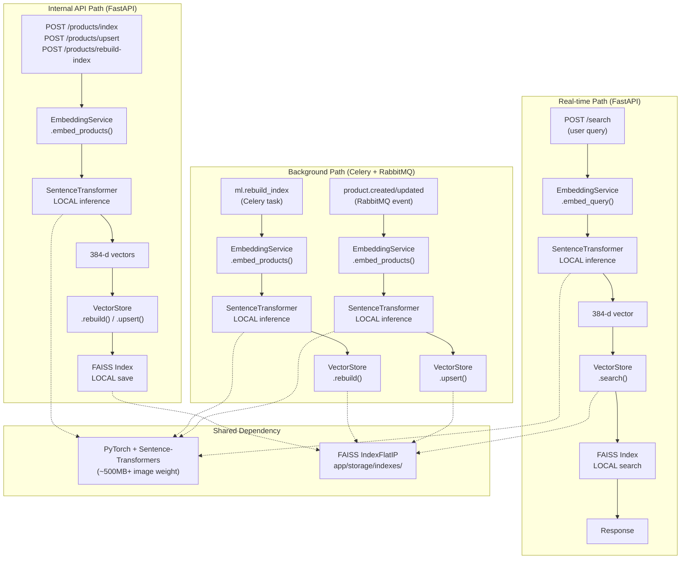
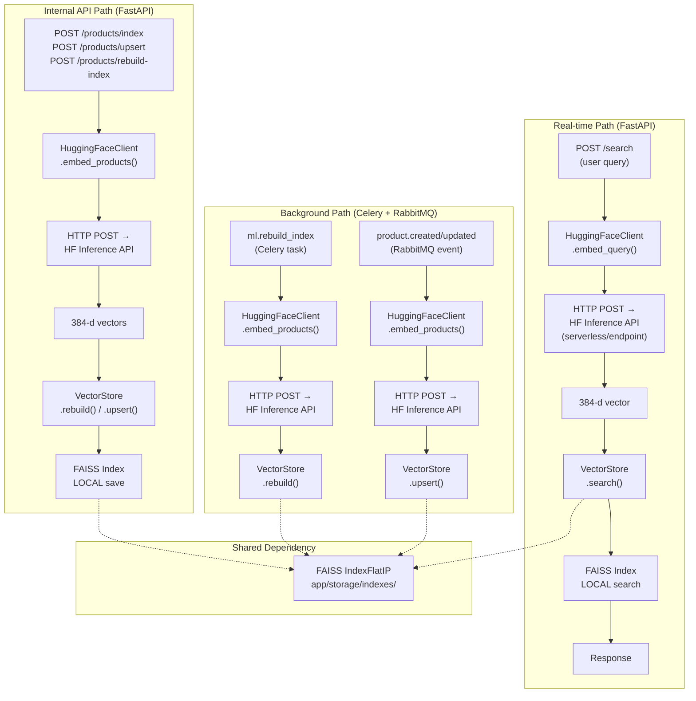

# Rencana Migrasi ML Engine — Local Model Loading → Hugging Face Inference API

---

## 1. Ringkasan Eksekutif

ML Engine saat ini menjalankan model embedding (`sentence-transformers/paraphrase-multilingual-MiniLM-L12-v2`) secara lokal di dalam container, dengan PyTorch sebagai backend dan FAISS untuk vector search. Total ada **6 titik pemanggilan inference** yang tersebar di 3 entry point (FastAPI endpoints, Celery task, RabbitMQ event consumer). Migrasi ke Hugging Face Inference API akan menghilangkan bedependency `torch` dan `sentence-transformers` (penghematan ~500MB+ image size, build time drastis lebih cepat), sementara FAISS index tetap dipertahankan lokal karena operasi search-nya ringan. Strategi migrasi yang direkomendasikan adalah **feature-flag bertahap**: mulai dari background path (Celery task + RabbitMQ consumer), lalu real-time path (search endpoint), dengan fallback ke local embedding jika HF API tidak tersedia. Semua fungsi yang tidak bergantung pada embedding (eco score, ranking, event logging) **tidak perlu perubahan**.

---

## 2. Peta Kode Saat Ini

### 2.1 Model & Inference Engine

| File | Baris | Fungsi/Kelas | Peran |
|---|---|---|---|
| `app/core/embedding.py` | 9-57 | `EmbeddingService` | **Inti migrasi**. Load `SentenceTransformer` lokal & generate embeddings |
| `app/core/embedding.py` | 24-37 | `EmbeddingService.load()` | Lazy load model dari Hugging Face Hub ke memory |
| `app/core/embedding.py` | 39-54 | `EmbeddingService.embed_texts()` | Semua inference routing lewat sini → model.encode() |
| `app/core/embedding.py` | 56-57 | `embed_query()` | Thin wrapper ke `embed_texts()` untuk single query |
| `app/core/embedding.py` | 59-60 | `embed_products()` | Thin wrapper ke `embed_texts()` dengan `product_to_text()` |
| `app/core/embedding.py` | 62-72 | `_hash_embedding()` | Fallback hash-based (hanya untuk testing `ML_USE_HASH_EMBEDDINGS`) |
| `app/core/embedding.py` | 75-91 | `product_to_text()` | Konversi `ProductIndexItem` → string untuk embedding |

### 2.2 Semua Titik Pemanggilan Inference

| # | File | Baris | Endpoint/Task | Tipe | Jalur |
|---|---|---|---|---|---|
| 1 | `app/api/search.py` | 24-28 | `POST /products/index` | Bulk index | Real-time (internal API) |
| 2 | `app/api/search.py` | 40-44 | `POST /products/upsert` | Single upsert | Real-time (internal API) |
| 3 | `app/api/search.py` | 68-114 | `POST /products/rebuild-index` | Full rebuild | Real-time (internal API, sync) |
| 4 | `app/api/search.py` | 126-127 | `POST /search` | Query embedding | Real-time (public API) |
| 5 | `app/workers/tasks.py` | 5-16 | `ml.rebuild_index` (Celery) | Full rebuild | Background (async) |
| 6 | `app/workers/event_consumer.py` | 115 | `handle_event()` (RabbitMQ) | Single upsert | Background (event-driven) |

### 2.3 Vector Store (FAISS)

| File | Baris | Fungsi/Kelas | Peran |
|---|---|---|---|
| `app/core/vector_store.py` | 19-28 | `VectorStore.__init__()` | Load FAISS index + metadata dari disk |
| `app/core/vector_store.py` | 42-76 | `VectorStore.load()` | Load binary `products.faiss` + `products_meta.json` |
| `app/core/vector_store.py` | 78-88 | `VectorStore.rebuild()` | Rebuild FAISS index dari embeddings baru |
| `app/core/vector_store.py` | 90-102 | `VectorStore.upsert()` | Single product update → rebuild |
| `app/core/vector_store.py` | 104-121 | `VectorStore.delete()` | Single product delete → rebuild |
| `app/core/vector_store.py` | 123-134 | `VectorStore.save()` | Persist ke disk (FAISS binary + JSON meta) |
| `app/core/vector_store.py` | 145-220 | `VectorStore.search()` | Search dengan filter (FAISS fast path / manual slow path) |
| `app/core/vector_store.py` | 223-249 | `_passes_filters()`, `_to_search_result()` | Helper functions |

### 2.4 Kode yang TIDAK Tersentuh Migrasi

| File | Fungsi | Alasan |
|---|---|---|
| `app/core/eco_score.py` | `calculate_eco_score()` | Heuristic rule-based, tidak pakai ML |
| `app/core/ranking.py` | `rank_home_products()`, `rank_eco_products()`, dll | Hanya sorting/ranking dari data yang sudah ada di index |
| `app/api/eco.py` | `POST /eco/score` | Wrapper endpoint untuk eco_score |
| `app/api/recommendation.py` | `GET /recommendations/*` | Pakai embeddings yang sudah tersimpan di index, tidak generate baru |
| `app/api/events.py` | `POST /events` | Hanya caching Redis, tidak ada ML |
| `app/clients/catalog_client.py` | `CatalogClient` | HTTP client ke catalog-service, tetap diperlukan |
| `app/workers/event_consumer.py` | `CatalogEventConsumer.resolve_product()` | Fetch data dari catalog, tidak ada ML |

---

## 3. Diagram Alur Data

### Sebelum Migrasi (Local Inference)

### Setelah Migrasi (HF Inference API)

---

## 4. Rekomendasi Opsi Hugging Face

### Model Assessment

| Aspek | Nilai |
|---|---|
| **Model ID** | `sentence-transformers/paraphrase-multilingual-MiniLM-L12-v2` |
| **Tersedia di Serverless Inference API** | ✅ Ya (model publik populer) |
| **Tugas** | `feature-extraction` (ambil hidden state sebagai embedding) |
| **Dimensi output** | 384 (sama dengan saat ini) |
| **Max sequence length** | 128 tokens (Model card: 128 word pieces) |
| **Rate limit (serverless)** | ~30 req/min untuk free tier, lebih tinggi dengan PRO subscription |

### Rekomendasi: Mulai dengan Serverless Inference API, siapkan opsi dedicated endpoint untuk Fase 3

| Kriteria | Serverless Inference API | Inference Endpoints (Dedicated) |
|---|---|---|
| **Cold start** | Tidak ada (HF manage pool) | Ada (instance spin-up) |
| **Biaya** | Per-request (gratis untuk tier rendah, berbayar untuk PRO) | Per-jam instance (fixed cost) |
| **Rate limit** | Ada (tergantung tier) | Tidak ada (dedicated) |
| **SLA** | Best effort | Guaranteed (sesuai instance type) |
| **Cocok untuk** | Awal migrasi, traffic rendah-sedang | Traffic tinggi/konsisten, butuh latency predictable |

**Alasan memulai serverless**:
1. Traffic ML Engine saat ini masih rendah (54 produk di index, skala development)
2. Model yang dipakai kecil (384-dim, 22MB) → cost per request sangat rendah
3. Tidak perlu khawatir cold-start management
4. Migrasi awal bisa dijalankan dengan zero infrastructure overhead

**Kapan perlu dedicated endpoint**: Jika traffic search sudah > 10.000 request/hari atau jika rate limit menjadi bottleneck.

---

## 5. Daftar Perubahan yang Diperlukan

### 5.1 Kode yang Perlu Diganti Total

| Modul | Perubahan | Prioritas |
|---|---|---|
| `app/core/embedding.py` | **Diganti total.** `EmbeddingService` → `HuggingFaceEmbeddingService` (atau refactor jadi interface + 2 implementasi). Ganti `sentence_transformers.encode()` → `httpx.AsyncClient` POST ke HF API | **WAJIB** |
| `app/config.py` | Tambah field HF config (`huggingface_api_token`, `huggingface_model_id`, `huggingface_api_url`, `hf_timeout`, `hf_retry_count`). `model_name` bisa dipertahankan sebagai alias/model ID | **WAJIB** |
| `app/deps.py` | Update type hint `get_embedding_service()` return type baru | Minor |
| `app/api/health.py` | Ubah `model_loaded` check (tidak ada model lokal, ganti dengan HF API connectivity check) | Minor |

### 5.2 Kode yang Bisa Dipertahankan (Tanpa Perubahan)

| Modul | Alasan |
|---|---|
| `app/core/vector_store.py` | Search & index management tetap sama. Embedding datang dari luar, sisanya identik. **Tidak perlu perubahan** |
| `app/core/ranking.py` | Ranking tidak bergantung pada inference. Beroperasi di atas data yang sudah ada di index |
| `app/core/eco_score.py` | Heuristic murni, tidak ada ML |
| `app/schemas.py` | Semua model data tetap relevan |
| `app/clients/catalog_client.py` | HTTP client ke catalog-service, tidak ada ML |
| `app/workers/celery_app.py` | Celery config tidak berubah |
| `app/workers/event_consumer.py` | Kecuali baris 115 (pemanggilan embedding), logic konsumsi event tetap sama |
| `app/api/recommendation.py` | Semua endpoint recommendation tidak memanggil embedding baru |
| `app/api/eco.py` | Tidak ada ML |
| `app/api/events.py` | Tidak ada ML |

### 5.3 Dependency yang Bisa Dihapus

| Dependency | Alasan |
|---|---|
| `sentence-transformers>=2.7.0,<3.0.0` | Tidak perlu load model lokal |
| `torch==2.2.2` (darwin x86_64) | Tidak perlu PyTorch sama sekali |
| `torch>=2.7.0` (linux + darwin arm64) | Tidak perlu PyTorch sama sekali |
| `[tool.uv.sources] torch` + `[[tool.uv.index]] pytorch-cpu` | Tidak perlu fetch PyTorch CPU wheels |

**Dampak**: Hilang dari `pyproject.toml` ±10 baris conditional dependencies + 1 custom index.

### 5.4 Dependency yang Tetap Diperlukan

| Dependency | Alasan |
|---|---|
| `faiss-cpu>=1.8.0` | FAISS index search tetap jalan lokal (ringan, tanpa model) |
| `numpy>=1.26.0` | Operasi vector (dot product, normalization, stacking) |
| `httpx>=0.27.0` | HTTP client — sudah ada, akan dipakai juga untuk HF API calls |
| `fastapi`, `uvicorn`, `pydantic`, `pydantic-settings` | Framework service |
| `celery>=5.3.0`, `amqp>=5.2.0` | Task queue |
| `redis>=8.0.0` | Celery backend + caching |
| `python-dotenv>=1.0.1` | Env loading |

### 5.5 Dependency Baru yang Disarankan

| Dependency | Alasan | Prioritas |
|---|---|---|
| `tenacity>=8.0.0` | Retry logic untuk HTTP calls ke HF API (exponential backoff) | **Recommended** |
| (opsional) `huggingface-hub>=0.20.0` | SDK resmi HF, bisa dipakai untuk API calls. Tapi tidak wajib — `httpx` saja cukup | Low |

### 5.6 Environment Variable & Config Changes

#### Hilang / Berubah Makna

| Variabel | Status | Alasan |
|---|---|---|
| `MODEL_NAME` | **BERTAHAN** tapi berubah makna → HF model ID (`sentence-transformers/paraphrase-multilingual-MiniLM-L12-v2`) | Sebagai HF model identifier |
| `ML_USE_HASH_EMBEDDINGS` | **HILANG** atau direpurpose jadi `HF_FALLBACK_TO_LOCAL` | Hash embedding adalah testing fallback; tidak relevan lagi. Bisa diganti jadi flag untuk fallback ke local model jika HF unavailable |

#### Baru

| Variabel | Default | Deskripsi |
|---|---|---|
| `HUGGINGFACE_API_TOKEN` | *(wajib diisi)* | HF API token (dari hf.co/settings/tokens) |
| `HUGGINGFACE_MODEL_ID` | `sentence-transformers/paraphrase-multilingual-MiniLM-L12-v2` | Model ID di HF Hub |
| `HUGGINGFACE_API_URL` | (auto dari model_id) | Override endpoint URL (untuk dedicated endpoint) |
| `HF_EMBEDDING_TIMEOUT` | `30` | Timeout per request HF API (detik) |
| `HF_EMBEDDING_RETRY_COUNT` | `3` | Jumlah retry untuk failed request |

### 5.7 Dampak Docker

**Sebelum**:
- `FROM python:3.12-slim`
- `uv sync` mengunduh PyTorch CPU (~200-400MB) + Sentence-Transformers (~100MB)
- Build time: 2-5 menit (tergantung koneksi)

**Sesudah**:
- Base image tetap `python:3.12-slim` (masih cocok)
- Tidak perlu PyTorch → tidak perlu `pytorch-cpu` custom index
- `uv sync` jadi jauh lebih cepat (tidak ada C++ extension build)
- Image size turun signifikan (~500MB+ saving)

`Dockerfile.dev` sendiri tidak perlu diubah struktur, hanya `pyproject.toml` yang berubah.

---

## 6. Rencana Bertahap (Phased Plan)

### Fase 1: Foundation — Setup HF Client & Feature Flag (Estimasi: 1-2 sesi)

**Tujuan**: Membuat komponen baru secara paralel tanpa menghapus local inference.

1. **Buat `app/clients/huggingface_client.py`**
   - Class `HuggingFaceEmbeddingClient` dengan API serupa `EmbeddingService`:
     - `embed_texts(texts) → np.ndarray`
     - `embed_query(query) → np.ndarray`
     - `embed_products(products) → np.ndarray`
   - Gunakan `httpx.AsyncClient` untuk POST ke HF Inference API
   - Implementasi retry logic (dengan `tenacity` atau manual backoff)
   - Error handling untuk timeout, rate limit (429), auth error (401/403)

2. **Update `app/config.py`**
   - Tambah field HF-specific settings (`huggingface_api_token`, `huggingface_model_id`, dll)

3. **Create `app/core/base_embedding.py` (Interface)**
   - Abstract class/Protocol untuk EmbeddingService agar bisa memiliki 2 implementasi (local + HF)

4. **Update `app/deps.py`**
   - Feature flag: jika `HUGGINGFACE_API_TOKEN` ada, gunakan `HuggingFaceEmbeddingClient`, else fallback ke `EmbeddingService` (local)

5. **Test HF API connectivity**
   - Test di local dengan token HF

**Acceptance Criteria**:
- Komponen HF client sudah terisolasi dan bisa dipanggil manual
- Docker compose masih bisa jalan dengan local inference seperti biasa
- Tidak ada perubahan pada runtime paths

### Fase 2: Migrasi Background Path — Celery Task + RabbitMQ Consumer (Estimasi: 1 sesi)

**Tujuan**: Memindahkan path non-real-time lebih dulu. Kalau ada masalah, dampaknya terbatas.

1. **Update `app/workers/tasks.py`**
   - Ganti `get_embedding_service().embed_products()` → panggil HF client (via feature flag)

2. **Update `app/workers/event_consumer.py` line 115**
   - Ganti `get_embedding_service().embed_products([product])[0]` → HF client (via feature flag)

3. **Uji coba**
   - Trigger `ml.rebuild_index` task via Celery
   - Trigger `product.created` event via RabbitMQ
   - Verifikasi FAISS index terupdate dengan benar

**Risiko**: HF API down → background task gagal → index tidak update → produk baru tidak muncul di search.
**Mitigasi**: Retry logic + logging error. Kalau HF API masih down setelah retry, produk akan ter-skip sampai rebuild berikutnya. Di Fase 1 kita sudah pastikan fallback mekanisme.

**Acceptance Criteria**:
- Celery task rebuild_index berhasil dengan embedding dari HF API
- Event consumer upsert produk baru berhasil
- Search tetap berfungsi (pakai embedding baru dari HF)
- Tidak ada retry yang gagal lebih dari threshold

### Fase 3: Migrasi Real-time Path — FastAPI Endpoints (Estimasi: 1-2 sesi)

**Tujuan**: Memindahkan endpoint-endpoint yang responsif terhadap waktu.

1. **Update `app/api/search.py`**
   - Endpoint `POST /search` (public, latency-sensitive) → HF client
   - Endpoint `POST /products/*` (internal) → HF client

2. **Update `app/api/health.py`**
   - Health check → test HF API connectivity, bukan model_loaded boolean

3. **Perhatikan timeout**
   - `POST /search` harus respond cepat (< 1 detik). HF API serverless biasanya 100-300ms per request untuk model kecil.
   - Set timeout ketat: 5s untuk search, 30s untuk batch embed

**Risiko**: Latency bertambah karena network call (vs local inference yang < 50ms).
**Mitigasi**: 
- HF API serverless untuk model ini biasanya < 500ms
- Jika latency jadi masalah, upgrade ke Inference Endpoints (dedicated GPU, latency < 100ms)

**Acceptance Criteria**:
- Search response time < 2 detik (acceptable untuk MVP)
- Internal API endpoints sukses untuk index/upsert/rebuild
- Health check report status HF connectivity

### Fase 4: Cleanup — Hapus Dependency Lokal (Estimasi: 0.5 sesi)

**Tujuan**: Membersihkan kode dan dependency yang sudah tidak terpakai.

1. **Hapus `sentence-transformers` dan `torch` dari `pyproject.toml`**
   - Hapus semua conditional `torch` dependencies
   - Hapus `[tool.uv.sources] torch` dan `[[tool.uv.index]] pytorch-cpu`

2. **Hapus atau arsipkan `EmbeddingService` (local)**
   - Jika feature flag masih dipertahankan, pindahkan ke modul terpisah `app/core/embedding_local.py`
   - Atau hapus total jika sudah 100% HF

3. **Hapus `ML_USE_HASH_EMBEDDINGS` reference**
   - Hapus dari dokumentasi dan kode

4. **Update dokumentasi**
   - `app/README.md` — update tech stack, env vars, arsitektur
   - `app/.env.example` — update env vars

**Acceptance Criteria**:
- `uv sync` berhasil tanpa `sentence-transformers` dan `torch`
- Build Docker sukses, image size terpantau turun
- Semua test masih pass
- Semua env var yang sudah tidak dipakai diarsipkan/hapus dari dokumentasi

---

## 7. Risiko & Mitigasi

### 7.1 Biaya

| Aspek | Local Inference (Saat Ini) | HF Inference API (Serverless) | HF Inference Endpoints |
|---|---|---|---|
| **Compute cost** | Container CPU/RAM (fixed) | Per 1M inference calls (~$0.02-0.10 untuk model kecil) | ~$0.1-1.0/jam (GPU instance) |
| **Storage cost** | Model ~90MB di disk, hapus setelah migrasi | N/A | N/A |
| **Estimasi untuk 54 produk** | ~1-2 kali rebuild = negligible | ~$0.001 per rebuild (54 calls) | Overkill, jangan pakai endpoint dedicated untuk traffic saat ini |

**Kesimpulan biaya**: Untuk skala saat ini (54 produk, traffic rendah), biaya HF serverless sangat rendah bahkan mungkin free tier mencukupi. Biaya dedicated endpoint tidak sebanding.

### 7.2 Latency

| Jalur | Local Inference | HF Serverless (estimasi) | HF Endpoint (estimasi) |
|---|---|---|---|
| `POST /search` (1 query) | ~20-50ms | ~200-500ms | ~50-100ms |
| Batch embed (54 produk) | ~1-3 detik | ~2-5 detik | ~0.5-1 detik |

**Catatan**: Model `paraphrase-multilingual-MiniLM-L12-v2` sangat kecil (22MB), jadi HF API response seharusnya cepat. Yang paling terasa adalah pada `POST /search` yang tadinya real-time (< 50ms) jadi ~200-500ms. Ini masih acceptable untuk search, tapi perlu dimonitor.

### 7.3 Ketergantungan Eksternal

| Risiko | Dampak | Mitigasi |
|---|---|---|
| HF API down | Service tidak bisa generate embedding → search tidak bekerja | Feature flag fallback ke local model (jika masih diinstall) |
| Rate limited (429) | Request ditolak sementara | Retry with exponential backoff + queue mechanism |
| Network latency tinggi | Search jadi lambat | Timeout configuration + monitoring |
| HF API change/breaking change | Service error | Pin API version via header, monitor changelog |

### 7.4 Dimensional Consistency

**RISIKO KRITIS**: Jika model HF Inference API mengembalikan vector dengan dimensi berbeda dari 384, atau jika normalize_embeddings tidak konsisten, FAISS index yang sudah ada akan rusak/corrupted.

**Mitigasi**:
- Validasi dimensi output HF API response sebelum diproses
- Simpan dimensi sebagai constant (384) dan fail early jika tidak cocok
- Rebuild index full dari awal setelah migrasi pertama kali
- Pastikan `normalize_embeddings=True` di parameter HF API request (untuk task `feature-extraction`, ini perlu dicek apakah HF API secara default normalize atau tidak)

---

## 8. Pertanyaan Terbuka (Butuh Konfirmasi)

1. **Token & Auth**: Apakah sudah ada Hugging Face account dan API token yang siap dipakai? Untuk testing lokal, token bisa dari hf.co/settings/tokens (read-only sudah cukup untuk inference).

2. **Budget**: Apakah ada budget untuk HF PRO subscription ($9/bulan) untuk rate limit yang lebih tinggi? Atau untuk free tier dulu? Saat ini dengan traffic rendah, free tier seharusnya mencukupi.

3. **Model Consistency**: Apakah model yang dipakai boleh berbeda (misal: switch ke `intfloat/multilingual-e5-small` yang juga 384-dim tapi performa lebih baik)? Atau harus tetap persis `paraphrase-multilingual-MiniLM-L12-v2` untuk konsistensi?

4. **Fallback Strategy**: Jika HF API down, apakah kita perlu mempertahankan kemampuan local inference sebagai fallback, atau cukup dengan graceful degradation (search tidak berfungsi sementara)? Mempertahankan local model sebagai fallback berarti tetap harus install `sentence-transformers` + `torch` (tidak ada penghematan image size).

5. **Data Residency**: Apakah ada concern data privacy dengan mengirim deskripsi produk ke HF API (data keluar dari infrastructure sendiri)? Produk-produk ini sudah publik (e-commerce), tapi tetap perlu dikonfirmasi.

6. **Monitoring**: Apakah ada sistem monitoring yang sudah siap (Grafana, Datadog, etc.) untuk memantau HF API latency, error rate, dan cost? Atau cukup dengan logging di service?

7. **NAF (Next Actionable Step)**: Apakah saya bisa mulai dengan Fase 1 (membuat HF client component) di sesi coding berikutnya setelah dokumen ini disetujui?
