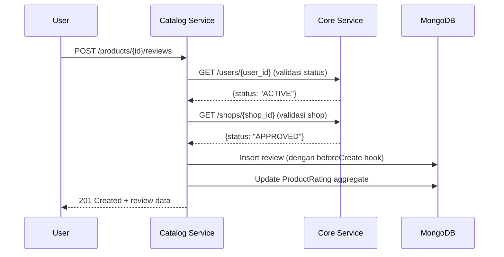

# 🔗 Catalog Service API Breakdown & Cross-Service Integration

Berikut adalah analisis sistematis untuk **Catalog Service** (MongoDB/Go) yang terkoneksi dengan **Core Service** (MySQL/Prisma), termasuk pemecahan API yang dibutuhkan dan pola integrasinya.

---

## 🗂️ 1. Internal APIs Catalog Service (MongoDB)

### 📦 Product Management
| Endpoint | Method | Deskripsi | Auth Required |
|----------|--------|-----------|--------------|
| `/products` | POST | Create product (validasi shop_id & category_id) | Shop Member |
| `/products/{id}` | GET | Get product detail + variant + price + images | Public |
| `/products/{id}` | PUT | Update product metadata | Shop Member |
| `/products/{id}/toggle-active` | PATCH | Activate/deactivate product | Shop Member |
| `/products/search` | GET | Search & filter products (by category, price, rating, etc.) | Public |
| `/products/bulk` | PUT | Bulk update stock/price/status | Shop Member |

### 🏷️ Category Management
| Endpoint | Method | Deskripsi |
|----------|--------|-----------|
| `/categories` | POST | Create category (dengan parent_id opsional) |
| `/categories/tree` | GET | Get hierarchical category tree |
| `/categories/{id}/products` | GET | Get products by category |

### 🎨 Variant & Image Management
| Endpoint | Method | Deskripsi |
|----------|--------|-----------|
| `/products/{id}/variants` | POST | Add variant to product |
| `/products/{id}/images` | POST | Upload product images (set primary, order) |
| `/images/{id}` | DELETE | Remove image |

### 💰 Price & Discount Engine
| Endpoint | Method | Deskripsi |
|----------|--------|-----------|
| `/products/{id}/price` | GET | Get active price + calculated final price |
| `/products/{id}/discounts` | POST | Add discount rule (percentage/fixed) |
| `/prices/calculate` | POST | Calculate final price: `base - discount + tax` |

### 📦 Inventory Management
| Endpoint | Method | Deskripsi |
|----------|--------|-----------|
| `/inventory/{product_id}` | GET | Get stock + reserved stock |
| `/inventory/reserve` | POST | Reserve stock for order (atomic) |
| `/inventory/release` | POST | Release reserved stock |

### ⭐ Review & Rating System
| Endpoint | Method | Deskripsi | Auth |
|----------|--------|-----------|------|
| `/products/{id}/reviews` | POST | Submit review (validasi user & order) | User |
| `/reviews/{id}/reply` | POST | Shop reply to review | Shop Member |
| `/products/{id}/rating` | GET | Get aggregated rating (avg, distribution) | Public |
| `/reviews/{id}/helpful` | PATCH | Mark review as helpful | User |

### ❤️ Favorite & Analytics
| Endpoint | Method | Deskripsi |
|----------|--------|-----------|
| `/favorites` | POST/DELETE | Add/remove product from favorites |
| `/users/{id}/favorites` | GET | Get user's favorite products |
| `/products/{id}/views` | POST | Track product view (untuk analytics) |
| `/analytics/products/{id}` | GET | Get view count, conversion rate, etc. |

---

## 🔗 2. External APIs yang Dibutuhkan dari Core Service

Catalog Service perlu memanggil Core Service untuk validasi dan enrich data. Berikut adalah **API contracts** yang direkomendasikan:

### ✅ A. Validation APIs (Sync Calls)

```go
// 1. Validate Shop Existence & Status
GET /core/v1/shops/{shop_id}
// Response:
{
  "id": "xxx",
  "name": "Shop Name",
  "status": "APPROVED", // PENDING/APPROVED/REJECTED/SUSPENDED
  "owner_id": "yyy"
}
// Use: Saat create/update product, pastikan shop APPROVED

// 2. Validate User Existence & Status  
GET /core/v1/users/{user_id}
// Response:
{
  "id": "xxx",
  "status": "ACTIVE", // ACTIVE/SUSPENDED/BANNED
  "email_verified": true
}
// Use: Saat user submit review/favorite, pastikan user ACTIVE

// 3. Check Shop Member Permission
GET /core/v1/shops/{shop_id}/members/{user_id}/permissions
// Response:
{
  "is_member": true,
  "roles": ["admin", "product_manager"],
  "can_manage_products": true,
  "can_reply_reviews": true
}
// Use: Authorization untuk action shop-specific di catalog
```

### 📦 B. Data Enrichment APIs (Bulk Lookup)

```go
// 4. Bulk Entity Lookup (untuk performa listing)
POST /core/v1/entities/lookup
// Request:
{
  "shop_ids": ["s1", "s2"],
  "user_ids": ["u1", "u2"]
}
// Response:
{
  "shops": {
    "s1": {"name": "Shop A", "status": "APPROVED", "avatar": "..."},
    "s2": {"name": "Shop B", "status": "SUSPENDED", "avatar": "..."}
  },
  "users": {
    "u1": {"full_name": "John", "avatar": "..."},
    "u2": {"full_name": "Jane", "avatar": "..."}
  }
}
// Use: Saat return list products + reviews, populate shop/user info tanpa N+1 query
```

### 🔐 C. Webhook Events (Async Integration)

Catalog Service sebaiknya **subscribe ke event** dari Core Service:

| Event dari Core | Action di Catalog |
|----------------|------------------|
| `shop.status_changed` (→ SUSPENDED) | Soft-delete/hide all products by shop |
| `shop.deleted` | Mark products as `orphaned` atau cascade soft-delete |
| `user.status_changed` (→ BANNED) | Hide reviews/favorites by user |
| `shop.profile_updated` | Update cached shop name/avatar di product listings |

```go
// Contoh webhook handler di Catalog Service
func HandleShopStatusChanged(event ShopStatusEvent) {
    if event.NewStatus == "SUSPENDED" {
        // Bulk update: set is_active = false untuk semua product shop ini
        catalogDB.Products().UpdateMany(
            bson.M{"shop_id": event.ShopID},
            bson.M{"$set": bson.M{"is_active": false, "suspended_at": time.Now()}}
        )
    }
}
```

---

## 🔄 3. Pola Integrasi & Best Practices

### 🎯 Strategi Komunikasi
```
┌─────────────────┐     HTTP/gRPC      ┌─────────────────┐
│  Catalog Svc    │ ◄──────────────► │   Core Svc      │
│  (MongoDB)      │   Sync Calls     │   (MySQL)       │
└─────────────────┘                  └─────────────────┘
         │                                    │
         │         Kafka/RabbitMQ             │
         └──────────────────────────────────► │
                 Async Events
```

### ✅ Guidelines Implementasi:

1. **Caching Layer**  
   Cache response `GET /core/shops/{id}` dengan TTL 5-15 menit untuk hindari call berulang.

2. **Circuit Breaker**  
   Gunakan circuit breaker (misal: `sony/gobreaker`) saat memanggil Core Service agar failure tidak cascade.

3. **Graceful Degradation**  
   Jika Core Service down:
   - Validasi shop/user bisa skip ke "allow with warning" untuk read operations
   - Write operations (create review/favorite) harus fail-fast dengan error jelas

4. **Consistency Pattern**  
   Untuk data kritis (stock reservation), gunakan **saga pattern** atau **outbox pattern** agar transaksi lintas service tetap konsisten.

5. **API Versioning**  
   Selalu gunakan versioned path: `/core/v1/...` agar breaking changes di Core tidak langsung break Catalog.

---

## 📋 4. Checklist Implementasi Prioritas

### Phase 1: MVP Catalog
- [ ] CRUD Product + Category
- [ ] Get Product Detail (dengan price calculation)
- [ ] Search Products (basic filter)
- [ ] Sync call ke Core: `GET /shops/{id}` untuk validasi

### Phase 2: Engagement Features  
- [ ] Review & Rating system
- [ ] Favorite products
- [ ] Bulk lookup API ke Core untuk enrich response

### Phase 3: Resilience & Scale
- [ ] Implement webhook listener untuk event dari Core
- [ ] Tambahkan caching + circuit breaker
- [ ] Analytics tracking (views, conversion)

---

## 🧩 5. Contoh Flow: User Submit Review



---

## 💡 Tips Tambahan

1. **Gunakan CUID konsisten** di kedua service agar ID bisa di-generate client-side tanpa collision.
2. **Soft delete pattern** (`deleted_at`) sudah ada di kedua model — pastikan query selalu filter `deleted_at: null`.
3. **Index strategy**: Pastikan index untuk field yang sering di-query: `shop_id`, `category_id`, `slug`, `is_active`.
4. **Price calculation logic** sebaiknya di-layer service, bukan di model, agar mudah di-test dan di-cache.

Jika ingin, saya bisa bantu buatkan:
- 📄 OpenAPI/Swagger spec untuk API Catalog Service
- 🧪 Contoh unit test untuk price calculation logic
- 🗄️ Migration script untuk index MongoDB
- 🔄 Contoh implementasi webhook listener dengan Kafka

Silakan pilih prioritas berikutnya! 🚀